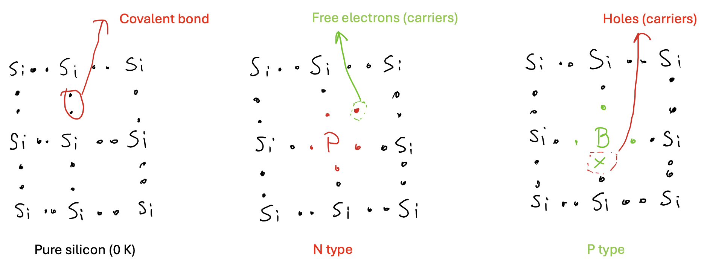

# Uvod v digitalno oblikovanje

# Uvod v digitalno načrtovanje

## PN-spoj

Eden temeljnih vidikov elektronike v trdnem stanju je obnašanje PN-spoja. Ko sta p-tip in n-tip materiala združena v stik, spoj kaže edinstvene lastnosti, ki se razlikujejo od posameznih materialov. Natančneje, tok zlahka teče v eno smer (pri prevodni smeri), vendar ne v nasprotno smer (pri zaporni smeri), kar tvori osnovno diodo. Ta enosmerno prevodno obnašanje je posledica prenosa nabojev na stiku.

### Silicij, N-tip in P-tip

**Silicij** je temeljni material, ki se uporablja v polprevodniških napravah zaradi svojih odličnih električnih lastnosti in razprostranjenosti. V svoji čisti obliki je silicij slab prevodnik elektrike. Vendar pa se njegova prevodnost lahko znatno izboljša z vnosom primes v procesu, imenovanem dopingiranje.

**N-tip Silicij**: Ta nastane z dopingom čistega silicija z elementi, ki imajo več valenčnih elektronov kot silicij, kot sta fosfor ali arzen. Ti dodatni elektroni postanejo prosti nosilci, kar poveča prevodnost materiala. "N" označuje prisotnost prostih elektronov kot glavnih nosilcev naboja.

**P-tip Silicij**: Ta nastane z dopingom čistega silicija z elementi, ki imajo manj valenčnih elektronov kot silicij, kot sta bor ali galij. To ustvarja "vrzeli" ali pozitivne nosilce naboja, saj se odsotnost elektrona lahko obravnava kot pozitiven naboj. "P" označuje prisotnost vrzeli kot glavnih nosilcev naboja.

### Osiromašeno področje

Osiromašeno področje je kritično območje znotraj P-N spoja, kjer se srečata p-tip in n-tip materiala. V tem območju se prosti elektroni iz n-tip materiala združijo z vrzeli iz p-tip materiala, kar povzroči območje, osiromašeno prostih nosilcev naboja. To ustvarja električno polje, ki nasprotuje nadaljnjemu gibanju elektronov in vrzeli čez spoj. Osiromašeno področje deluje kot izolacijska pregrada, ki preprečuje tok ko je spoj v zaporni smeri.

#### Ravnotežno stanje

V ravnotežnem stanju se vzpostavi Coulombova pregrada, ki preprečuje izmenjavo nosilcev med koncema spoja.

#### Zaporna smer diode  (ang. reverse bias)

Napetost s pozitivno polariteto na N-strani dodatno ovira pretok elektronov čez spoj. Za prevodnost v napravi morajo elektroni iz N-regije priti do spoja in se združiti z luknjami v P-regiji. Tako priključena napetost odganja elektrone stran od spoja, kar preprečuje prevodnost.

#### Prevodan smer diode (ang. forward bias)

Uporabljena napetost v prevodni smeri pomaga elektronom premagati Coulombovo pregrado prostorskega naboja v osiromašenem področju. 

## CMOS tehnologija

Komplementarna kovinsko-oksidno-polprevodniška (CMOS) tehnologija je nenadomestljiva v digitalnem oblikovanju zaradi svoje visoke učinkovitosti, nizke porabe energije in skalabilnosti. CMOS tehnologija uporablja tako p-tip kot n-tip MOSFET tranzistorje za ustvarjanje logičnih funkcij, kar omogoča oblikovanje kompleksnih integriranih vezij z minimalno porabo energije. To je ključno za naprave na baterijski pogon in veliko integracijo, kot so mikroprocesorji in pomnilniški čipi. Poleg tega CMOS tehnologija ponuja visoko odpornost proti šumu in hitre preklopne hitrosti, kar jo naredi za hrbtenico sodobne digitalne elektronike, od potrošniških naprav do naprednih računalniških sistemov.

CMOS tehnologija je nenadomestljiva v digitalnem načrtovanju zaradi svoje visoke učinkovitosti, nizke porabe energije in skalabilnosti. CMOS uporablja tako p-tip kot n-tip MOSFET tranzistorje za ustvarjanje logičnih funkcij, kar omogoča zasnovo kompleksnih integriranih vezij z minimalno porabo energije. To je ključnega pomena za naprave na baterijsko napajanje in veliko integracijo, kot so mikroprocesorji. Poleg tega CMOS tehnologija ponuja visoko odpornost na šum in hitre preklopne hitrosti, kar jo naredi za hrbtenico sodobne digitalne elektronike – od potrošniških naprav do naprednih računalniških sistemov.

### MOSFET tranzistorji

MOSFET tranzistor je primarno obravnavan kot stikalo, čeprav se lahko uporablja tudi za ojačanje signala. Na prvi pogled se MOSFET zdi kot štiripolna naprava: vrata, vir, odtok in telo. Napetost, uporabljena na vratih, določa, ali in koliko toka teče med virom in odtokom. Telo modulira napetostno-tokovne karakteristike in je običajno povezano z ustreznim napajalnikom.

Ime MOSFET pomeni kovinsko-oksidno-polprevodniški tranzistor z učinkom polja. Tranzistor z učinkom polja (FET) uporablja električno polje za nadzor pretoka toka v polprevodniku. Del "MOS" se nanaša na strukturo MOSFET-a, kot je prikazano na sliki spodaj. Prikazujemo NMOS. Vrata sestavljajo kovinska plast in oksidna plast, ki deluje kot izolator, preprečuje, da bi naboj iz p-podlage vstopil v vrata. Odtok in vir sta n+-tip regiji, vgrajeni v p-tip substrat. Vir je tako imenovan, ker je vir nosilcev naboja (elektronov za n-kanal, lukenj za p-kanal), ki tečejo skozi kanal; podobno je odtok, kjer nosilci naboja zapustijo kanal.

Za vklop MOS tranzistorjev je prvi korak uporaba pozitivne napetosti na vratih. To privlači elektrone iz p-tip substrata in potisne luknje navzdol. Gibanje elektronov in lukenj povzroča električno polje, zato ime tranzistor z učinkom polja (FET). Zaradi električnega polja se elektroni koncentrirajo na vrhu p-substrata, kar učinkovito ustvarja most med virom in odtokom. Ko je ta most, znan kot kanal, vzpostavljen, lahko tok teče od vira do odtoka. Dolžina tega kanala je značilnost uporabljene MOS tehnologije. V bistvu MOS tranzistor deluje kot nadzorovano stikalo. Ko se napajanje odstrani z vrat, elektroni nimajo več energije, da bi ostali v kanalu, kar povzroči razpad kanala in odpre povezavo med odtokom in virom.

### Komplementarni MOS

CMOS tranzistorji sestavljajo dva MOS tranzistorja: NMOS in PMOS, ki delita skupna vrata. Ker vemo, kako omogočiti NMOS tranzistor, se lahko osredotočimo na delovanje CMOS. Ko se na vhod CMOS tranzistorja uporabi pozitivna napetost, se NMOS tranzistor vklopi, medtem ko se PMOS tranzistor izklopi, kar nastavi izhod na nič. Nasprotno, ko je vhod povezan z zemljo (ničelna napetost), se PMOS tranzistor vklopi, NMOS tranzistor pa izklopi, kar prav tako nastavi izhod na nič. To prikazuje funkcionalnost inverterja.

## Proizvodnja CMOS integriranih vezij

- NMOS in PMOS tranzistorje je treba zgraditi z uporabo istega silicijskega materiala

### Fotolitografski proces

- Vse se začne z rezino
- Oksidacijski sloj: nanesite tanko plast SiO2 po celotni rezini
- Premaz s fotorezistom
  - svetlobno občutljiv polimer med vrtenjem rezine
  - negativni (privzeto): topen, ko je izpostavljen svetlobi
  - pozitivni: obratno
- Izpostavitev s stepperjem
  - steklena maska, ki vsebuje vzorce, se približa rezini
    - neprosojna območja: želimo proces, prosojna v drugih
  - UV svetloba se oddaja
- Razvoj in peka fotorezista
  - odstranite topen del maske s kislinsko ali bazično raztopino
  - peka - utrditev fotorezista
- Kislinsko jedkanje
  - odstranite območja, ki niso prekrita z masko
- Vrtenje, izpiranje in sušenje
- Različni procesni koraki
- Odstranitev fotorezista