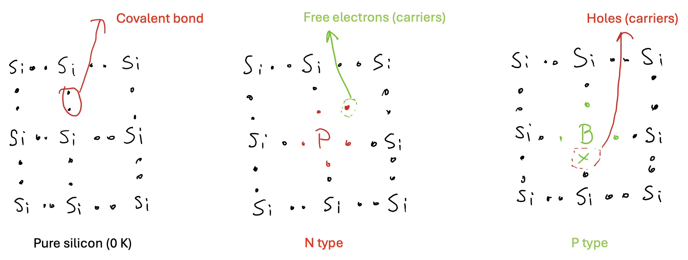
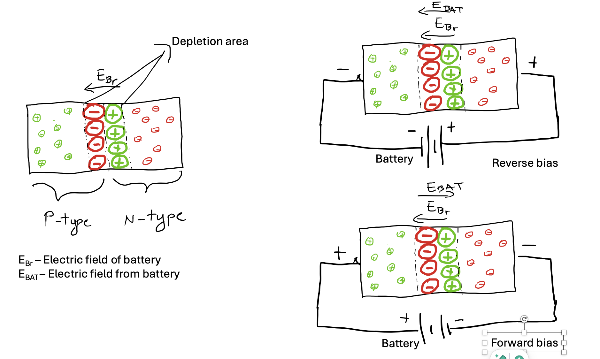
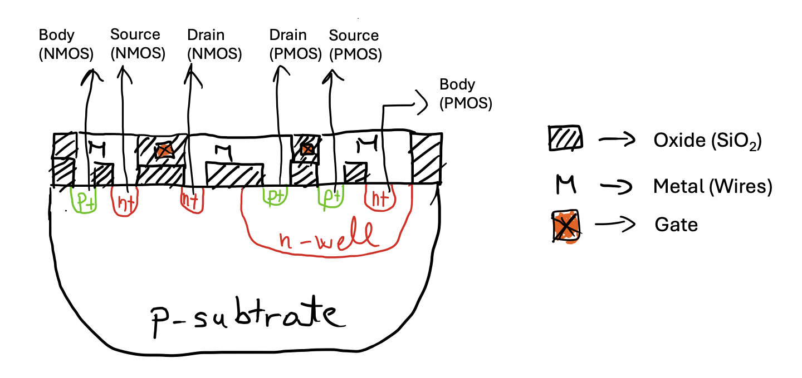

# Introduction to Digital Design 

## PN junction 

One of the fundamental aspects of solid-state electronics is the behavior of the P-N junction. When p-type and n-type materials are brought into contact, the junction exhibits unique properties distinct from those of the individual materials. Specifically, current flows easily in one direction (forward biased) but not in the opposite direction (reverse biased), forming the basic diode. This unidirectional behavior results from the charge transport mechanisms inherent in the two types of materials. 

### Silicon, N-type and P-type 

**Silicon** is a fundamental material used in semiconductor devices due to its excellent electrical properties and abundance. In its pure form, silicon is a poor conductor of electricity. However, its conductivity can be significantly enhanced by introducing impurities in a process known as doping.

**N-type Silicon**: This is created by doping pure silicon with elements that have more valence electrons than silicon, such as phosphorus or arsenic. These extra electrons become free carriers, increasing the material's conductivity. The "N" stands for negative, indicating the presence of free electrons as the primary charge carriers.

**P-type Silicon**: This is formed by doping pure silicon with elements that have fewer valence electrons than silicon, such as boron or gallium. This creates "holes" or positive charge carriers, as the absence of an electron can be treated as a positive charge. The "P" stands for positive, indicating the presence of holes as the primary charge carriers.

### Depletion region 

The depletion region is a critical area within a P-N junction where the p-type and n-type materials meet. In this region, free electrons from the n-type material combine with holes from the p-type material, resulting in a zone depleted of free charge carriers. This creates an electric field that opposes further movement of electrons and holes across the junction. The depletion region acts as an insulating barrier, preventing current flow under reverse bias conditions while allowing current to flow under forward bias conditions. 

#### Equlibrium state  

In the equilibrium state, the Coulomb barrier is established, preventing the exchange of carriers between the ends of the junction. 

#### Reverse bias

An applied voltage with the positive polarity on N-side further impedes the flow of electrons across the junction. For conduction in the device, electrons from the N region must move to the junction and combine with holes in the P region. A reverse voltage drives the electrons away from the junction, preventing conduction.

#### Forward bias

An applied voltage in the forward direction as indicated assists electrons in overcoming the coulomb barrier of the space charge in the depletion region. Electrons will flow with very small resistance in the forward direction.

## CMOS technology

Complementary Metal-Oxide-Semiconductor (CMOS) technology is unreplacable in digital design due to its high efficiency, low power consumption, and scalability. CMOS technology uses both p-type and n-type MOSFETs to create logic functions, allowing for the design of complex integrated circuits with minimal power dissipation. This is crucial for battery-operated devices and large-scale integration, such as microprocessors and memory chips. Additionally, CMOS technology offers high noise immunity and fast switching speeds, making it the backbone of modern digital electronics, from consumer gadgets to advanced computing systems.

### Mosfet transistors 

The MOSFET transistor is primarily considered a switch, although it can also be used for signal amplification. At first glance, the MOSFET appears as a four-terminal device: gate, source, drain, and body. The voltage applied to the gate determines whether and how much current flows between the source and drain. The body modulates the voltage-current characteristics and is typically connected to the appropriate power supply by default.

The name MOSFET stands for Metal Oxide Semiconductor Field-Effect Transistor. A field-effect transistor (FET) uses an electric field to control the flow of current in a semiconductor. The "MOS" part refers to the structure of the MOSFET, as shown in the picture below. We illustrate an NMOS. The gate consists of a metal layer and an oxide layer, which acts as an insulator, preventing charge from the p-subtrate from entering the gate. The drain and source are n+-type regions embedded in the p-type substrate.
The source is so named because it is the source of the charge carriers (electrons for n-channel, holes for p-channel) that flow through the channel; similarly, the drain is where the charge carriers leave the channel.
 

To turn on MOS transistors, the first step is to apply a positive voltage to the gate. This attracts electrons from the p-type substrate and pushes holes downward. The movement of electrons and holes is caused by the electric field, hence the name Field-Effect Transistor (FET). Due to the electric field, electrons concentrate at the top of the p-substrate, effectively creating a bridge between the source and drain. Once this bridge, known as a channel, is established, current can flow from the source to the drain. The length of this channel is a characteristic of the MOS technology used. Essentially, the MOS transistor acts as a controlled switch. When the power source is removed from the gate, the electrons no longer have the energy to stay in the channel, causing the channel to dissolve and opening the connection between the drain and source.

### Complementary MOS 

CMOS transistors consist of two MOS transistors: NMOS and PMOS, which share a common gate. Since we know how to enable an NMOS transistor, we can focus on CMOS operation. When a positive voltage is applied to the input of a CMOS transistor, the NMOS transistor turns on, while the PMOS transistor turns off, setting the output to zero. Conversely, when the input is tied to ground (zero voltage), the PMOS transistor turns on, and the NMOS transistor turns off, also setting the output to zero. This depicts the functionallity of an inverter. 

## CMOS characteristics 

### Transfer function 

Transfer function depicts how the output. is dependent from the input. The Transfer function of CMOS inverter is depicted in image bellow.

### Noise margins 

High noise margins. High and low output levels equal to Vdd and GND (or -Vdd).

### Power  
CMOS technology is known for its low power consumption, which is one of its most significant advantages. The power consumption in CMOS circuits can be broadly categorized into two types: static power (leakage power) and dynamic power.

#### Static Power (Leakage Power):

This is the power consumed when the circuit is not switching. It is mainly due to leakage currents that flow through the transistors even when they are supposed to be off. Leakage power becomes significant in modern, highly scaled-down technologies.

#### Dynamic Power:

This is the power consumed when the circuit is actively switching states.
It is given by the formula: ( P_{dynamic} = \alpha C V^2 f ):

-  **\alpha** is the activity factor (the fraction of time the circuit is switching).
-  **C**  is the load capacitance.
-  **V**  is the supply voltage.
-  **f** is the switching frequency.

### Dynamic behaviour 

The CMOS does not switch on instantaneously. To turn on, the CMOS needs to charge (when the output goes high) or discharge (when the output goes low) the load capacitance. The load capacitance includes the gate capacitance of subsequent logic gates and interconnect capacitance. Additionally, the capacitance of reverse-biased PN junctions must be considered. To lower delay, we can increase power supply voltage, increase channel width/length ratio or reduce number of connected logic gates. 

## Manufacturing CMOS integrated circuits 

- NMOS and PMOS transistors need to be built using the same silicon material 

### Photoligraphy process 

- All starts with the wafer 
- Oxidation layering: deposit thin layer of SiO2 over the complete wafer 
- Photoresist coating 
  - light sensitive polymer while spining wafer 
  - negative (default): soluble when exposed to the light 
  - positive: otherwise 
- Stepper exposure 
  - glass mask containing patterns is brought to the proximity of the wafer 
    - opaque regions: we want process, transparent in others 
  - UV light is shed 
- Photoresistor develpoment and baking 
  - remove solubale part of mask with acid or base solution 
  - bake - harden the photoresistor 
- Acid etching 
  - remove the areas which are not covered by mask 
- Spin, rinse and dry 
- Various process steps 
- Photoresists removal 

