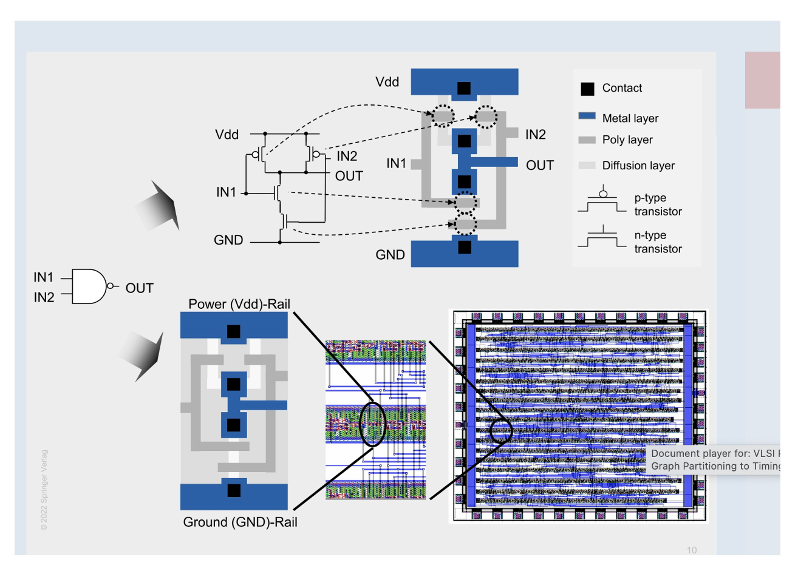
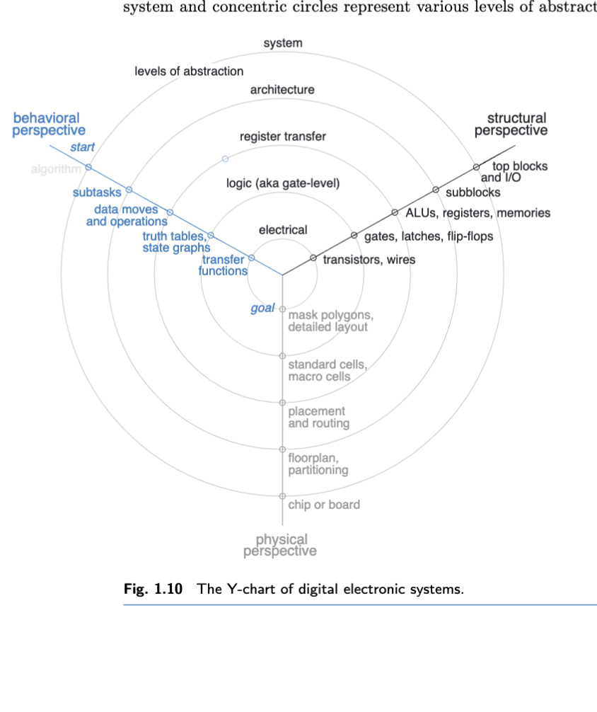
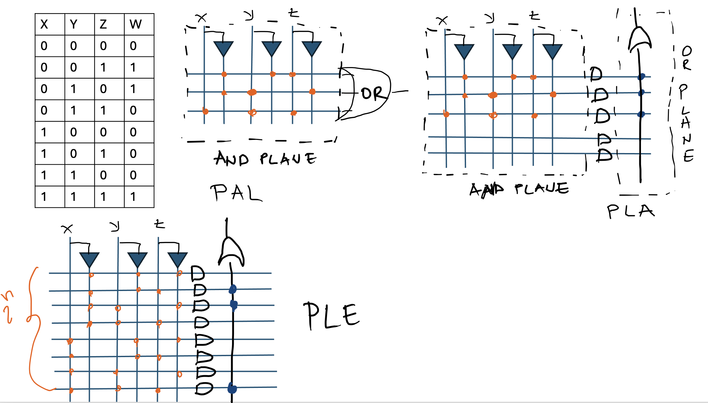
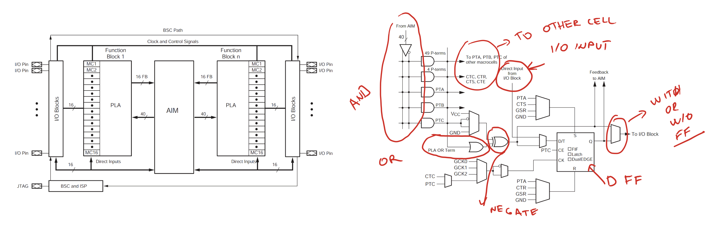

# Digital integrated circuits 

- In simple terms, a miniature low-cost circuit consisting of active and passive elements fabricated on a single-crystal die.

- Based on technology, we can divide Digital ICs (Integrated Circuits) into:
  - Bipolar (BJT)
  - Unipolar -> MOS, CMOS
  - Mixed (BiCMOS)
  
> Bipolar Junction Transistors compared to CMOS
> - Operate at higher frequencies 
> - Better gain
> - Higher output currents
> - However, exhibit higher energy consumption (static consumption is not equal to zero), larger dimensions, and are slower

- Scale of integration: measure of the complexity of digital circuits  
  - Small Scale Integration (SSI): up to 100 basic elements 
  - Medium Scale Integration (MSI): 100 to 1000 basic elements 
  - Large Scale Integration (LSI): 1000 to 10000 basic elements 
  - Very Large Scale Integration (VLSI): 10000 to 100000 basic elements 
  - Ultra Large Scale Integration (ULSI): 100000 to 1000000 basic elements
  - Wafer Scale Integration

- Moore's Law 

## Design methodologies 

- We can divide Digital ICs into: 
  - Standard Integrated Circuits (SIC)
  - Application Specific Integrated Circuits (ASIC)
  - Standard ASIC (SASIC)
  
### Standard Integrated Circuits: 

- Targeted for an unknown customer, e.g. 
  - The end-user does not have any influence on the design 
- Manufactured in large quantities (mass-produced) -> lower costs 
- First SICs were not suited for end-users 
  - Weld SICs together to form the desired system
- Software programmable SICs
  - Programming offers higher flexibility to the end-users
    - User only needs to software program the required processor 
  - Software bottleneck
    - CPUs can be used for different purposes but how effectively 
  
### Application specific integrated circuits 

- Target specific application/field 
- Two types: 
  - Full custom 
  - Semi custom
  
#### Full custom 

- Specially built for a specific user 
  - every layer mask needed for making chip is designed according to customer needs 
- Designed according to the customer's needs e.g. systolic arrays, genome analysis, accelerator 
- Design is strongly confidential 
- High price per product
  - Design cost same as SIC but smaller amount of products 

#### Semi custom 

- Predesigned or preprocessed chips 
  - Only certain layer mask are adapted to customer needs, the rest of them indetical to different customers 
- Manufacturer has on board multiple tested modules, which are connected 
- Based on user requirements, the manufacturer connects them into design, does not start from scratch 
- Can be adapted to multiple users, it is much cheaper per sold item.

 ### ASIC technology 

  #### Standard cells: 
  - small but universal building blocks e.g. logic gates, flip-flops, multiplexers etc.
  - each standard cell has predefined layout and electrical layout 
  - For example, look at the [NAND 2-input gate](https://skywater-pdk.readthedocs.io/en/main/contents/libraries/sky130_fd_sc_hd/cells/nand2/README.html#contents-libraries-sky130-fd-sc-hd-cells-nand2-readme--page-root) from a standard cell library SKY130. It consists of:
    - symbol  
    - schematic
    - GDSII layout
    - HDL description 
  - each cell has as same height, which allows them to be placed in the rows 
  - The cells are connected with wires tat are placed above the rows, so called over-the-cell routing 
  - All standard cells constitute PDK - Process Design Kit 

  
  Source: Kanhg et. al VLSI Physical
Design: From Graph Partitioning to Timing Closure

### Macrocells and megacells : 
- larger logic blocks than standard cells, such as adders, multipliers, registers and even microprocessors 
- like standard cell come with predefinied layout
- difference between megacells and macrocells:
  - megacells designed without prior knowledge of the specific application, allowing for more flexibility in usage.
  - macrocells designed per case basis according to customer needs. 

### Gate Array
- The basic elements are gates or groups of unconnected transistors.
- The logic is implemented by connecting gates with metal wires.
- Originally, gate arrays were separated by routing channels.
- Later versions ("sea of gates") used higher-level metal layers which enabled better density; routing was implemented by shorting or bridging the previously unconnected transistors.

## Design cycle for ASICs

<!-- 
### The Y chart 

- Defines different perspectives digital design (axis) and various level of abstractions (concentric circles)

- Behavioral perspective: what a circuit or system does, not how it is actually built
  - black box method
  - e.g. adder is module for adding. Not interested how is it implemented (CLA, Kogge-Stone, simple adder)
  
- Structural perspective: looking at building blocks is composed and how they connect to each other. 
  - indetify elements of an adder: half/full adders, carry generation circuits p and g 
  
- Physical point of view: how the various HW components and wires are arranged in space availaible on semiconductor chip. 
--->

### Major stages in VLSI design 

Several steps are required for an efficient VLSI design cycle:

1. System-level design
  - Specify functionality, operating conditions, and target characteristics.
  - Partition the system functionality into subtasks.
  - Define interfaces, protocols, data formats, and operating modes.

2. Algorithm design
  - Develop algorithms to meet the data and/or signal-processing requirements.
  - Create algorithmic models for simulation and performance evaluation.
  - Consider numerical precision, complexity, and suitability for hardware implementation.

3. Architecture design
  - Determine the necessary hardware resources and their organization to meet performance, cost, and power constraints.
  - High-level architecture: partition the design, select parallelism and pipelining strategies, choose memory and interconnect structures, and select target cell libraries.
  - Register Transfer Level (RTL): model the circuit as storage elements connected by combinational logic; decide on arithmetic implementations, control strategy (hardwired vs microcoded), scheduling, and binding.

4. Logic design and synthesis
  - Translate RTL into a gate-level netlist and optimize it.
  - Major synthesis steps:
    - Parse and elaborate the design (construct structural representation).
    - Perform logic optimization (technology-independent and technology-dependent).
    - Mapping/technology mapping: reduce high-level constructs to library primitives and map those primitives to standard cells.

5. Verification and testing
  - The most time-consuming phase; verification and testing can consume around 80% of the project effort.
  - Activities include functional simulation, formal verification, static timing analysis, power analysis, emulation/prototyping, DFT insertion, test-vector generation, and silicon bring-up.
  - Iterate fixes across previous stages as bugs and issues are discovered.

### Physical design 

#### Glossary: 

| Term                | Definition                                                                 |
|---------------------|----------------------------------------------------------------------------|
| Standard cell              | building block that implements a logic gate      |
| Macro cell               | building block that is typically larger and more complex than standard cells (a subdesign or full-custom block like a RAM)|
| Terminal               |  logical connection part of a module or cell    |
| Net      | The logical/signal interconnection between instances      |
| PDK | Process Design Kit — data and files provided by the foundry required to design for a process |
| .gds | The layout data format commonly used to transfer IC design layout to mask/laser writing equipment. |
| Die area | Total silicon area available to place pads and core cells. |
| Power planning | Creation of the power distribution network. |

#### Floorplanning 

- Floorplanning is concerned with arranging the major circuit blocks within a rectangular area as small as possible while minimizing interconnection delays. It balances area, timing, and routing congestion to provide a practical foundation for subsequent placement and routing.

#### Place & route 

- Each cell is assigned a specific location on the die before wires are placed.

- Global placement: addresses the chip-wide placement problem and places cells roughly where they belong to optimize for area, routability, and timing.
  > A good global placement minimizes area, reduces routing congestion, and maximizes achievable clock frequency.

- Detailed placement: refines global placement by moving individual cells into legal locations, resolving overlaps, and applying local optimizations to improve timing and routability.

- Estimating interconnect delay:
  - Model wire parasitics (resistance and capacitance) to estimate routing delay.
  - Use wire-length and topology estimates to predict signal propagation and its impact on timing.

- Clock tree synthesis: constructs the clock distribution network to deliver the clock to sinks while controlling insertion delay, skew, and clock uncertainty.
  - In digital design, it is crucial that the clock signal reaches every part of the circuit simultaneously.
  - Similarly, when meeting friends you expect their watches or phones to show the same time as yours.

- Global routing:
  - Partition the chip into routing regions (routing bins or grids).
  - Estimate and allocate routing resources; track congestion (how many wires or routing demands pass through each region).

- Timing repair:
  - Apply fixes (cell resizing, buffer insertion, rerouting, logic restructuring, or placement tweaks) to meet setup, hold, and other timing constraints.
  - Iterate with placement and routing until timing goals are satisfied.

- Detailed routing:
  - Implement the routing plan with exact geometries, obeying design rules and layer assignments.
  - Resolve DRC issues, finalize vias and track usage, and produce the manufacturable layout.

#### Physical design verification 

- Goal: physical layout database that essentially contains the geometrical info for all design layers.
  - This (mask data) is used by the IC foundry as a blueprint for manufacturing.
- This step is most important:
  - Fabricating a chip is expensive and time-consuming.
  - Discovering errors in the design during fabrication is highly undesirable.
- Relies on a number of software tools:
  - DRC (Design Rule Check): examines the conformity of the layout with geometric rules imposed by the target process.
  - Layout extraction: obtains the actual circuit netlist in preparation for the next stage.
  - LVS (Layout vs schematic): compares the layout against the desired one.
  - Post-layout timing verification.
  - Post-layout simulation.

## SASIC 

### Configuration technologies 

- **Static memory**: The key element is an electronic switch (TG, three-state buffer, pass transistors) that gets turned on or off under the influence of configuration bits. The configuration bits are typically stored in SRAM.
- **UV-erasable memory**: The key element is a special MOSFET with a second gate electrode, sandwiched between the actual gate and bulk material (floating gate). A strong lateral field between the drain and source injects electrons into the floating gate. Because the electrons cannot escape, they are trapped in the floating gate. If you want to erase it, you need to apply UV light.
- **Electrically erasable memory**: The key element is a MOSFET with a floating gate that can be electrically erased.
- **Fuse or antifuse**
  - Fuses: narrow bridges of conducting materials that blow when a programming current is forced through.
  - Antifuse: thin dielectrics which separate two conducting layers. After applying programming voltage, the antifuses rupture, thereby establishing a conductive channel.
  - Programming is permanent.

### Organization of hardware resources 

#### Simple programmable logic devices (SPLD):
  - Consist of one or two programmable logic planes: AND plane and OR plane.
  - Remember: we represent each function as a sum of products.
  - Vertical lines: inputs and their inverted values (2*n, n - number of input variables).
  - Horizontal lines: represent product terms.
  
  - PAL - Programmable Array Logic:
    - AND plane is configurable.
    - OR plane is fixed.
  
  - PLA - Programmable Logic Arrays:
    - Both AND and OR planes are configurable.
  
  - PLE - Programmable Logic Element:
    - AND plane is fixed: it consists of all product terms (2^n).
    - OR plane is configurable: connect only terms that evaluate to true in the truth table.

- Complex programmable logic devices (CPLDs) are effectively many SPLDs (small programmable logic devices) integrated on a single chip and connected by a programmable interconnect, giving higher capacity and more flexible routing than a single SPLD.

- Example: CoolRunner®-II (Xilinx) — see https://docs.amd.com/v/u/en-US/ds090

- CoolRunner-2 architecture:
  - I/O blocks: interface the chip to the board and external signals.
  - Functional blocks: 32 identical programmable logic blocks.
  - AIM (Advanced Interconnect Matrix): programmable interconnect that links functional blocks to each other and to the I/O blocks.

- Functional block organization:
  - PAL-like core:
    - 56 product terms (AND terms).
    - 16 OR terms (sum outputs).
  - Additional resources:
    - XOR stage for controlled inversion or parity-style functions of inputs.
    - Flip-flop resources configurable as:
      - D flip‑flop
      - Level-sensitive latch
      - T flip‑flop (toggle)
    - Output multiplexer to select the output source:
      - pure combinational (the PAL/OR outputs)
      - registered/sequential (the chosen flip‑flop/latch output)

- This structure lets CPLDs implement larger combinational and sequential logic by tiling multiple PAL-like blocks and wiring them through the AIM, providing predictable timing and fast I/O performance compared to larger, more routing‑dense FPGAs. 
  

Source: Adopted from official documentation for [CoolRunner II](https://docs.amd.com/v/u/en-US/ds090) 

