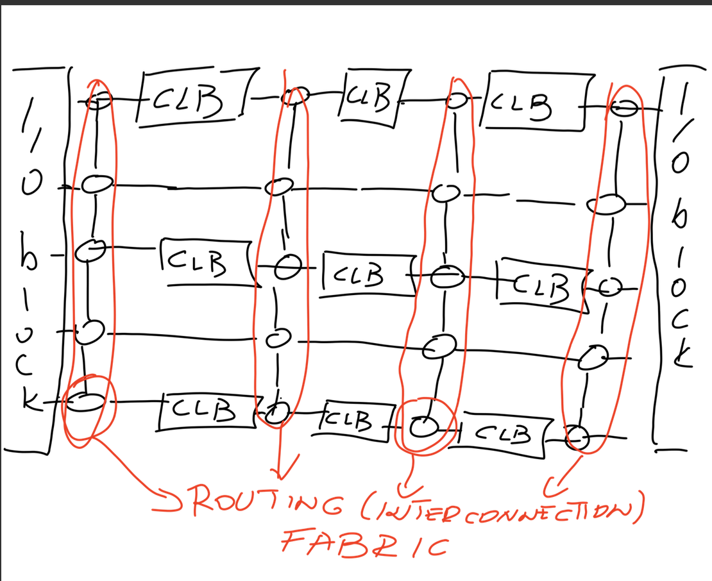
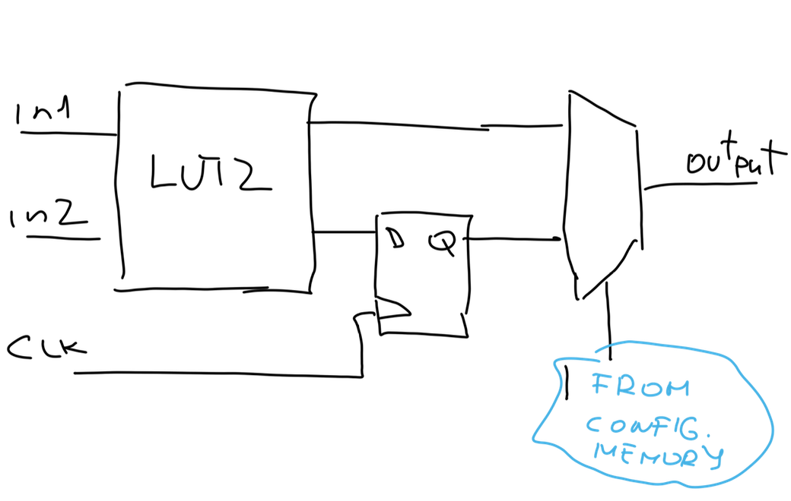
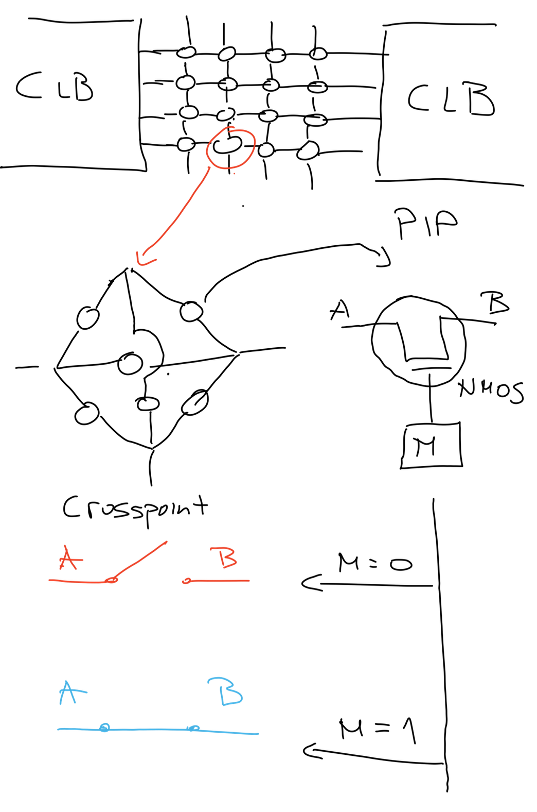
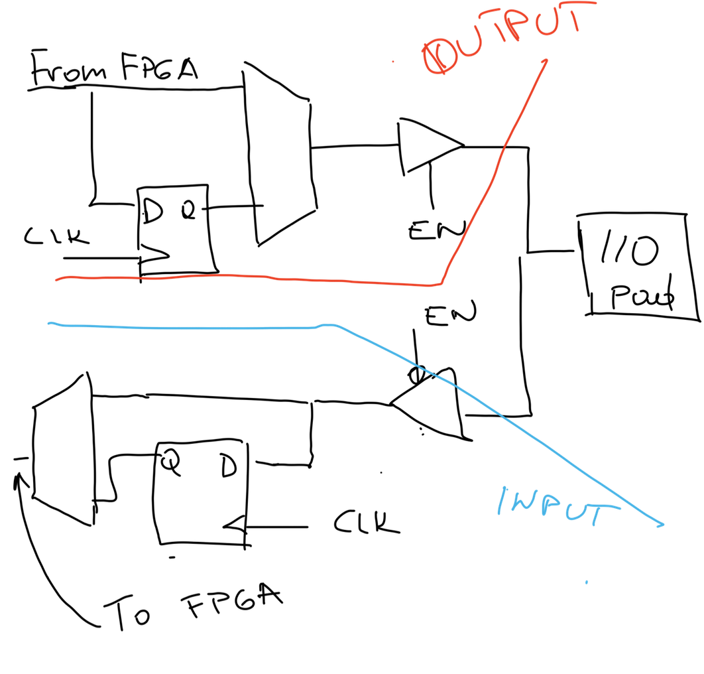
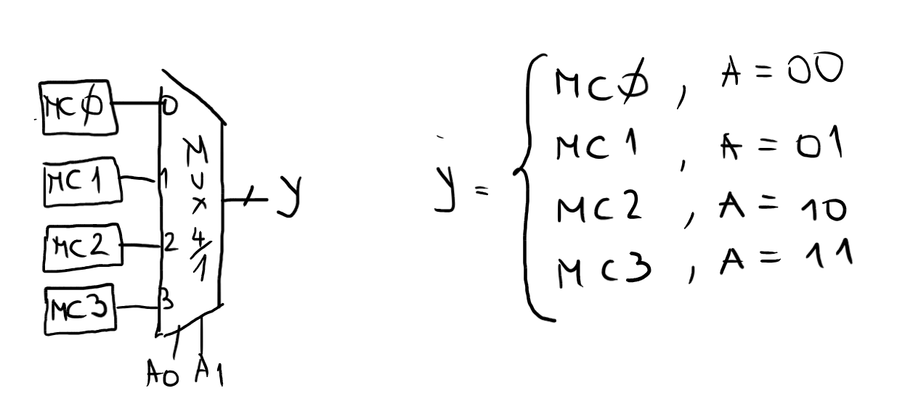
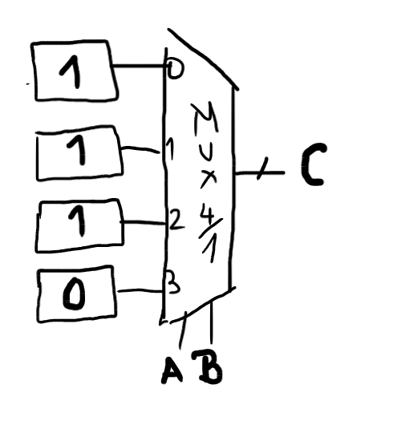
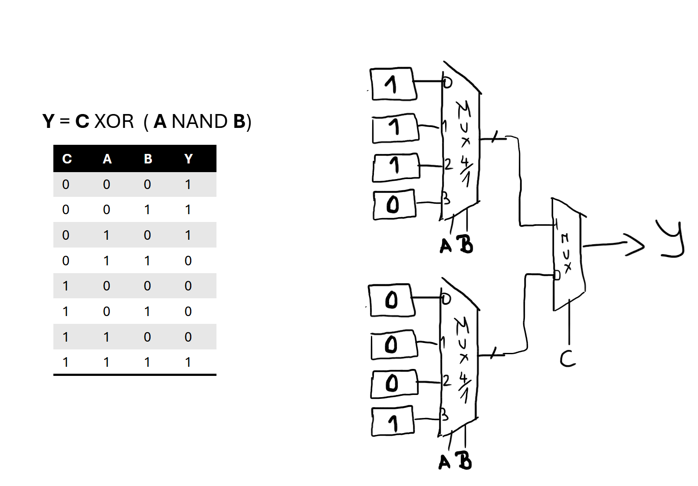

# Intro to FPGAs and SystemVerilog 

- Field Programmable Gate Arrays (FPGA) represent a unique and flexible approach in the realm of digital circuits 

- FPGAs provide a reconfigurable platform that bridges the gap between general-purpose processors and dedicated hardware 

- Users can modify the logical function of FPGAs (after manufacturing), offering adaptability similar to software-based systems 

- FPGA use cases:
    - rapid prototyping 
    - hardware acceleration 
    - similar applications 

## Conceptual architecture of FPGA devices 


- The FPGA consists of three basic building blocks:
  - CLB
  - Routing plane
  - I/O blocks




### CLB — Configurable Logic Block
  - also known as a logic element
  - the primary building block for digital designs; consists of:
      - look-up tables (LUTs)
      - flip-flops (FFs)
      - additional configuration/control logic



### Routing plane 
  - used to connect CLBs to one another
  - relies on Programmable Interconnection Points (PIPs)
      - a PIP is typically a transistor controlled by configuration memory
          - when the configuration bit is 1, the transistor is ON and connects nodes A and B
          - otherwise, A and B remain disconnected
 


### I/O blocks
  - interfaces for connecting the FPGA to external signals and devices
  - each I/O pad can be employed either as input or output  





## Look-up tables (LUTs) as basic elements    

- In FPGAs, we rely on LUTs to implement functions.
- Envision LUTs as little scratchpads. Non-volatile.

- Remember how you implemented functions before: Let's try to implement the NAND function using LUT2.

```
        _____               A | B | C
 A ----|     \             -----------
       | NAND |O---- C      0 | 0 | 1
 B ----|_____/              0 | 1 | 1
                            1 | 0 | 1
                            1 | 1 | 0
```

- We can implement LUT2 with 4 memory cells (MC) and one 4-to-1 MUX as shown in the images below:
    - The inputs of LUTs are referred to as addresses.
    - The output of LUTs is equal to the content of the addressed memory cell.

    

- How to implement the NAND gate using the LUT2:
    - First, save the output values in memory cells.
    - Use inputs of the logical function as address signals.

    

- How to implement three-variable logical functions using previous functions:
    - We need at least 2 LUT2s (8 different outputs).
    - An additional MUX for selecting which intermediate result will be used.

    

- For the memory cells, the FPGAs employ SRAM cells.
    - The SRAM cells are volatile; therefore, any configuration will be erased after powering off the board. 


>> The LUT table are often implemented with `n/(2**n)` decoder and network of `2**n` memory cells. 
>>  - The input of LUTs are reffered to as address 
>>  - The output of LUTs is equal to content of addressed memory cell  -->

## Overview of 7-Series Architecture 

Xilinx® 7 series FPGAs comprise four FPGA families that address the complete range of system requirements, ranging from low-cost, small form factor, cost-sensitive, high-volume applications to ultra high-end connectivity bandwidth, logic capacity, and signal processing capability for the most demanding high-performance applications.

### CLB - Complex Logic Blocks 

- Implement both combinational logic, multiplexers, and storage elements (FF).
- Xilinx differentiates between two types of CLBs: CLB0 (2x SLICEL) and CLB1 (SLICEM & SLICEL).
- SLICEL -> Slice Logical:
    - Four six-input LUTs.
    - Multiplexer for combining more LUTs into one:
        - F7AMUX and F7BMUX: combine two six-input LUTs into one seven-input LUT.
        - F8CMUX: combines all four into one eight-input LUT.
    - Carry chain for calculating carry during addition:
        - Contributes to faster addition.
    - Eight flip-flops:
        - Four of them can be used as latch or FF.
        - Four of them can be used only as FF.
        - Control signals: FF/LAT (mode), INIT1/INIT0 (init), SRHI/SRLO (reset signal).
        - Common clock, CE (Clock Enable) signal.
- SLICEM -> Slice Memory:
    - Difference between SRAM and LUT:
        - During runtime execution, the content of LUT cannot change.
        - Applications:
            - 32-bit shifter.
            - Distributed RAM (concatenating slices of RAM in FPGA fabric).

### Input/Output Pads 

- For connecting with the outside world.

### Memory 

- Block RAMs:
    - Hard-wired RAM in flavors of 36 kB or 18 kB:
        - 36 kB: 32Kx1, 16Kx2, 8Kx4, ...
        - 18 kB: 16Kx1, 8Kx2, ...
        - 32 bits (32 bits data + 4 bits parity).
    - Configurations:
        - Single port RAM.
        - (True) Dual port RAM: In True Dual-Port RAM mode, Port A and Port B are available with two address ports (one at Port A and one at Port B) and two data output ports (one at Port A and one at Port B). Both Port A and Port B can perform read and write operations according to the address provided from its address port. The same address is always referenced when read and write operations are happening at the same time at the same port.
        - Simple dual port RAM: In Simple Dual-Port RAM mode, Port A and Port B are available with two address ports (one at Port A and one at Port B) and one data output port (only at Port B). Port A is the write port that performs write operations according to the write address. Port B is the read port that performs read operations according to the read address and outputs the data.

- FIFO:
    - BRAM with additional logic.

### DSP Slices 

- Dedicated units for fast arithmetic.
- All arithmetic is hard-wired.

### Clock Management 

- Global clock buffers.
- Low skew clock distribution.
- Clock regions - 50 CLB high.
- Clock management tile.

### Interconnection Routing 

- Switch boxes contain multiple switches that permit flexible wiring configurations between different routing tracks in routing channels.

- The configurable routing network on FPGAS is accomplished using programmables switches.
    - simple model: NMOS transistor 
    - programmable interconnect points (PIPs)
        - controlled by configuration SRAM bit 


## Design flow for FPGAs 

The design flow for FPGAs shares similarities with the design flow for ASICs; however, it has distinctive features because the basic elements represent LUTs, not standard cells.

> Introduction to logical circuits and logical design with Verilog: Section 5.5 

1. **Design entry**
2. **Synthesis**: Interprets RTL code and produces a synthesized circuit netlist in a standard EDIF format.
    - Provides preliminary performance estimates.
3. **Translate**:
    - Merges multiple design files into a single netlist.
    - Circuit netlist: Text description of the circuit connectivity.
4. **Mapping**:
    - Groups logical symbols from the netlists (gates) into physical components.
5. **Placing**:
    - Places components on the chip.
6. **Routing**:
    - Connects components and extracts timing data into reports.
    - **Static timing analyzer**:
        - Performs static analysis of the circuit.
        - Identifies critical paths with all sources of delays.
        - Determines maximum clock frequency.
        - Critical path: The longest path from the outputs of registers to the inputs of registers.
7. **Bitstream generation**:
    - Once a design is implemented, you must create a configuration file for the FPGA (bitstream).
    - The bit file can be downloaded directly to the FPGA or converted into a PROM file, which stores programming information.


<!-- ## Literature:

1. https://doc.sling.si/workshops/hls-for-fpga/01-intro/03-fpga/
2. https://docs.amd.com/v/u/en-US/ds180_7Series_Overview
3. https://www.slideshare.net/slideshow/fpga-design-flowpdf/258752175#26 -->