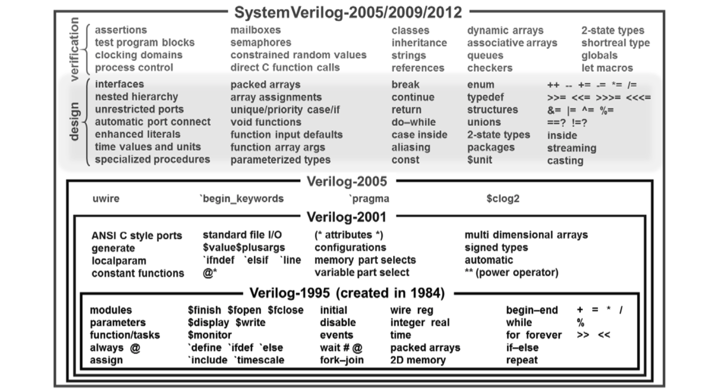

# SystemVerilog 

- Verilog, the predecessor of SystemVerilog
  - was introduced in 1984 with a dual purpose:
    - model digital systems 
    - describe testbenches for checking the functionality of modeled systems 
  - synthesis supports only a subset of the original Verilog language 
  
- IEEE Standards of the Verilog language:
  - First standard in 1995 (1364-1995, nickname: Verilog-1995)
  - Second standard in 2001 (1364-2001, nickname: Verilog-2001)
    - Patch for the synthesizable part in 2002 (1364.1-2002, nickname: Verilog RTL Synthesis)
  - Third and last standard in 2005 (1364-2005, nickname: Verilog-2005)
  
- SystemVerilog builds on the Verilog-2005 standard:
  - Too many new features forced the definition of a new HDL 
  - Original standard in 2005 (1800-2005, aka. SystemVerilog-2005)
    - set of extensions of the Verilog-2005 standard
  - Second standard in 2009 (1800-2009, aka. SystemVerilog-2009)
  - Third standard in 2012 (1800-2012, aka. SystemVerilog-2012)
  - Fourth standard in 2017 (1800-2017, aka. SystemVerilog-2017)
  - Fifth standard in 2023 (1800-2023, aka. SystemVerilog-2023)

> Note: each standard represents an extension of the previous one. In other words, backward compatibility is preserved. For example, a synthesizer for SV-2005 can support constructs from Verilog; however, a synthesizer for Verilog-2001 will report an error if you employ constructs from SystemVerilog. 

- The SystemVerilog standard extends both the verification and the hardware modeling capabilities of Verilog.

- In the course, we will cover only a subset of synthesizable SystemVerilog
  - Reason 1: it is impossible to cover the whole SV in one course
  - Reason 2: when you acquire the basic skills of prototyping with SystemVerilog, you will easily learn new constructs.

## Hardware desription languages 

- HLDs were originally defined to be abloe to model behavour at multiple levels of abstraction 

> Abstraction: allows us to specify how systems will opeate without getting consumed prematurely with implementation details. 

- Examples of HLD usage: 
  - used for variety of purposes in digital system design 
  - high-level behavioral modeling 
  - RTL (Register-Transfer level) modeling 
  - Gate and transistors level netlist 
  - Timing models for timing ismulation 
  - Design verification 

## SystemVerilog constructs 

Look exercise 01. 