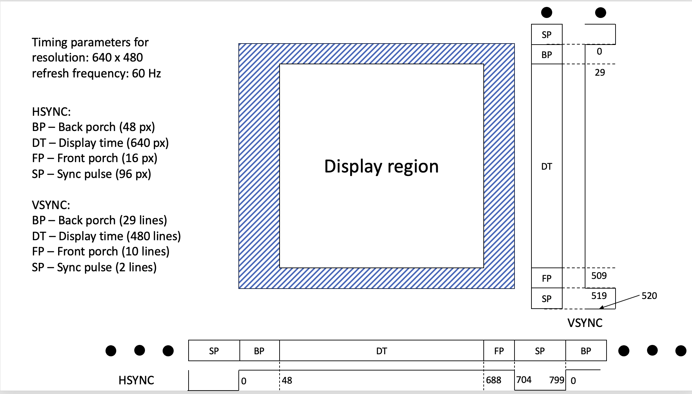

# VGA Controller 


## VGA Controller Overview
  - **VGA (Video Graphics Array):** A standard created by IBM in 1987, characterized by a 15-pin connector.
  - **Purpose of the VGA controller:** Acts as a bridge between the computer’s **video memory** (storing display content) and the screen, displaying images.
  - **Process:**
    - The controller requests pixel data from the computer.
    - Converts pixel data into **analog RGB signals** to drive CRT monitors.
    - Generates synchronization signals (**HSYNC and VSYNC**) to coordinate how the image is drawn on the screen.


## CRT Screen Parts

- **Electron Gun or Cannon:** Generates electron beams that are directed towards the screen.
- **Grid:** Creates an electrostatic field to control electron flow from the electron gun.
- **Deflection Coils:**
  - **Horizontal Coil:** Controls the beam’s left-to-right movement across each line.
  - **Vertical Coil:** Moves the beam down to the next line after completing a horizontal pass.
- **Fluorescent Coating:** Contains red, green, and blue phosphors that light up when struck by electrons, forming the visible image.


## CRT Monitor Functioning (Cathode Ray Tube Monitors)
  - **Electron Beams:** CRT monitors use **electron guns** to create electron beams, which hit the screen’s fluorescent coating to light up pixels in different colors.
  - **RGB Control:** The intensity of the electron beams is controlled by the **RGB signals**, determining the color of each pixel.
  - **Scanning Pattern (Raster):** 
    - The electron beam moves in a raster pattern—**from left to right** across each line.
    - When a line is complete, the beam moves down to the next line using vertical deflection.


## HSYNC and VSYNC Signals
  - **HSYNC (Horizontal Sync):**
    - Controls the **horizontal movement** of the electron beam.
    - Begins with a **Sync Pulse (SP)** to initiate the line drawing.
    - Phases of HSYNC signal:
      1. **SP (Sync Pulse):** No current through the horizontal coil.
      2. **BP (Back Porch):** Current starts to increase, but no visible drawing happens yet.
      3. **DT (Display Time):** Current flows linearly, drawing the visible part of the screen.
      4. **FP (Front Porch):** The current stops increasing, and the beam returns to the start position for the next line.
  
  - **VSYNC (Vertical Sync):**
    - Controls the **vertical movement** of the beam, determining when the electron beam moves to the next line.
    - VSYNC works similarly to HSYNC but controls the vertical deflection coil.


## Timing Parameters for VGA (VESA Standard)

  - **Resolution:** 640x480 pixels at a **60 Hz refresh rate** (meaning one full screen refresh every 16.67 milliseconds).
  - **Pixel Timing:** Each pixel lasts **40 nanoseconds**.
  - **HSYNC Signal Parameters:**
    - Display Time (DT) for one line: 640 pixels × 40 ns = 25,600 ns.
    - Total HSYNC period: 32,000 ns (including visible and invisible parts).
    - Invisible part (20% of total period) lasts 6.4 μs, divided into:
      - **Sync Pulse (SP):** 3.8 μs.
      - **Back Porch (BP):** 1.92 μs.
      - **Front Porch (FP):** 640 ns.
  
  - **VSYNC Signal Parameters:**
    - Total time for a full screen refresh: 16.67 ms.
    - One line takes one HSYNC period (32 μs), resulting in 521 total lines.
    - Of these, 480 lines are visible, with 41 lines as overhead:
      - **SP:** 2 lines.
      - **BP:** 29 lines.
      - **FP:** 10 lines.



## Designing VGA controller 

### System-Level Design

- Includes several steps: 
  - Specify the functionality, operating conditions, and desired functionality.
  - Partition the system's functionality into subtasks.
  - Decide on the data formats, operating modes, exception-handling procedures, and similar aspects.

- Functional descriptions: 
  - Inputs: 
    - Clock signal: synchronizes every circuit inside a digital domain.
    - Reset signal: resets flip-flops to the initial state.
  - Intermediate ("local") signals:  
    - x_pos -> x_position of the current pixel.
    - y_pos -> y_position of the current pixel.
    - video_on -> control status: indicates if the current pixel is part of the display region.
  - Output:
    - hsync: horizontal synchronization signal.
    - vsync: vertical synchronization signal.
    - rgb values:
      - Based on pixel position, outputs the value of the pixel.
      - Draws some predetermined pattern.


### Algorithm design 

The central goal is to describe the data and signal processing requirements with a series of computations, which are described in a programming language or some other form.

### HSYNC Requirements:
- Count pixels.
- HSYNC is equal to 1 during the blanking area display region.
- HSYNC is equal to 0 during the synchronization pulse.

### VSYNC Requirements:
- Count lines.
- VSYNC is equal to 1 during the blanking area display region.
- VSYNC is equal to 0 during the synchronization pulse.
  


### Architecture design 

Involves two levels:
- High-level architecture design:
  - Partition the system into subsystems.
  - Define datapaths and controllers.
  - Define the interaction between subsystems.
- Register transfer level:
  - Circuit is modeled as a collection of storage elements interconnected by purely combinational circuits.

The high-level architecture of VGA controller:


## Designing counter25MHz 

- The VGA standard requires 25 MHz pixel clock
- However, the Nexys A7 board offers 100 MHz clock 
- Solution: The counter25MHz clock will assert pixel tick at every 4th clock tick (100/25 = 4)


### SystemVerilog description 

- Interface 
  - Inputs: 
    - clk -> clock signal 
    - rst -> reset signal 
  - Output:
    - pixel_tick signal
      - Asserted to 1 every fourth cycle of clk signal 

```verilog
module counter25MHz(
  input logic clk,
  input logic rst,
  output logic pixel_tick
)
```

- How to implement the required behavior:
  - We will model the required module as a counter.
  - If the counter state is equal to 3, the module asserts `pixel_signal` to 1; otherwise, it is zero (the counter starts counting from 0).
  - To model the counter state, we introduce the interim/local signal `counter`.

```verilog
logic [1:0] count; // 4-states -> 2 bits 
```

#### Procedural assignments 

- To model the counter, we will employ procedural assignments (PAs).
- SystemVerilog uses PAs to model signal assignments based on events.
- An event can be anything:
  - For sequential logic: the transition of a clock signal (positive or negative edge).
  - For combinational circuits: any change in the level of any input signal.
- PAs can only drive variables.

#### Always block 
- As the name suggests, it executes forever, but only when the trigger/event happens.
- Three types (Introduced by SystemVerilog):
  - `always_ff`, `always_comb`, and `always_latch`
- `always_ff`
  - Used for modeling sequential circuits.
  - The `_ff` suggests that the designer wants to create a design with flip-flops.
    - The sensitivity list must be specified.
      - The list of events/conditions/signals that trigger the execution of the block.
   
   - Example DFF: 
  ```verilog
  module dff(
      input logic clk,
      input logic rst,
      input logic D,
      output logic Q
    );
    // block executes on every positive edge of clk
    // sensitivity list is refered after @ sign 
    always_ff @(posedge clk) begin 
      if (rst) begin
        Q <= 1'b0; 
      end
      else begin
        Q <= D; 
      end
    end
  endmodule  
  ```
- ```always_comb```
  - used for modeling combinational circuits 
  - empty sensitivity list 
    - all input signal are part of sensitivity list 
  - example MUX4to1:
  
  ```verilog
    module MUX4to1(
      input logic [3:0] I,
      input logic [1:0] S,
      output logic O
    );
      // block executes whenever any of the 
      // input signals of block changes 
      always_comb begin 
        case(S)
          2'b00: O = I[0];
          2'b01: O = I[1];
          2'b10: O = I[2];
          2'b11: O = I[3];
          default: O = 1'b0;
        endcase
      end
    endmodule 
  ```


- Lets consider the counter25MHz module 
  - we will use ```always_ff``` block 
  - the sensitivity list will contain the clk signal 
  - the block will be triggered on every positive edge of the clk signal 
  - when the counter state is equal to 3, the pixel_tick signal will be asserted to 1, otherwise 0
  
```verilog
module counter25MHz(
  input logic clk,
  input logic rst,
  output logic pixel_tick
);

  // local signal to store the counter state 
  logic [1:0] count; // 4-states -> 2 bits 

  // always block to model the counter
   always_ff @(posedge clk) begin
        if (reset) begin
            count <= 0;
            pixel_tick <= 0;
        end else begin
            pixel_tick <= 0;
            count <= count + 1  ;
            if (count == 3) begin
                pixel_tick <= 1;
            end 
        end
    end

endmodule
```

### Simulation

- After the code is develop we need to simulate the code to verify the functionality
- We simulate the code using the testbench on the computer
- The testbench is a module that instantiates the module under test and provides the necessary stimulus to the module
- Elements of the testbench:
  - define time scale and resolution
  ```verilog 
  `timescale 1ns/1ns
  ```
  - include the file containing the module under test
  ```verilog
  `include "counter25MHz.sv"
  ```
  - define the testbench module
  ```verilog
  module counter25MHz_tb;
  ```
    - NOTE: the TB does not have any ports
  - define the signals to be used in the TB
  ```verilog
  // Signals
  logic clk;
  logic reset;
  logic count;
   ``` 
  - Instantiation of the module under test
  ```verilog
  // Instantiate the counter module
  counter25MHz uut (
      .clk(clk),
      .reset(reset),
      .pixel_tick(count)
  );
  ```
  - Generate the clock signal
  ```verilog
  // Clock generation
    always #((CLK_PERIOD)/2) clk = ~clk;
  ```
    - ```#((CLK_PERIOD)/2)``` -> delay of half the clock period
    - ```~clk``` -> toggles the clock signal
  
  - Providing stimulus to the module under test
  ```verilog
      initial begin
        $dumpfile("tb.vcd");
        $dumpvars;
        clk = 0;
        reset = 1;
        #((CLK_PERIOD)*2) 
        reset = 0;
        #((CLK_PERIOD)*20) 
        $finish;
    end
  ```
    - ```$dumpfile("tb.vcd")``` -> creates a VCD file to store the simulation results
    - ```$dumpvars``` -> dumps the variables to the VCD file
    - ```reset = 1``` -> asserts the reset signal
    - ```#((CLK_PERIOD)*2)``` -> delay of 2 clock periods
    - ```reset = 0``` -> deasserts the reset signal
    - ```#((CLK_PERIOD)*20)``` -> delay of 20 clock periods
    - ```$finish``` -> stops the simulation

#### Complete testbench code 

```verilog
`timescale 1ns/1ns
`include "counter25MHz.sv"

module counter25MHz_tb;

    // Parameters
    parameter CLK_PERIOD = 10; // Clock period in ns

    // Signals
    logic clk;
    logic reset;
    logic count;
   
    // Instantiate the counter module
    counter25MHz uut (
        .clk(clk),
        .reset(reset),
        .pixel_tick(count)
    );

    // Clock generation
    always #((CLK_PERIOD)/2) clk = ~clk;

    // Reset generation
    initial begin
        $dumpfile("tb.vcd");
        $dumpvars;
        clk = 0;
        reset = 1;
        #((CLK_PERIOD)*2) 
        reset = 0;
        #((CLK_PERIOD)*20) 
        $finish;
    end

endmodule
```

#### Waveforms 

We can run the simulation using the following commands:
  - for the simulation we need to compile the code using the iverilog compiler

```bash
#!/bin/bash

# Define the testbench file
TB_DES="counter25MHz_tb" # name of the testbench file

iverilog -g2012 -o $TB_DES.out $TB_DES.sv
./$TB_DES.out

```

The waveforms are stored in the VCD file
- The waveforms show the behavior of the signals in the simulation
- With the help of waveforms, we can verify the functionality of the module under test


As we can see from the waveforms, the pixel_tick signal is asserted to 1 every fourth cycle of the clock signal.
- this is what we expected from the module
- Note: if you compare the code, you will see that the pixel_tick is delayed by one clock cycle
  - Due to the non-blocking assignment
  - how could you fix this issue?
