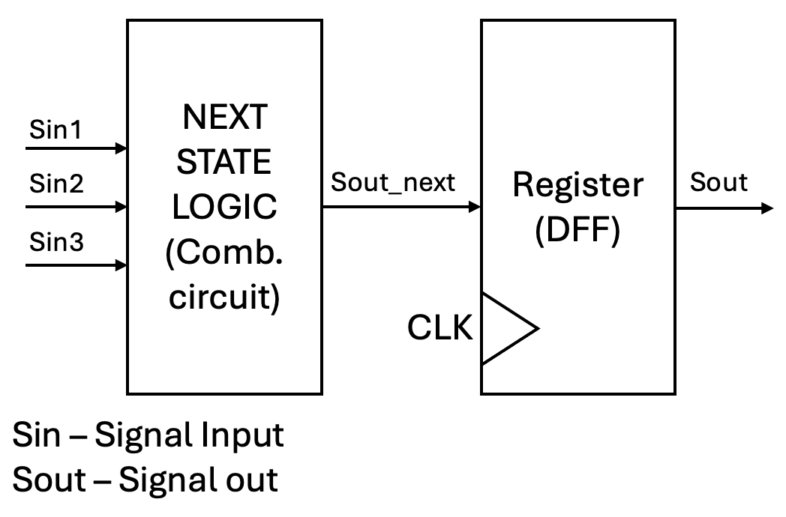
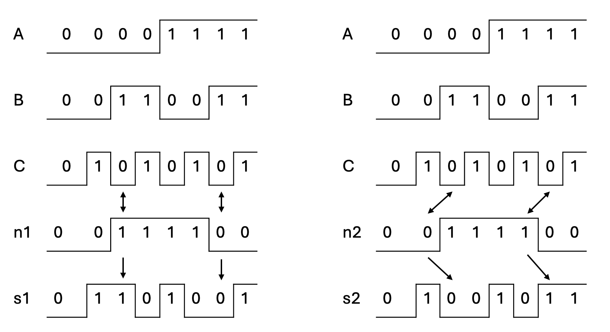
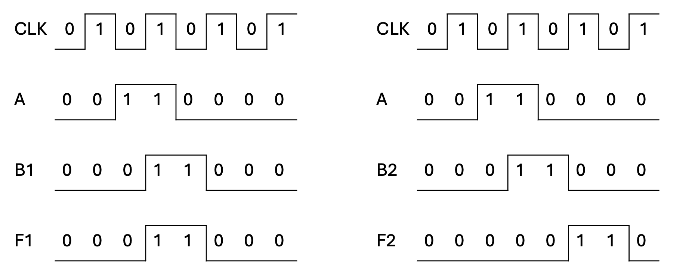

# VGA Controller - part 2 

## HSYNC module 

Let's define the interface of the HSYNC module:
- input `clk` : the clock signal
- input `reset` : the reset signal
- input `pixel_tick` : the pixel tick signal, generated every time we sweep a pixel on the screen. For resolution 640x480, the pixel tick signal is generated every 4 clock cycles.
- output `hsync` : the horizontal synchronization signal
- output `eol` : the pulse signal indicating the end of line
- output `hvideo_on` : the signal indicating that the visible part of the line 
- output `x_pos` : the  x position of current pixel on the screen

### HSYNC module implementation

The main idea behind HSYNC signal: 
- Parameters:
  - `BP` : back porch
  - `DT` : display time
  - `FP` : front porch
  - `SP` : sync pulse
- Implement mod-(BP+DT+FP+SP) counter:
  - For 640x480 resolution, we need a mod-800 counter
  - the counter is incremented every pixel_tick and on the rising edge of the clock signal
- How to generate the output signals:
  - the HSYNC signal is high when the counter is in the range [0, BP+DT+FP], otherwise it is low
  - the EOL signal is high when the counter reaches the value 799
  - the HVIDEO_ON signal is high when the counter is in the range [BP, BP+DT-1]

### Implementation steps:

0. Define the interface of the HSYNC module
```verilog
module hsync (
  input clk,
  input rst,
  input pixel_tick,
  output hsync,
  output eol,
  output hvideo_on,
  output [9:0] x_pos
);
```

1. Define the parameters of the HSYNC module
```verilog
  localparam BP = 48;
  localparam FP = 16;
  localparam SP = 96;
  localparam DT = 640;
  localparam COUNTER_LIMIT = BP + FP + SP + DT; // 800
```

2. Define the internal signals of the HSYNC module
```verilog
 // How many bits does need for counter floor(log2(800)) = 10 
 // count is used to count pixels 
 // x_pos_next is used to store the x position of the current pixel
  logic [9:0] count, x_pos_next; 
  // *_next signals are used to store the next value of the signals
  logic hsync_next, eol_next, hvideo_on_next;
```

3. Implementing the pixel counter 
   
```verilog
  // Implementing the pixel counter
  always_ff @(posedge clk) begin
      // reset logic 
      if(reset) begin
          count <= 0;
          hsync <= 0;
          eol <= 0; 
          hvideo_on <= 0;
          x_pos = 0;
      end else begin
          // increment the counter on the rising edge of the clock signal and when pixel_tick signal        
          if(pixel_tick) begin
              // modulo counter implementation
              // count until you reach the limit
              // when you reach the limit, reset the counter
              count <= count + 1;
              if(count == COUNTER_LIMIT-1) begin
                  count <= 0;
              end
              // save the signal values for the next clock cycle
              hsync <= hsync_next;
              eol <= eol_next; 
              hvideo_on <= hvideo_on_next;
              x_pos <= x_pos_next;
          end
      end
  end
```

4. Generating the values of the output signals
   
```verilog
  // Generating the values of the output signals
  // in the next clock cycle, the value of the signals will be updated
  // the generation is based on comparing the count value with the parameters
  assign hsync_next = count < (BP + FP + DT);
  assign eol_next = count == COUNTER_LIMIT - 1 ;
  assign hvideo_on_next = (count >= BP) && (count < (BP + DT));
  assign x_pos_next = (hvideo_on_next) ? (count - BP) : 0; 
```

> Note: we employ *next signals* to determine the next value of the signals. At the end of the clock cycle, we update the appropriate signals with the values of the *next signals*. We use this technique to avoid the glitches in our design. 
> 
> 


## Blocking assignment vs Non-blocking assignment

Blocking assignments:
- Takes effect immediately
- Denoted with `=` symbol
- Used to model the model combinational logic, when combined with `always_comb` block

Non-blocking assignments:
- Denoted with `<=` symbol
- Used to model the sequential logic, when combined with `always_ff` block

Difference between blocking and non-blocking assignments:
- The difference arrises when there is signal interdependency in code 
- Let's consider the following behaviour when using blocking and non-blocking assignments for designing the combinational logic

```verilog
module xor_gate (
  input logic a,
  input logic b,
  input logic c,
  output logic s1,
  output logic s2
);

logic n1, n2;
// case1 : blocking assignment
always_comb begin
  n1 =  a ^ b;
  s1  = c ^ n1 ;
end

// case2 : non-blocking assignment
always_comb begin
  n2 <=  a ^ b;
  s2  <= c ^ n2 ;
end

endmodule
```

In the case1 (blocking assignment), the value of `n1` is updated immediately after the assignment. Therefore, the updated value of `n1` is used in the next line of the code. However, in the case2 (non-blocking assignment), the value of `n2` is updated at the end of the clock cycle. Therefore, the updated value of `n2` is not used in the next line of the code. Instead the previous value of `n2` is used. The first case models the combinational logic, while the second case does not.



- Let's consider the following behaviour when using blocking and non-blocking assignments for designing the sequential logic

```verilog
module clock_gate (
  input logic clk,
  input logic a,
  input logic f1,
  input logic f2,
);

logic b1, b2;

// case1 : blocking assignment
always_ff @(posedge clock) begin
  b1 =  a;
  f1 = b1;
end

// case2 : non-blocking assignment
always_ff @(posedge clock) begin
  b2 <=  a;
  f2 <= b2;
end

endmodule
```

In case 1 (blocking assignment), the value of `b1` is updated immediately after the assignment. Therefore, the signal `f1` is updated with the value of `b1` in the same clock cycle. However, in case 2 (non-blocking assignment), the value of `b2` is updated at the end of the clock cycle. Therefore, the signal `f2` is updated with the value of `b2` in the next clock cycle. 




## VHSYNC module 

Let's define the interface of the VSYNC module:
- input `clk` : the clock signal
- input `reset` : the reset signal
- input `pixel_tick` : the pixel tick signal, generated every time we sweep a pixel on the screen. For resolution 640x480, the pixel tick signal is generated every 4 clock cycles.
- input `eol` : the pulse signal indicating the end of line
- output `vsync` : the vertical synchronization signal
- output `vvideo_on` : the signal indicating that the visible part of the line 
- output `y_pos` : the  x position of current pixel on the screen

The main idea behind VSYNC signal: 
- Instead of counting the pixels, we count the lines
- To count the lines, we need to increment line counter every time we reach the end of the line and when the pixel tick signal is high
- To generate the output signals, we need to compare the line counter with the parameters of the VSYNC module
- For 640x480 resolution at 60 Hz refresh rate, we need a mod-521 counter

## VGA Controller - top module

Let's define the interface of the VGA controller:
- input `clk` : the clock signal
- input `reset` : the reset signal
- output `hsync` : the horizontal synchronization signal
- output `vsync` : the vertical synchronization signal
- output `vga_r` : the 4-bit red color signal
- output `vga_g` : the 4-bit green color signal
- output `vga_b` : the 4-bit blue color signal
  
> Note: the `vga_r`, `vga_g`, and `vga_b` signals are used to denote the color of the pixel on the screen. Due to the limited number of bits, we can represent only 16 shades for each channel.
> By combining the red, green, and blue channels, we can generate 4096 different colors on the screen.
> The `vga_r`, `vga_g`, and `vga_b` signals are connected to DAC (Digital to Analog Converter) to generate the analog signals for the VGA monitor. More information about the employed DAC can be found in the Figure 8.1 of [Nexys A7 board reference manual](https://digilent.com/reference/programmable-logic/nexys-a7/reference-manual?srsltid=AfmBOorHTp4LYylWp6hKGgnZc4rA8bS3StD3VFtYFvpcDUkXyDhd1NEt).


### VGA Controller implementation

In the VGA controller, we need to instantiate the counter25MHz, HSYNC and VSYNC modules and generate the color signals for the VGA monitor. We refer to this style of design as structural modeling. In the structural modeling, we include lower-level modules in the top module to build the desired functionality. This style of design is similar to the Lego blocks, where we combine different blocks to build a complex structure. 

> Note: When designing submodules, we employed behavioral modeling. In the behavioral modeling, we describe the functionality of the module without specifying the internal structure. 

1. First, we instantiate the counter25MHz module 
   
```verilog
//1. instantiate the 25MHz counter
logic pixel_tick; 
// we employ the interim signal as an output of the counter25MHz module

counter25MHz uut_counter25MHz(
    .clk(clk),
    .reset(reset),
    .pixel_tick(pixel_tick)
);
```
alternatively, we can use the following code snippet to instantiate the counter25MHz module
```verilog
counter25MHz uut_counter25MHz(clk, reset, pixel_tick);
```

2. Second, we instantiate the HSYNC module 
   
```verilog
//2. instantiate the hsync module
logic eol;
logic hvideo_on;
logic [9:0] x_pos;

hsync uut_hsync(
    .clk(clk),
    .reset(reset),
    .pixel_tick(pixel_tick),
    .hsync(hsync),
    .eol(eol),
    .hvideo_on(hvideo_on),
    .x_pos(x_pos)
);
```

3. Third, we instantiate the VSYNC module 
   
```verilog
//3. instantiate the vsync module
logic vvideo_on;
logic [9:0] y_pos;

vsync uut_vsync(
    .clk(clk),
    .reset(reset),
    .pixel_tick(pixel_tick),
    .eol(eol),
    .vsync(vsync),
    .y_pos(y_pos),
    .vvideo_on(vvideo_on)
);
```

4. Fourth, we generate the color signals for the VGA monitor. For this example, we generate the RGB pattern on the screen. Try to generate different patterns on the screen. 
   
```verilog
//4. assign video_on
logic video_on;
assign video_on = hvideo_on && vvideo_on;

// 5. Display image 

// rgb pattern
assign vga_r = ( video_on && y_pos >= 0 && y_pos < 160) ? 4'b1111 : 4'b0000;
assign vga_b = ( video_on && y_pos >= 160 && y_pos < 320) ? 4'b1111 : 4'b0000;
assign vga_g = ( video_on && y_pos >= 320 && y_pos < 480) ? 4'b1111 : 4'b0000;
```

## Connecting the VGA controller on the Nexys A7 board

To display the generated image on the VGA monitor, we need to connect the VGA controller to the VGA monitor. The VGA monitor has the following pins:
- `hsync` on pin `B11`
- `vsync` on pin `B12`
- `vga_r` on pin `A3, B4, C5, A4`
- `vga_g` on pin `C6, A5, B6, A6`
- `vga_b` on pin `B7,C7, D7, A7`

