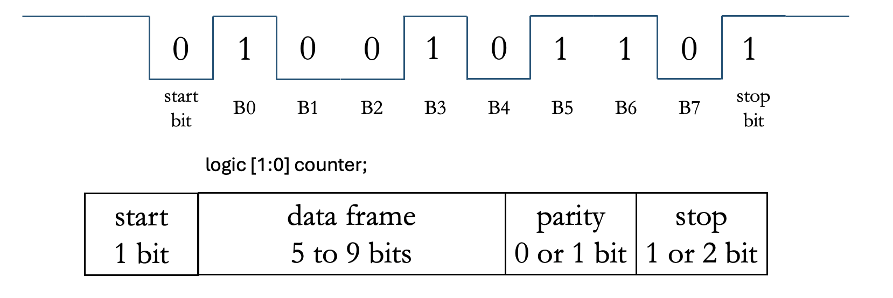
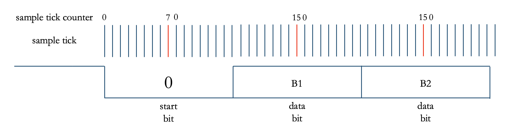
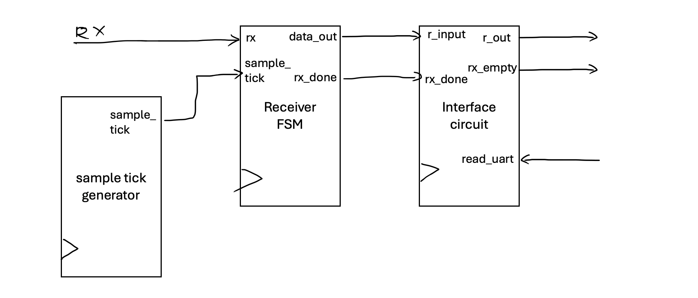
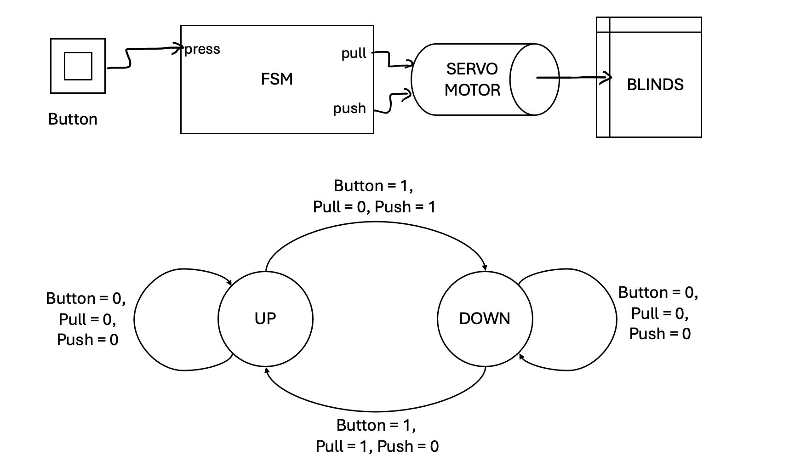
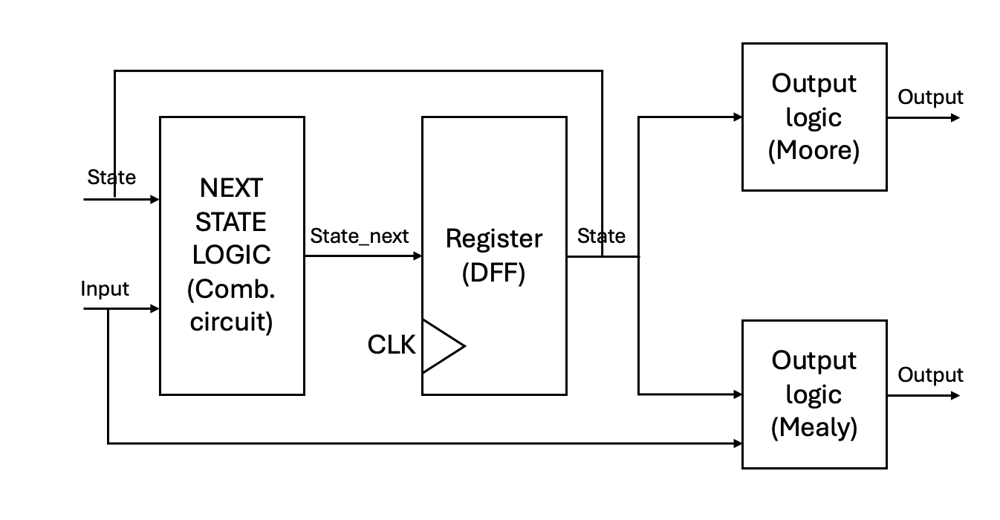
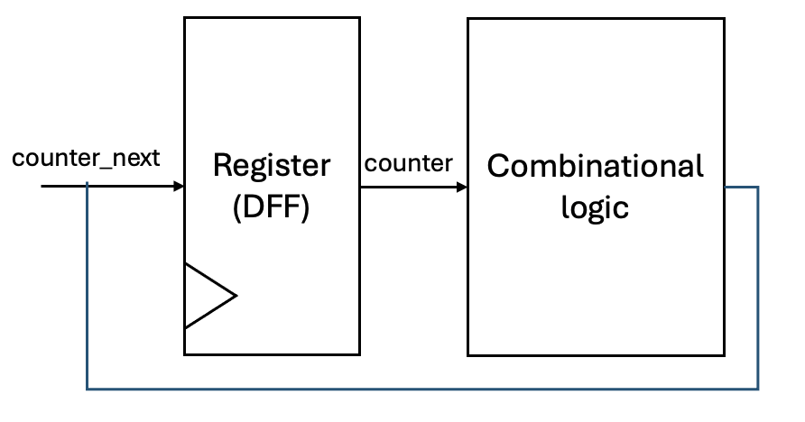

# Modeling digital systems with Finite State Machines: Uart showcase

## Introduction

- Universal Asynchronous receiver trnsmitter (UART) is a widely used serial communication protocol in digital systems. It is a simple and efficient way to transmit data between devices.

- One of the most used device-to-device communication protocols.
  
- Communication can be:
  - Simplex (one-way communication)
  - Half-duplex (two-way communication, but not simultaneously)
  - Full-duplex (simultaneous transmission in both directions)

- UART signals:
  - Tx (transmit)
  - Rx (receive)
  - RTS (Request to send)
  - CTS (Clear to send)

- Where is UART used?
  - Microcontrollers
  - Wireless communication modules
  - GPS modules
  - Bluetooth modules

- Advantages of UART:
  - Simple -> easy to implement in various systems
  - Widespread adoption -> supported by many devices
  - Efficient -> low overhead, high data rate
  - Asynchronous -> no need for a common clock signal
  - Error detection -> parity bit
- Disadvantages of UART:
  - Single-point communication -> one transmitter and one receiver
  - Limited data frame structure 
  - No built-in addressing -> not suitable for multi-device communication
  - power consumption -> consumes power than rival protocols
  
- UART data frame:
  - Start bit
    - used to signal the beginning of a data frame
    - Start of communication: transition from iddle high to low
  - Data bits (5-9 bits)
    - usually 8 bits
  - Parity bit (optional)
    - used for error detection
    - Even or odd parity 
  - Stop bit(s) (1-2 bits)
    - used to signal the end of a data frame
    - End of communication: transition from low to idle high

- UART baud rate:
  - Baud rate is the speed at which data is transmitted



## UART receiver design 

### The oversampling method

- The oversampling method is a common way to implement a UART receiver. It is based on the idea of sampling the incoming signal multiple times per bit period to detect the start and end of a data frame.
- The oversampling method relies on sampling the incoming signal at a rate that is a multiple of the baud rate. The most common oversampling rate is 16x, which means that the incoming signal is sampled 16 times per bit period.
- The oversampling algorithm works as follows:
  - Wait for the start bit (low to high transition) and then start counting the number of samples per bit (symbol) period
  - When the number of samples reaches 7, we are at the center of start bit period. Clear the sample counter.
  - When the number of samples reaches 15, we are at the center of the first data bit period. Sample the incoming signal and store it in a shift register. Clear the sample counter.
  - Repeat the process for the remaining data bits and the parity bit (if present).
  - When the number of samples reaches 15, we are at the center of the stop bit period. This marks the end of the data frame.



## UART receiver architecture

- We will partition the UART receiver into the following blocks:
  - Sample tick generator
  - Receiver state machine
  - interface ciruit 


### Sample tick generator

- The sample tick generator is responsible for generating the sample ticks that are used to keep track of sampling the incoming signal.
- Similar function as pixel tick generator in VGA controller
- For 16x oversampling, we need to generate 16 sample ticks per bit period.
- The baud rate is equal to the 19200 bps
- The interface:
  - clock: 100 MHz
  - reset: synchronous reset signal
  - sample_tick: output signal that generates the sample ticks
- Design:
  - Counter that increments on each (system) clock cycle (GP_counter module)
  - When the counter reaches the value corresponding to the sample tick period, the sample_tick signal is asserted
    - The counter is then reset to zero
  - Calculating the counter limit:
    - Baud rate = 19200 bps
    - Sample rate = 16x
    - Clock frequency = 100 MHz
    - Counter limit = Clock frequency / (Baud rate * Sample rate) ≈ 326 ticks
      - Every 326 ticks, the sample_tick signal is asserted

### Receiver state machine

- The receiver state machine is responsible for controlling the operation of the UART receiver.
- We employ a simple finite state machine (FSM) to implement the receiver state machine.

#### Finite state machine

- Finite state machine (FSM) are used to model of a system that transists between a finite number of internal states in response to external inputs.
- Transition depends on the current state and the external input.
- Role: 
  - model controllers of a large digital system:
    - examines the external commands and state of the system
    - activates the appropriate output signals to control the operation of the data path

- Describing the functionality of FSMs:
  - State diagram consists of:
    - consists of states, 
    - defining the transitions between states
    - defining the outputs associated with each state
- Example: 
  - Push-button controller
  - Design a system that allows user to open or close window blinds in accordance to the blinds current state
    - Blinds down: push-button pull the blinds
    - Blinds up: push-button push the blinds

- FSM design steps:
  - Define the states of the system
    - Blinds up, Blinds down
  - Define the transitions between states
    - Push-button press: Blinds up -> Blinds down
    - Push-button press: Blinds down -> Blinds up
    - No action: Blinds up -> Blinds up
    - No action: Blinds down -> Blinds down
  - Define the outputs associated with each state
    - Blinds up and button pressed: pull = 1, push = 0
    - Blinds down and button pressed: pull = 0, push = 1
    - Blinds up and no button pressed: pull = 0, push = 0
    - Blinds down and no button pressed: pull = 0, push = 0



- Logic synthesis of FSMs 
  - Two types of FSMs:
    - Mealy machine: outputs depend on the current state and the external input
      - previous example is a Mealy machine
    - Moore machine: outputs depend only on the current state 
      - example: traffic light controller

  - Structural design of FSMs:
    - State register: stores the current state of the FSM
      - holds the current state of the FSM
      - upon receiving an external input, the FSM transitions to the next state
      - number of bits in the state register depends on the encoding of the states:
        - binary encoding: log2(number of states) bits
          - the simplest encoding 
          - each state is represented by a unique binary number
        - gray encoding: log2(number of states) bits
          - each state is represented by a unique gray code
          - only one bit changes between adjacent states, reducing the power consumption
        - one-hot encoding: number of states bits
          - only one bit is high at a time
          - the position of the high bit indicates the current state
    - Next state logic: determines the next state based on the current state and the external input
    - Output logic: determines the output based on the current state and the external input



  - Algorithmic state machine (ASM) chart:
    - A graphical representation of the FSM
    - Consists of:
      - State box: represents the current state of the FSM
      - Next state logic: determines the next state based on the current state and the external input
      - Output logic: determines the output based on the current state and the external input
      - External inputs: inputs to the FSM
      - External outputs: outputs of the FSM
    
#### UART receiver FSM

- Interface:
  - Parameters:
    - `DATA_BITS`: number of data bits per frame
    - `STOP_BITS`: number of stop bits per frame
  - Ports:
    - `clock`: 100 MHz
    - `reset`: synchronous reset signal
    - `sample_tick`: input signal that generates the sample ticks
    - `rx`: input signal that carries the received data
    - `data_out`: output signal that carries the received data
    - `rx_done`: output signal that indicates that a data frame has been received
  
- Define the states of the UART receiver FSM:
  - We employ a enumeration type to define the states of the FSM
    - Enumerated type is a user-defined data type that consists of a set of named values called enumerators
  - The states of the UART receiver FSM are:
    - IDLE: waiting for the start bit
    - START: sampling the start bit
    - DATA: sampling the data bits
    - STOP: sampling the stop bit

```verilog
// define the states
typedef enum logic [1:0] { // binary encoding
    IDLE,
    START,
    DATA,
    STOP
} state_uart_t;

state_uart_t state, next_state;
```
>Alternatively, we can employ a one hot encoding to define the states of the FSM:
>
>```verilog
>typedef enum {
>   IDLE = 4'b0001,
>   START = 4'b0010,
>   DATA  = 4'b0100,
>   STOP = 4'b1000
>} state_uart_t;
>```

- Define the internal signals: 
```verilog 
// signal declarations 
logic [DBITS-1:0] shift_reg, shift_reg_next; // shift register to store the received data bits  
logic [3:0] s_counter, s_counter_next; // counter for sample_tick
logic [3:0] n_counter, n_counter_next; // counter for number of symbols 
logic rx_done_next; // flag to indicate that a data frame has been received
```
> Discussion:
> Diffence between `signal` and `signal_next`?
> The `signal` is the current value of the signal, while the `signal_next` is the next value of the signal. The `signal` is updated with the value of `signal_next` at the next active edge.
> 
> Example: counter with clock enable signal. The `counter` is the current value of the counter, while the `counter_next` is the next value of the counter. The `counter_next` is updated at the end of the clock cycle based on the current value of the counter and the clock enable signal.
> ```verilog
>always_ff @(posedge clock) begin
>   if (reset) begin
>        counter <= 0;
>    end else if (clock_enable) begin
>        counter <= counter_next;
>    end
> end
> 
> assign counter_next = counter + 1;
> ```
> 