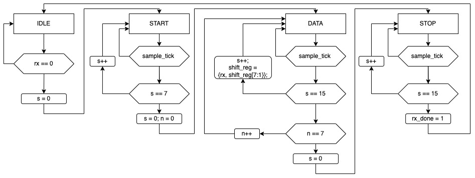
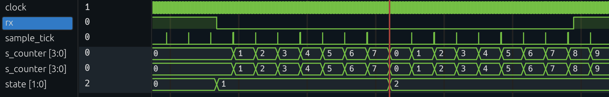
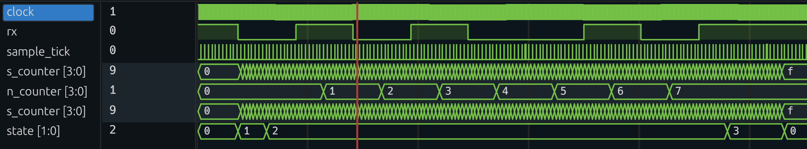

# Modeling digital systems with Finite State Machines: Uart showcase

## Building the UART FSM 

### State registers 

The main task of state register or state memory is to update the current state of the FSM. The state register is a D flip-flop that stores the current state of the FSM. The state register is updated at the positive edge of the clock signal. Besides the current state, we are updating also the current state of the auxiliary signals, that we definied. 

```verilog
// state register
always_ff @(posedge clock) begin : state_reg
    if (reset) begin
        state <= IDLE;
        shift_reg <= 0;
        s_counter <= 0;
        n_counter <= 0;
        rx_done <= 0;
    end
    else begin
        state <= next_state;
        shift_reg <= shift_reg_next;
        s_counter <= s_counter_next;
        n_counter <= n_counter_next;
        rx_done <= rx_done_next;
    end
end
```


### The AFSM diagram 

The AFSM diagram is a graphical representation of the FSM. The AFSM diagram is a directed graph where the nodes represent the states of the FSM and the edges represent the transitions between the states. We will us it to visualize the behavior of the FSM and to identify the states and transitions of the FSM. 

Four states are defined in the UART FSM: IDLE, START, DATA, and STOP. The IDLE state is the initial state of the FSM and is the state in which the FSM waits for the start bit of the UART frame. The START state is the state in which the FSM reads the start bit of the UART frame. The DATA state is the state in which the FSM reads the data bits of the UART frame. The STOP state is the state in which the FSM reads the stop bit of the UART frame.




### Transition logic

The transition logic is a combinational logic that determines the next state of the FSM based on the current state and the input signals. Which is the next state of the FSM depends on the current state and the input signals. The transition logic is implemented using a case statement that checks the current state and the input signals and assigns the next state to the next_state signal. 

As we define the combination logic, we need to consider all the possible transitions between the states and all the possible value of internal signals. One way to do that is to define the default values of signals and states. We implement this by assigning the value of next signals with the current ones.

```verilog
    // next state logic
    always_comb begin : next_state_logic
        // default values, otherwise we will have a latch
        // need to cover all the cases 
        next_state = state;
        rx_done_next = 0; // default value for rx_done
        shift_reg_next = shift_reg;
        s_counter_next = s_counter;
        n_counter_next = n_counter;

        case (state) // the transistions using state 
```

#### Transition from IDLE to START state: 

We stay in IDLE state until we receive the start bit (rx line is equal to 0). When the start bit is received, we move to the START state. Additionally, reset the counter that counts the number of sample ticks (`s_counter_next`). 

```verilog
    IDLE : begin
        if (rx == 0) begin
            next_state = START;
            s_counter_next = 0;
        end
    end
```

#### Transition from START to DATA state:

we stay in the START state until we receive 8 sample tick. This is our sign that we have received the start bit and we can move to the DATA state. Before we move to DATA state, we need to reset the counter that counts the number of sample ticks and the counter that counts the number of bits received (`n_counter_next`). 

```verilog
START : begin
            if(sample_tick) begin
                if (s_counter == 7) begin
                    // cannot do n_counter = 0, two blocks power the same signal 
                    n_counter_next = 0;
                    s_counter_next = 0;
                    // do not forget to update state 
                    next_state = DATA;
                end else begin
                    s_counter_next = s_counter + 1;
                end
            end
        end 
```

#### Transition from DATA to STOP state:

We stay in the DATA state until we receive 8 data bits. To receive the sample bit, we need to get 16 sample ticks. When we detect 15th sample tick, we sample the signal by shifting the value of the shift register (`shift_register`). Then we increment the counter of received bits (`n_counter_next`). If we have received all the bits, we move to the STOP state. 

```verilog
DATA : begin
            if(sample_tick) begin
                if (s_counter == 15) begin
                    s_counter_next = 0;
                    shift_reg_next = {rx,shift_reg[DBITS-1:1]};
                    if (n_counter == DBITS-1) begin
                        next_state = STOP;
                    end else begin
                        n_counter_next = n_counter + 1;
                    end
                end  else begin
                    s_counter_next = s_counter + 1;
                end
            end
        end
```

#### Transition from STOP to IDLE state:
In the STOP state, we wait for the stop bit. When we receive the stop bit, we move to the IDLE state. We also set the `rx_done_next` signal to 1, which indicates that we have received the UART frame. 

```verilog
STOP : begin
            if (sample_tick) begin
                if (s_counter == STOP_TICKS - 1) begin
                    rx_done_next = 1;
                    next_state = IDLE;
                end else begin
                    s_counter_next = s_counter + 1;
                end
            end
        end
```

#### Interface circuit 

The interface circuit consists of the buffer and control logic. The buffer stores the received data while the control logic generates the status of buffer (e.g. empty or full). 

Concerning the buffer, we employ one D flip-flop to store the received data. The buffer is updated at the positive edge of the clock signal and when the `rx_done` signal is equal to 1. 

```verilog
always_ff @(posedge clock) begin : OneWordBuffer
    if (reset) begin
        r_out <= 0;
    end else begin
        if (rx_done) begin
            r_out <= r_input;
        end
    end
end
``` 

The control logic outputs only one signal, `rx_empty`. The signal is equal to 1 when the buffer is empty, i.e. consumer device has read the data. The consumer request the data by setting the `rd_uart` signal to 1. Vice versa, the buffer is full when the `rx_done` signal is equal to 1.

```verilog
assign set_flag = rx_done;
assign clr_flag = rd_uart;

always_ff @( posedge clock ) begin : rx_empty_gen
    if (reset) begin
        flag <= 0; // on reset buffer is empty 
    end else begin
        if (set_flag) begin
            flag <= 1;
        end else begin
            if (clr_flag) begin
                flag <= 0;
            end
        end
    end
end

assign rx_empty = ~set_flag;
```

## UART system in action

To test the system, we provided the testbench. In the provdided testbench, we employ the task `send_symbol` that generates uart frame. A task is a reusable block of code that can be called from different parts of the testbench. 

```verilog
task send_symbol(input logic [SYMBOL_LENGTH-1:0] symbol);
    integer i;
    begin
        // Start bit
        rx = 0;
        #(1000000000 / BAUD_RATE);

        // Data bits
        for (i = 0; i < SYMBOL_LENGTH; i = i + 1) begin
            rx = symbol[i];
            #(1000000000 / BAUD_RATE);
        end

        // Stop bit
        rx = 1;
        #(1000000000 / BAUD_RATE);
    end
endtask
```

### Waveforms 

The bellow figure shows the waveform, which illustrates the transition between the states of the UART FSM. The waveform shows the transitions between the IDLE, START and DATA. As we can see from the waveform, the FSM moves from the IDLE state to the START state when the rx is goes to 0. Then, the FSM start counting the number of sample ticks and moves to the DATA state when the 8 sample ticks are received.



For transition from DATA to STOP state, we need to receive 8 data bits. The bellow figure shows the waveform, which illustrates the transition between the states of the UART FSM. The waveform shows the transitions between the DATA and STOP. 


