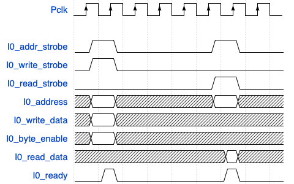

# FPRO SoC platform

- FPRO stands for Fun and Professional platform, built from scratch by [Pong P. Cho](https://engineering.csuohio.edu/eecs/pong-p-chu-associate-professor), in the book ["FPGA Prototyping by SystemVerilog Examples: Xilinx MicroBlaze MCS SoC Edition"](https://www.amazon.com/FPGA-Prototyping-SystemVerilog-Examples-MicroBlaze/dp/1119282667) 

- Features:
  - simple: easy to use and understand
  - portable: all the IP cores are developed from scratch
  - functional: can be used for real-world applications, but not as powerful as commercial platforms
  - educational: designed for educational purposes
  
- The platform consists of:
  - processor module
  - FPRO bridge and bus 
  - Memory-mapped I/O (MMIO) module
  - Video System module


## Processor module:

- any 32-bit RISC processor can be used
- On the class, we use the [MicroBlaze processor](https://www.amd.com/en/products/software/adaptive-socs-and-fpgas/microblaze.html) and [MicroBlaze MCS](https://www.amd.com/en/products/software/adaptive-socs-and-fpgas/mb-mcs.html)
- Microblaze MCS (Microcontroller system):
  - complete computer system centered around the MicroBlaze processor
  - besides the processor, it includes RAM and IO module with standard set of microcontroller interfaces
  - all the components are constructed from FPGA resources
- Microblaze processor
  - 32-bit processor with RISC architecture
  - "soft" processor, i.e. implemented in the FPGA fabric
  - can be customized to the user requirements
    - e.g. floating-point unit, memory management unit, caches, etc.
    - AXI protocol for communicating with the peripherals
    - Note: the MicroBlaze MCS does not support the AXI protocol

## Memory-mapped I/O (MMIO) subsystem:

- MMIO scheme: use load and store instructions to access the memory-mapped registers
  - I/O devices and memory are mapped to the same address space
  
- I/O register map:
  - I/O device is just a set of registers
    - each register is mapped to a specific address
    - each register depicts a specific function of the device

### I/O address space of the FPRO SoC platform:

- The FPro bridge and MMIO controller do the decoding and multiplexing to access the I/O devices and its registers
  - 22-bit address bus for addressing the 32-bit registers
- MMIO subsystem specification
  - provides space for 64 I/O devices or slots (0-63)
  - each device has 32 registers (0-31)
  - each register is 32-bit wide
  - the address of the register is 22-bit wide:
    -  ADDRESS[20:16] - don't care bits, not involved in the address decoding
    -  ADDRESS[10:5] - address of slot 
    -  ADDRESS[4:0] - address of register


### Interface with the bus

- Main task in SoC is to integrate the custom logic into the system

- To attach the custom logic to the bus and access I/O core, the following steps are required:
  1. Add a wrapper around the custom logic to form a compatible I/O core that can interact with the bus
  2. Update system-level decoding (write operation) and multiplexing (read operation) logic to circuit to indetify and access the I/O core

- Wrapping circuit : 
  - enables core to be addressed by the bus
  - makes the core as a small memory-mapped device
  - contains:
    - decoding circuit for writing into the registers
    - multiplexing circuit for reading from the registers

-  System-level decoding and multiplexing logic:
   - used to identify the I/O core
   - multiplexes the data bus to read the data from the I/O core
  
#### Write interface and decoding logic

- Signals involved in the write operation:
  - `address`: 21-bit wide address bus
  - `write_data`: 32-bit wide data bus
  - `write`: write signal

- Write operation:
  1. Master device places the address and data on the bus and asserts the write signal
  2. The data, write signal, and lower part of address (register address) is broadcasted to all the I/O cores
  3. Sequence of decoders takes the upper part of address (slot address) and generates the enable signal for the designated I/O core
     -  The selected I/O core reads the data and write signal and stores the data into the register
     -  the rest of the I/O cores ignore the data and write signal
 
- System level decoding logic:
  - compares the slot address with the address of the each I/O core
  - if the slot address matches the address of the I/O core, the chip signal (`cs`) is generated for the I/O core

- Write interface of wrapping circuit:
  - consist of the decoding logic and the D flip-flops to store the data
  - decoder takes the register address, slot address, and write signal as inputs
    - outputs the enable signal for the designated register of the I/O core
  


#### Read interface and multiplexing logic

- Signals involved in the read operation:
  - `address`: 21-bit wide address bus
  - `read`: read signal
  - `read_data`: 32-bit wide data bus
 
- Read operation:
  1. Master device places the address on the bus and asserts the read signal
  2. The address and read signal is broadcasted to all the I/O cores
  3. Sequence of multiplexers transmit the data from the designated I/O core to the data bus

- System level multiplexing logic:
  - multiplexes the data from the I/O cores to the data bus
  - the multiplexer is controlled by the slot address
    - the data from the designated I/O core is transmitted to the data bus

- Read interface of wrapping circuit:
  - consists of the multiplexing logic
  - multiplexer takes the slot address and the data from the I/O core as inputs
    - outputs the data to the data bus
    - which register is selected is determined by the register address


## FPRO Bus protocol and MMIO slot protocol specification

- Bus represents the communication path that connects multiple components in the system
- System bus: communication path between the processor and the memory and I/O devices
- Slave/Master relationship: 
  - Master (CPU): initiates the data transfer
  - Slave  (IO device): responds to the data transfer request
- Bus, collection of lines:
  - Address line: carries the address of the memory location or the I/O device
  - Data line: carries the data to be written or read
  - Control line: signals that control the data transfer
    - e.g. read, write, chip select, etc.
- SoC interconnect:
  - distributed communication infrastructure that connects the components in the system
  - addresses the disadvantages of the centralized bus
    - e.g. scalability, performance, etc.
  - AXI (Advanced eXtensible Interface) protocol: widely used in the SoC interconnect
    - point-to-point connection
    - five channels: address, data, read, write, response

### FPRO bus specification

- synchronous bus that supports only read and write operations
- contains following singals:
  - `fp_address`: 22-bit wide address signal used to indetify the destination I/O core or memory location in video subsystem
  - `fp_rd_data`: 32-bit wide data signal, used to obtain the data from the destination I/O core 
  - `fp_wr_data`: 32-bit wide data signal, used to write the data to the destination I/O core
  - `fp_rd`: read signal
  - `fp_wr`: write signal
  - `fp_mmio_cs`: chip select signal used for activating the MMIO subsystem
  
#### Timing diagram of the FPRO bus

- The timing diagram depicts the read and write operations on the FPRO bus


Write operation:
    - t1 - master initiates the write operation 
    - t2 - address, write data, and write signal are valid 
    - t3 - the decoded signal reaches the I/O core
    - t4 - the destination I/O core stores the data into the register


Read operation:
    - t5 -  master initiates the read operation
    - t6 - address and read signal are valid
    - t7 - the data from the I/O core is transmitted to the master
    - t8 - the master reads the data from the data bus
    
Requirement for the FPRO bus:
  - the read and write operations should be completed within the clock cycle


## Development FPRO SoC platform in SystemVerilog

### Developing the I/O cores 

- needs to be in comliance with the slot interface
- MMIO slot interface:

| Signal Name | Width | Function |
|-------------|-------|----------|
| `address` | 5-bit | Identifies the register within the I/O core |
| `wr_data` | 32-bit | Data to be written to the I/O core |
| `rd_data` | 32-bit | Data read from the I/O core |
| `write` | 1-bit | Write signal to initiate a write operation |
| `read` | 1-bit | Read signal to initiate a read operation |
| `cs` | 1-bit | Chip select signal to activate the I/O core |

Basic steps to develop the I/O core:
    1. Develop the custom logic 
    2. Determine the I/O register map
    3. Develop the wrapping circuit
    4. Develop driver 

In the next section, we will illustrate the development of the I/O core using the example of the Timer core.

#### Example: Timer core

1. Custom logic:
   - Timer core: simple 64-bit counter that counts the number of clock cycles 
   - signal `go`: start the timer
   - signal `clear`: clear the timer
  ```verilog
    always_ff @(posedge clock) begin
        if (reset) begin
            count <= 0;
        end else begin
            if (clear) begin
                count <= 0;
            end
            else begin
                if (go) begin
                    count <= count + 1;
                end
            end
        end
    end
  ```
2. I/O register map:
   
| Register Name | Width | Functionality | Offset |
|---------------|-------|---------------|--------|
| `timer_config`       | 32-bit| Bit 0 denotes the clear signal, while bit 1 denotes the go signal|0x0|
| `count_low`          | 32-bit | Lower 32-bit bits of counter register  |0x1|
| `count_high`       | 32-bit | Upper 32-bit bits of counter register  | 0x2|

3. Wrapping circuit:
   - decoding logic: 
     - takes the address, write signal, and register address as inputs
     - generates the enable signal for the register `timer_config`
    ```verilog
        // decoding logic
        logic [31:0] config_reg; // 0x00

        // wr_enable signal 
        logic wr_en;

        // Remember: everything you want to write is contained in the wr_data signal
        // the trick is to decode the address and write signal to know where to write
        assign wr_en = cs & write & (address == 5'h00); // here 5'h00 is the address of the timer_config register

        always_ff @(posedge clock) begin
            if (reset) begin
                config_reg = 0;
            end else begin
                if (wr_en) begin
                    config_reg <= wr_data;
                end
            end
        end

        // connect config reg with go and clear 
        assign go = config_reg[1];
        assign clear = config_reg[0];
    ```
    - multiplexing logic:
      - takes the address and the data from the I/O core as inputs
      - generates the data to be transmitted to the data bus
     
    ```verilog
          logic [31:0] count_low; // 0x01
            logic [31:0] count_high; // 0x02    

            // give values to regs 

            assign count_low  = count[31:0];
            assign count_high = count[63:32];

            // read interface 


            always_comb begin : MUX_for_count
                case (address)
                    5'h01: begin
                        rd_data = count_low;
                    end 
                    5'h02: begin
                        rd_data = count_high;
                    end
                    default: begin
                        rd_data = 5'h00;
                    end
                endcase
            end
     ```
4. Develop driver:
   - We will develop the driver later in the text 


### MMIO controller

- MMIO controller: used to access the I/O cores
- performs system-level decoding and multiplexing
  - the decoding circuit generates the 64 chip select signals to each I/O core
  - the multiplexing circuit transmits the data from the I/O core to the data bus
    - controlled by the slot address
    - implemented as 64-to-1 multiplexer
#### Developing the MMIO controller

1. Remember: the address is 22-bit wide, but only 6 bits are used for the slot address, and 5 bits are used for the register address
    ```verilog
       // module and register address
      logic [4:0] reg_addr;
      logic [5:0] slot_addr;

      assign reg_addr = mmio_address[4:0]; // last 5 bits 
      assign slot_addr = mmio_address[10:5];

    ```
2. Write interface:
   1. Decoding circuit:
      - generates the chip select signal for the I/O core
      - One of the I/O core will have 1 in the chip select signal, the rest will have 0
      - Dynamic indexing is used to generate the chip select signal
    
      ```verilog
         // address decodig  
         always_comb begin : decodeLogic
             slot_cs = 0;
             if (slot_enable) begin
                 slot_cs[slot_addr] = 1;
             end
         end    
      ```
    2. Broadcast register address, write data, and write signal to all the I/O cores
      - we are using the generate block to broadcast the signals to all the I/O cores
      ```verilog
        // broadcast everything
        generate
        genvar i;
        for ( i=0 ; i<64 ; i++ ) begin
            assign slot_reg_addr[i] = reg_addr;
            assign slot_write_data[i] = mmio_write_data;
            assign slot_write[i] = mmio_write;
        end
        endgenerate
      ```

3. Read interface and multiplexing logic:
   1. Multiplexing circuit:
      - transmits the data from the I/O core to the data bus
      - controlled by the slot address
      - implemented as 64-to-1 multiplexer
      ```verilog
        always_comb begin : readData
          mmio_read_data = 0;
          if (mmio_read) begin
              mmio_read_data = slot_read_data[slot_addr];
          end
        end
      ```
    2. Broadcast the read signal to all the I/O cores:
       - we are using concatenation to broadcast the read signal to all the I/O cores
       ```verilog
          // broadcast read request
          assign slot_read = {64{mmio_read}}; // repeat 64 times
       ```


### MMIO subsystem
 
- MMIO subsystem: used to access the I/O cores
  - consists of the MMIO controller and the I/O cores
- the MMIO controller interprets the signals coming from FPRO bridge and outputs the signals to the I/O cores
- The base address of I/O cores depends on the index of chip select signal, which is generated by the MMIO controller
  - the first bit of the address is used to access the GPO, therefore the base address of the GPO is 0x0000
  ```verilog
    // GPO
    GPO gpo_inst (
        .clock(clock),
        .reset(reset),
        // Because the GPO is the first slot, the base address is 0x00
        // on hw level we implement this by routing the signals with index 0
        // the mmio_controller will generate appropriate signals
        // based od address[10:5] == 6'h02
        .address(slot_reg_addr[0]),
        .rd_data(slot_read_data[0]),
        .wr_data(slot_write_data[0]),
        .read(slot_read[0]),
        .write(slot_write[0]),
        .cs(slot_cs[0]), 
        .data_out(data_out)
    );
  ```
  - the second bit of the address is used to access the GPI, therefore the base address of the GPI is 0x0020
  ```verilog
    // instantiate the GPI
    GPI gpi_inst (
        .clock(clock),
        .reset(reset),
        // Because the GPI is the second slot, the base address is 0x01
        // on hw level we implement this by routing the signals with index 1
        // the mmio_controller will generate appropriate signals
        // based od address[10:5] == 6'h01
        .address(slot_reg_addr[1]),
        .rd_data(slot_read_data[1]),
        .wr_data(slot_write_data[1]),
        .read(slot_read[1]),
        .write(slot_write[1]),
        .cs(slot_cs[1]), 
        .data_in(data_in)
    );
  ```
  - the third bit of the address is used to access the Timer, therefore the base address of the Timer is 0x0040
  ```verilog
    // instantiate the timer
    timer timer_inst (
        // Because the timer is the third slot, the base address is 0x02
        // on hw level we implement this by routing the signals with index 2
        // the mmio_controller will generate appropriate signals
        // based od address[10:5] == 6'h02
        .clock(clock),
        .reset(reset),
        .address(slot_reg_addr[2]),
        .rd_data(slot_read_data[2]),
        .wr_data(slot_write_data[2]),
        .read(slot_read[2]),
        .write(slot_write[2]),
        .cs(slot_cs[2]) 
    );
  ```

  - we effectively register the I/O cores by connecting them in the MMIO subsystem

### FPRO bridge

- translate the MCS I/O bus protocol bus's write and read signals to the FPRO bus protocol

#### MCS I/O bus protocol

- signals involved in the MCS I/O bus protocol:
  - `io_address_strobe`: address strobe signal, used to indicate that the address is valid
  - `io_write_strobe`: write strobe signal to initiate a write operation
  - `io_read_strobe`: read strobe signal to initiate a read operation
  - `io_address`: 32-bit wide address signal used to identify the destination I/O core attached to the MCS I/O bus
  - `io_write_data`: 32-bit wide data signal, used to write the data to the destination I/O core
  - `io_read_data`: 32-bit wide data signal, used to obtain the data from the destination I/O core
  - `io_ready`: indicates whether transaction has been received
  - `io_byte_enable`: which byte of the `io_write_data` data is valid





Write operation:
  1. Master device places the address and data on the bus and asserts the address and write strobe signal
  2. Slave assets the `io_ready` signal, when the transaction is received
  3. Optionally, the master can assert the `io_byte_enable` signal to indicate which byte of the data is valid

Read operation:
  1. Master device places the address on the bus and asserts the address and read strobe signal
  2. Slave gets request and places the data on the `io_read_data` line 
  3. Slave assets the `io_ready` signal, when the read data is available

#### Developing the FPRO bridge

1. address translation
   - bits [31:24] of MCS address is used to indetify the FPRO bridge and the FPRO bus
     - the parameter `BRG_BASE` is used to identify the FPRO bridge base address
     - Note: the FPRO bridge acts as an I/O device on the MCS I/O bus
    ```verilog
      assign mcs_bridge_enable = (io_address[31:24] == BRG_BASE[31:24]);
    ```
   - bits [23] of of MCS address is used to enable the MMIO subsystem
      - if the bit is 0, the MMIO subsystem is enabled
    ```verilog
      assign fp_mmio_cs = mcs_bridge_enable & (io_address[23] == 0);
    ```
   - bits [22:2] of MCS address is used as the FPRO address
      - the FPRO address is 22-bit wide
      - we remove last 2 bits of MCS address to get the FPRO address, as the FPRO addressess 32-bit registers (32/8 = 4 bytes -> log2(4) = 2)
      - Note: the MCS address space is byte addressable, while the FPRO address space is 32-bit word addressable
    ```verilog
      assign fp_address = io_address[22:2];
    ```
2. Control line conversion 
   - pass the read and write signals from the MCS I/O bus to the FPRO bus
   - assert `io_ready` as every transaction is done in one cycle in the FPRO bus
   
    ```verilog
      assign fp_wr = io_write_strobe;
      assign fp_rd = io_read_strobe;
      assign io_ready = 1'b1; // always ready
    ```

3. Data conversion
   - pass the data from the MCS I/O bus to the FPRO bus
    ```verilog
      assign fp_wr_data = io_write_data;
      assign io_read_data = fp_rd_data;
    ```

## Determining the I/O address of the FPRO bridge

- To determine the address of register in the I/O core, we need to know:
  - the base address of the FPRO bridge (`BRG_BASE`)
  - the slot address of the FPRO bridge
  - the register address of the FPRO bridge
  - Note: we shift the slot address by 5 bits, as each slot has 32 registers
  - Note: we shift the `((SLOT_ADDRESS << 5) + REGISTER_ADDRES)` address by 2 bits, as address space of MCS I/O bus is byte addressable, while the FPRO address space is 32-bit word addressable
```
  BRG_BASE = 32'hC000_0000
  MMIOSUB_BASE = BR_BASE  // MMIO subsystem
  SLOT_ADDRESS = 6'h02 // timer
  REGISTER_OFFSET = 5'h01 // upper 32 bits of the counter

  ADDRESS = MMIOSUB_BASE + ((SLOT_ADDRESS << 5) + REGISTER_OFFSET)<<2)
```

