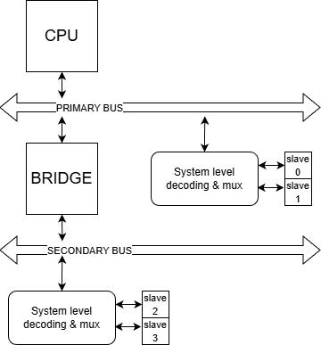
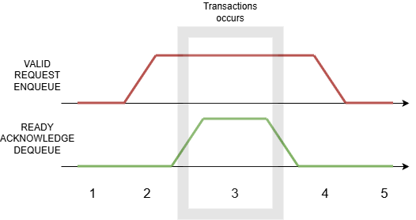

# On-Chip Communication

- Two types of interconnect:
    - on chip interconnect, which conects:
      - processor
      - IP blocks
      - on-chip memory
    - off-chip interconnect, which connects:
      - off-chip peripherals
      - off-chip memory
      - off-chip ASIC components

- Communication considerations:
  - bandwidth: amount of data that can be transferred in a given time
  - latency: time it takes between the request and response
  - master/slave architecture:
    - master: initiates the communication
    - slave: responds to the master's request
  - concurrency: multiple masters can access the bus simultaneously
  - multiple clock domains: different parts of the system can operate at different clock frequencies

- System level trends:
  - interconnects (i.e. wires) scale slower than transistors
- The most critical aspect of the system performance is the interconnect architecture
  - up to 50% of the total system power is consumed by the interconnect
  - largest chunk of design effort is spent on the interconnect
  
## On-chip communication articles

- Comunication topology:
  - how the components are connected to each other
  - types of topologies: simple shared bus, crossbar switch, hierarchical bus, rings, mesches, etc.
- Communication protocols:
  - defines how you manage the communication between the components, e.g. how the data is transferred, etc.
  - how do we prioritize the access to the interconnect when multiple masters are trying to access it simultaneously

- Mapping of system components to the interconnect:
  - how the components are connected to the interconnect
  - e.g. which component is connected to which bus, which component is a master or a slave, etc. 
  - e.g. principle of locality: components that communicate frequently should be placed close to each other to minimize the communication latency

## Basic operations with system bus

- Bus represents a set of signals that are connected to multiple IP blocks or components 
  
- Basic signals include:
  - clock signal and reset signal for synchronization and global reset
  - address bus to specify the address of the data to be read or written
  - data bus to transfer the actual data
    - read and write data 
  - control signals to manage the bus operations, e.g. read/write signal, chip select signal, etc.

- The basic SoC consists of following components:
  - Master - initiates the communication, e.g. processor. We can have multiple masters in the system
  - Slave - responds to the master's request, e.g. memory, peripherals. We can have multiple slaves in the system
  - Decoder - decodes the the address and selects the appropriate slave
    - System-level decoding and multiplexing logic:
      - decoder: used to select the appropriate slave based on the address and send data to the IP core
      - multiplexes the data bus to read the data from the IP core
  - Bridge - connects two different types of buses, e.g. AHB to APB bridge
    - protocol conversion: converts the protocol of one bus to another bus
    - data width conversion: converts the data width of one bus to another bus
    - clock domain crossing: handles the communication between two different clock domains

FIGURE 1: Basic SoC components

### Basic bus operations and protocol   

- Two components:
  - interface: set of signals that are used to connect IP cores
  - protocol: set of rules that define how the communication is managed between the components.
    - e.g. how the data is transferred

- Handshaking protocol:
  - one of the most common protocols used in on-chip communication
  - defines flow control between the master and slave
  - the greates strength: allows master and slave to operate at their own pace
  - basic signals:
    - valid or request or enqueue signal: indicates that the master has data to send and is ready to send it
    - ready or acknowledge or dequeue signal: indicates that the slave is ready to receive data
  - data transfer occurs when both valid and ready signals are high
  - The figure below shows a simple handshaking protocol with a single master and single slave
    - first cycle: both valid and ready signals are low, no data transfer occurs
    - second cycle: master asserts valid signal to indicate that it has data to send
    - third cycle: slave asserts ready signal to indicate that it is ready to receive data
      - now both valid and ready signals are high, so data transfer occurs
    - fourth cycle: the slave deasserts ready signal to indicate that it has received the data
    - five cycle: the master deasserts valid signal to indicate end of data transfer
  

FIGURE 2: Handshaking protocol with single master and single slave
