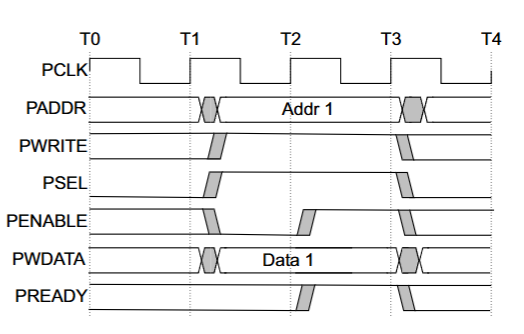
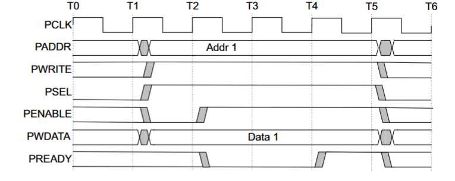
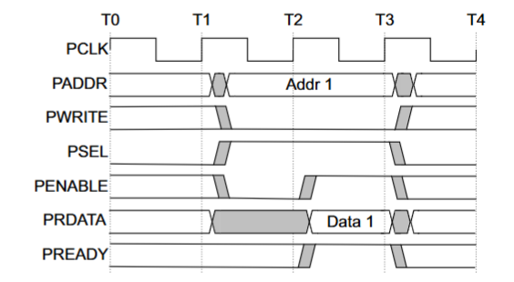
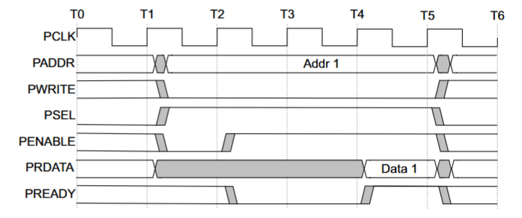
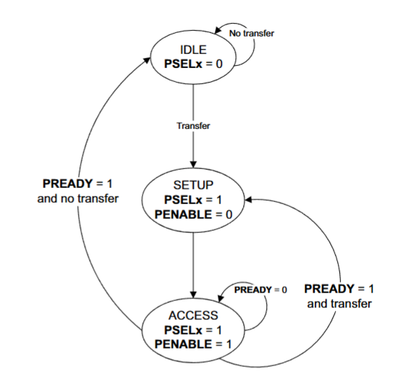

# Advanced Peripheral Bus (APB)

- The Advanced Peripheral Bus (APB) is part of the AMBA (Advanced Microcontroller Bus Architecture) family and is mainly intended for connecting low-bandwidth peripherals.

- The APB is designed to be simple and efficient, with a focus on minimizing power consumption and reducing the complexity of the bus interface.

- The APB is typically used for peripherals that do not require high-speed data transfer, such as UARTs, timers, and GPIOs.

- It takes at least two clock cycles to complete a transfer on the APB.
  
- It is not pipelined, meaning that a new transfer cannot begin until the previous one has completed.

## Interface signals

| Signal Name | Source       | Width       | Description                                                                 |
|-------------|--------------|-------------|-----------------------------------------------------------------------------|
| PCLK        | System Clock | 1 bit       | Clock signal used to synchronize the APB interface.                        |
| PRESETn     | System Reset | 1 bit       | Active low reset signal to initialize the APB interface.                   |
| PADDR       | Master       | Typically 32 bits | Address bus specifying the address of the peripheral being accessed.       |
| PSEL        | Master       | 1 bit per peripheral | Peripheral select signal indicating which peripheral is being accessed.    |
| PENABLE     | Master       | 1 bit       | Enable signal indicating the second cycle of a transfer.                   |
| PWRITE      | Master       | 1 bit       | Write signal indicating whether the transfer is a read (0) or write (1).   |
| PWDATA      | Master       | Typically 32 bits | Write data bus carrying data to be written to the peripheral.              |
| PRDATA      | Slave        | Typically 32 bits | Read data bus carrying data read from the peripheral.                      |
| PREADY      | Slave        | 1 bit       | Ready signal indicating that the peripheral is ready to complete the transfer. |
| PSLVERR     | Slave        | 1 bit       | Slave error signal indicating an error during the transfer.                |


## Transfers 

### States

We distinguish three phases of a write transfer:
- Idle phase: the bus is idle, no transfer is taking place
- Setup phase: PSEL is asserted to select the peripheral, PWRITE is asserted to indicate a write transfer, PADDR and PWDATA are valid
- Access phase: PENABLE is asserted to indicate the second cycle of the transfer, PREADY is monitored to determine when the transfer is complete. After the PREADY signal is active, the transfer will be completed in the next clock cycle. This marks the end of the transfer, and all signals can be deasserted.


### Write transfer 


- Signals involved in a write transfer:
  - PSEL: Peripheral Select
  - PENABLE: Enable
  - PWRITE: Write signal
  - PADDR: Address bus
  - PWDATA: Write data bus
  - PREADY: Ready signal from the slave

FIGURE 1: APB write transfer timing diagram without slave wait states




FIGURE 2: APB write transfer timing diagram with slave wait states



### Read transfer

- Signals involved in a read transfer:
  - PSEL: Peripheral Select
  - PENABLE: Enable
  - PWRITE: Write signal
  - PADDR: Address bus
  - PRDATA: Read data bus
  - PREADY: Ready signal from the slave

FIGURE 1: APB read transfer timing diagram without slave wait states




FIGURE 2: APB read transfer timing diagram with slave wait states



### Slave error

- Indicates an error during the transfer
  - e.g. invalid address, peripheral not ready, etc.
  - transaction might or might not be have been completed

- PSLVERR is asserted by the slave during the access phase to indicate an error
  - PSLVERR is consider to be valid when PSEL, PENABLE, and PREADY are high
  - 

<!-- Why we have PENABLE
  - PENABLE indicates that the operation is active
  - it is used to differentiate between the time when we have valid address and the time when data is valid
  - The AXI has two separate channels for address and data, so we don't need PENABLE

- Source: reddit: https://www.reddit.com/r/FPGA/comments/1568vxe/what_is_the_purpose_of_the_penable_signal_on_an/
If I remember correctly, PSEL qualifies the address and PENABLE qualifies the data. APB transaction always have a single address cycle before the data phase, hence PENABLE being asserted one cycle after PSEL. You could generate PENABLE in the slave theoretically but there is a single master and multiple slaves so this is less efficient.
-->
### State machine 


Three states:
- IDLE: no transfer is taking place - default state
- SETUP: PSEL is asserted to select the peripheral. The SETUP phase only lasts for one clock cycle.
- ACCESS: PENABLE is asserted to indicate the second cycle of the transfer, PREADY is monitored to determine when the transfer is complete.
  - Exit condition:
    - PREADY is low: stay in ACCESS state
    - PREADY is high: 
      - if no more transfers: go to IDLE state
      - if more transfers: go to SETUP state

FIGURE 3: APB state machine




## Developing APB master 

- APB master is used to initiate the communication with the APB slave
- We implement APB master as a state machine 
  - Moore machine: outputs depend only on the current state
  - States: IDLE, SETUP, ACCESS
  - Triggerd by the i_valid signal, which indicates that a transfer should be initiated

### Defining the interface

```verilog
module APB_master #(
    // Configurable Parameters
    parameter DW = 32 ,  // Data width
    parameter AW = 32  ,  // Address width
    // Derived Parameters
    localparam CW = 1 + DW + AW ,  // Command width  {pWRITE, pWDATA, pADDR}  
    localparam RW = 1 + DW              // Response width { pSLVERR, pRDATA}
)(
    input logic pCLK,
    input logic pRESETn,
    // Command & Response Interface
    input  logic [CW-1:0] i_cmd   ,  // Command
    input  logic          i_valid ,  // Denotes transfer 
    output logic [RW-1:0] o_resp  ,  // Response
    output logic          o_ready ,  // Ready

    // APB signals
    output logic [AW-1:0] pADDR,
    output logic  pSELx, // for each peripheral
    output logic  pENABLE,
    output logic  pWRITE,
    output logic [DW-1:0] pWDATA,
    input logic [DW-1:0] pRDATA,
    input logic  pREADY,
    input logic  pSLVERR
);
```

- The command interface includes:
  - i_cmd: command signal that includes pWRITE, pWDATA, and pADDR
  - i_valid: indicates that the command is valid and a transfer should be initiated
  - o_resp: response signal that includes pSLVERR and pRDATA
  - o_ready: indicates that the master is ready to accept a new command
  - APB signals: pADDR, pSELx, pENABLE, pWRITE, pWDATA, pRDATA, pREADY, pSLVERR
- Parameters:
  - DW: data width
  - AW: address width
  - CW: command width (derived from DW and AW)
  - RW: response width (derived from DW)

### State machine implementation


- Define the state machine for the APB master
  
```verilog
// APB Master FSM
    typedef enum logic [1:0] {
        IDLE,
        SETUP,
        ACCESS
    } state_apb;

    state_apb state, next_state;
```
- State transition and next state logic
```verilog
    // State Transition
    always_ff @(posedge pCLK) begin
        if (!pRESETn) begin
            state <= IDLE;
            pWRITE <= 0;
        end
        else begin
            state <= next_state;
            pWRITE <= i_cmd[CW-1]; // specific to I/O bus
        end
    end
```
- Next state logic

```verilog

    // Next State Logic
    always_comb begin
        next_state = state;
        case (state)
            IDLE: begin
                if (i_valid) begin
                    next_state = SETUP;
                end
            end
            SETUP: begin
                next_state = ACCESS;
            end
            ACCESS: begin
                if (pREADY && i_valid) begin
                    next_state = SETUP;
                end else if (pREADY && !i_valid) begin
                    next_state = IDLE;
                end
            end
            default: next_state = state;
        endcase
    end
```
- Decode the state to generate the APB signals
```verilog
    // Output Logic
    // APB signals that are independent of the current state
    assign pADDR = i_cmd[AW-1:0];
    assign pWDATA = i_cmd[CW-2:AW];
    // APB signals that depend on the current state
    assign pENABLE = (state == ACCESS) ? 1 : 0;
    assign pSELx = (state == SETUP  || state == ACCESS) ? 1 : 0;
    // To command interface
    assign o_ready = pENABLE && pREADY; // to signal that we sucessfully read the data. Figure 3.4 T2 cycle or Figure 3.5 T4 cycle
    assign o_resp = {pSLVERR, pRDATA}; // Forward the  slave error and read data. Read data is always valid when pREADY is high.
```  