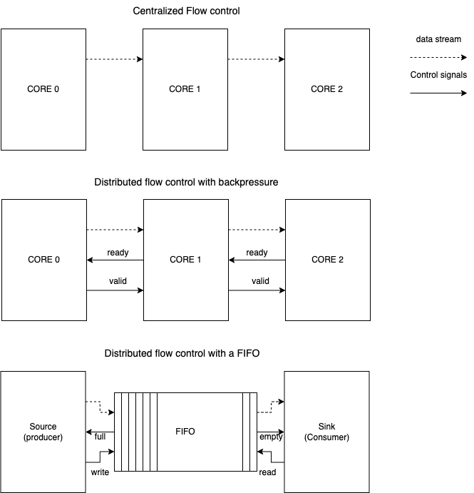

# FPro SoC platform - Video subsystem


## Introduction

- Video system generates and processes the pixel data stream.
- In this lesson, we will introduce the basic concepts of video systems and how they are implemented on the FPro SoC platform.
  - The video subsystem illustrates the concept of stream interfaces and how they are used to connect different modules in the system.

- Video display:
  - we introduced the VGA and video display at the beginning of the course.

### Stream interface

  - The video subsystem is a good example of a system that uses stream interfaces to connect different modules.
  - Stream interfaces are used to connect modules that generate or process data streams.
  - To introduce the concept of stream interfaces, we will start by identifying the differences between stream interfaces and random access interfaces.
    - Random access interface: 
      - We used a random access interface to access our I/O devices in FPro SoC.  
      - The random access interface was used to develop the memory-mapped I/O subsystem.
      - Random access interface: Data can be accessed in the same amount of time regardless of the physical location of the data.
      - Signals: Address line, data line, and control line (select operation: read or write).
    - Stream interface:
      - data is transmitted in a steady, continuous flow.
      - provides a high-speed unidirectional flow between two points.
      - Lines:
        - Data line: carries the data.
        - flow-control line (optional): regulates the data rate
        - control lines are not needed because the data is transmitted in one direction between the two points.
        - Address lines are not needed because the data is transferred in huge batches and in a predefined order.
          - Predefined order: Remember how the pixel data are stored in raster scan order.

#### Flow control of stream interface

- The flow control line is used to regulate the flow data between the source and the sink.
  - Source: module that generates the data.
  - Sink: module that consumes the data.
- Three basic schemes:
  - Centralized flow control: 
    - A central module controls the flow of data between the source and sink.
    - No flow control line is needed.
  - Distributed flow control with backpressure:
    - simple handshake protocol.
    - valid and ready signals.
      - valid: asserted when new data becomes available. Generated by the source.
      - ready: asserted when the sink is ready to accept new data. Generated by the sink.
      - The source waits for the ready signal to be asserted before sending new data.
      - The sink waits for the valid signal to be asserted before reading the data.
    - Backpressure: the sink can slow down the source by deasserting the ready signal.
  - distributed flow control with a FIFO buffer:
       - The FIFO acts as a cushion between the source and sink.  
       - The source sends data to a FIFO buffer.
       - The sink reads data from the FIFO buffer. 
       - The FIFO buffer has a limited size.
       - The source can send data to the FIFO buffer even if the sink is not ready to read the data.
       - The FIFO buffer can store the data until the sink is ready to read it.
       - The FIFO buffer can be implemented using a memory block.




## Video subsystem

- The video subsystem is composed of three main modules:
  - Frame buffer: stores the pixel data stream.
  - Video cores: generate and process the pixel data stream. 
  - Video controller: controls the video core and the frame buffer.


### Frame buffer

- The frame buffer stores the pixel data stream of the screen or video frame.
- The frame buffer is a memory block that stores the pixel data in raster scan order.
- Note: The frame buffer has not been added to the FPro SoC platform.
  
### Video cores

- Inputs a pixel data stream, performs computation or adds new content to the stream, and outputs the modified pixel data stream.
- Video cores are arranged as cascaded chains, and pixel data travels from one core to the next.
- eventually, the pixel data stream reaches the VGA core and is displayed on the screen.
- video core contains a collection of control registers and maintains a local memory to store image patterns or other data.
- The processor interacts with the video-core through the control registers to configure the core and to transfer data to the local memory, thus creating new image patterns.
  
### Video controller

- The video controller is responsible for controlling the video cores and the frame buffer.
  - decodes the address signals from the processor and selects the appropriate video core or frame buffer.
  - the write request and data are broadcasted to all cores and the frame buffer. Only the selected core or frame buffer accepts the data and writes it to the local memory.
- We do not read data from the video cores or the frame buffer. Therefore, the video controller only writes data to the video cores and the frame buffer.

### Video subsystem in FPro SoC

- Summary of the video subsystem in FPro SoC:
  - Frame buffer contains 2^20 locations.
  - 8 video cores, each core contains 2^14 locations.


- Video subsystem specification
  - provides space for 8 video cores and a frame buffer.
    - the address space is divided into two regions: the video core region and the frame buffer region.
  - each device has 32 registers (0-31)
  - each register is 32-bit wide
  - the address of the locations is 21-bit wide:
    - ADDRESS[20] - select the address (0: video core, 1: frame buffer)
    - Frame buffer address:
      - selected by ADDRESS[20] = 1
      - ADDRESS[19:0] - 20-bit address for accessing the frame buffer.
      - Implementing the video control signals for frame buffer in SystemVerilog:
      ```verilog
      // video control signals
      assign frame_cs = video_address[20] & video_cs; 
      assign frame_wr = video_write; 
      assign frame_address = video_address[19:0];
      assign frame_write_data = video_write_data;
      ```
    - Video core address:
      - selected by ADDRESS[20] = 0
      - ADDRESS[19:18] - don't care bits. They are not used for address decoding.
      - ADDRESS[17:14] - 3-bit address for selecting the video core.
      - ADDRESS[13:0] - 14-bit address for accessing the video core.
        - The 14-bit address is used to access the 2^14 locations in the video core. 
        - This encompasses the control registers and the local memory of the video core.
      - Implementing the video control signals for video cores in SystemVerilog:
      ```verilog
      // interface to the video cores 
      logic slot_enable; 
 assign slot_enable = ~video_address[20] & video_cs; 

      always_comb begin
         slot_cs = 0; 
          if (slot_enable) begin
         slot_cs = (1 << video_address[16:14]);
          end
 end

 genvar i; 
 generate
          for ( i = 0 ; i < 8 ; i++ ) begin
              assign slot_mem_write[i] = video_write;
              assign slot_reg_addr[i] = video_address[13:0];
              assign slot_write_data[i] = video_write_data;
          end
 and generate
      ```


## Developing the video subsystem in SystemVerilog

### FPro Video core IP 

- Two types of video cores:
  - pixel transformation core: applies a transformation to the pixel data stream.
  - pixel generator core: generates a new pixel data stream.

#### Pixel transformation core

- The pixel transformation core performs certain operations on the pixel data stream and outputs the modified pixel data stream.
- The pixel transformation core contains control registers that are used to configure the core's operation.
- Essential control registers: 
  - bypass register: bypasses the core and passes the pixel data stream without any modification.


##### RGB to grayscale conversion core 

- The RGB to grayscale conversion core converts the RGB pixel data stream to a grayscale pixel data stream.
- Conversion is implemented in SystemVerilog as follows:

```verilog
  // local parameters
  localparam RW = 8'h35; // red weight
  localparam GW = 8'hb8; // green weight
  localparam BW = 8'h12; // blue weight
  // internal signals
 logic [11:0] gray_tmp;
 logic [3:0] r, g, b;

  assign r = rgb[11:8];
  assign g = rgb[7:4];
  assign b = rgb[3:0];
  // rgb to grey conversion
  assign gray_tmp = r*RW + g*GW + b*BW;

  assign gray = {gray_tmp[11:8],gray_tmp[11:8],gray_tmp[11:8]}; // divide by 256
```

- We implemented a bypass register in the pixel transformation core.
  - Note: as we only have one core, we do not need to implement the address decoding logic.
```verilog
    // control enable signal
 logic wr_en;
    assign wr_en = slot_cs & write; 

 logic bypass_reg; // Bypass register: Function to bypass the rgb2gray module 
    // write data to the gray register
 always_ff @( posedge clock ) begin : writeLogic
        if (reset) begin
 bypass_reg <= 1'b1;
        end else begin
            if (wr_en) begin
 bypass_reg <= write_data[0];
            end 
        end
    end

    // assign the output
    assign so_rgb = bypass_reg ? gray : si_rgb;
```
#### Pixel generator core

- The pixel generator core generates a new pixel data stream.
- the circuit can produce images for a whole screen or a part of the screen.
- blending circuit: combines the generated pixel data stream with the incoming pixel data stream. 
  - multiplexing circuit: selects the pixel data stream to be displayed on the screen.
  - alpha blending: combines the two pixel data streams based on the alpha value.
    - alpha value: determines the transparency of the pixel data stream.
    - alpha blending: the pixel data stream is blended with the background pixel data stream based on the alpha value.
  - chroma keying: replaces the pixel data stream with a new pixel data stream based on the chroma key value.
    - chroma key value: determines the colour to be replaced.
    - chroma keying: the pixel data stream is replaced with the new pixel data stream based on the chroma key value.


##### RGB bar generator core

- The RGB bar generator core generates an RGB bar pattern.
  - Note: the x and y position is obtained from the frame counter.

```verilog
 logic [11:0] bar_tmp;
 logic [3:0] vga_r, vga_g, vga_b;
  
  // rgb pattern
  assign vga_r = (  y_pos >= 0 && y_pos < 160) ? 4'b1111 : 4'b0000;
  assign vga_g = (  y_pos >= 160 && y_pos < 320) ? 4'b1111 : 4'b0000;
  assign vga_b = (  y_pos >= 320 && y_pos < 480) ? 4'b1111 : 4'b0000;

  assign bar_tmp = {vga_r, vga_g, vga_b};

 always_ff @( posedge clock ) begin : barLogic
      if (reset) begin
 bar_rgb <= 12'b0;
      end else begin
 bar_rgb <= bar_tmp;
      end
    end
```

- As a blending operation, we employ a simple multiplexing circuit.
```verilog
  // control enable signal
 logic wr_en;
  assign wr_en = slot_cs & write & (addr == 14'h0000); // 14'h0000 is the address of the bar_rgb register

 logic bypass_reg; // Bypass register: Function to bypass the bar_src module 
  // write data to the bar_rgb register
 always_ff @( posedge clock ) begin : writeLogic
      if (reset) begin
 bypass_reg <= 1'b1;
      end else begin
          if (wr_en) begin
 bypass_reg <= write_data[0];
          end 
      end
  end

  // assign the output
  assign so_rgb = bypass_reg ? bar_rgb : si_rgb;
```

### FPro VGA core IP

- Consists of two main modules:
  - Line buffer: stores the pixel data stream of a line.
  - Video synchronisation circuit:
    - supplies the pixels to a monitor with a rate specified by the VGA standard (25 MHz).
    - generates the horizontal and vertical sync signals. 

#### Line buffer

  - The line buffer acts as a cushion between the video cores and the VGA core.
    - The video cores generate the pixel data stream at a higher rate (100 MHz) than the VGA core (25 MHz).
    - Provides a space to store the pixel data stream of at least one line.
  - Implemented as a FIFO buffer.
    - Memory block: stores the pixel data stream of a line.
    ```verilog
    // Internal signals
    logic [DATA_WIDTH-1:0] fifo_mem [FIFO_DEPTH-1:0]; // FIFO memory
    logic [$clog2(FIFO_DEPTH)-1:0] write_ptr;         // Write pointer
    logic [$clog2(FIFO_DEPTH)-1:0] read_ptr;          // Read pointer
    logic [$clog2(FIFO_DEPTH):0] fifo_count;          // FIFO count
    ```

    - Write operation: 
      - Insert data to the FIFO buffer and increment the write pointer.
      - The write occurs when the write enable signal is asserted and the FIFO buffer is not full.
    ```verilog
      // Write operation
     always_ff @(posedge clock) begin
          if (reset) begin
     write_ptr <= 0;
          end else if (write_en && !full) begin
     fifo_mem[write_ptr] <= data_in;
     write_ptr <= write_ptr + 1;
          end
      end
      ```
     - Read operation:
       - Read data from the FIFO buffer and increment the read pointer.
       - The read occurs when the read enable signal is asserted and the FIFO buffer is not empty.
      ```verilog
      // Read operation
      always_ff @(posedge clock) begin
          if (reset) begin
         read_ptr <= 0;
          end else if (read_en && !empty) begin
         data_out <= fifo_mem[read_ptr];
         read_ptr <= read_ptr + 1;
          end
 end
      ```
    - Full and empty signals:
      - implemented by comparing the write and read pointers.
    ```verilog
 assign empty = read_ptr == write_ptr;
 assign full = (write_ptr == read_ptr - 1) || (write_ptr == FIFO_DEPTH-1 && read_ptr == 0); 
    ```

#### VGA synchronization circuit

- The VGA synchronization circuit generates the horizontal and vertical sync signals.
- The circuit reads the pixel data from the line buffer when the pixel tick occurs, and we are in the active region of the screen.
- The design is similar to the VGA circuit we implemented at the beginning of the course.

#### Overall VGA core


### Video subsystem in FPro SoC

- First, we instantiate the video controller:

```verilog
 // instantiate the video_controller
 video_controller u_video_controller (
 .clock(clock),
 .reset(reset),
    // from Fpro Bridge
 .video_cs(video_cs),
 .video_address(video_address),
 .video_write_data(video_write_data),
 .video_write(video_write),
    // to frame buffer
 .frame_cs(frame_cs),
 .frame_wr(frame_wr),
 .frame_address(frame_address),
 .frame_write_data(frame_write_data),
    // to video cores
 .slot_cs(slot_cs),
 .slot_mem_write(slot_mem_wr_array),
 .slot_reg_addr(slot_reg_add_array),
 .slot_write_data(slot_write_data_array)
 );
```

- Then, we instantiate the frame counter 
  - The frame counter generates the x and y position of the pixel data stream.
  - consists of two counters: x counter and y counter.
    - x counter: modulo 640 counter.
    - y counter: modulo 480 counter.
    - the x counter increments when the inc signal is asserted.
    - the y counter increments when the x counter reaches the end of the line.

    ```verilog
      // frame counter signals
    logic inc;
    logic [9:0] x,y;
    frame_counter uut_frame_counter(
        .clock(clock),
        .reset(reset),
        .inc(inc),
        .x(x),
        .y(y)
        );
    ```

- Finally, we instantiate the video cores and the VGA core.
  - The video cores are connected in a cascade.
    - The pixel data stream is generated by the first video core and is passed to the next video core.
  - The VGA core is connected to the last video core. 
  ```verilog
  // video data stream
    logic [11:0] si_rgb = 12'b0, bar_rgb, gray_rgb;
    logic si_ready, si_valid;

    // Instantiate bar_src_core
    bar_src_core uut_bar_src_core(
     .clock(clock), .reset(reset), .x(x), .y(y),
     .slot_cs(slot_cs[0]), .write(slot_mem_wr_array[0]),
     .addr(slot_reg_add_array[0]), .write_data(slot_write_data_array[0]),
     .si_rgb(si_rgb), .so_rgb(bar_rgb)
    );

    // Instantiate rgb2gray_core
    rgb2gray_core uut_rgb2gray_core(
     .clock(clock), .reset(reset),
     .slot_cs(slot_cs[1]), .write(slot_mem_wr_array[1]),
     .addr(slot_reg_add_array[1]), .write_data(slot_write_data_array[1]),
     .si_rgb(bar_rgb), .so_rgb(gray_rgb)
    );

    // Instantiate vga_core
    vga_core u_vga_core(
     .clock(clock), .reset(reset),
     .slot_cs(slot_cs[2]), .write(slot_mem_wr_array[2]),
     .addr(slot_reg_add_array[2]), .write_data(slot_write_data_array[2]),
     .si_rgb(gray_rgb), .vga_rgb(vga_rgb),
     .si_ready(si_ready), .si_valid(si_valid),
     .hsync(hsync), .vsync(vsync)
    );
    ```
   
    - The slot base address is determined by the slot number and the size of the video core.
    
    | Core Name             | Base Address (In MCS address space)  |
    |-----------------------|---------------|
    | Bar Source Core       | 0xC080_0000     |
    | RGB to Grayscale Core | 0xC081_0000     |
    | VGA Core              | 0xC082_0000     |

- Control signals 
  - the `inc` signal is asserted when the FIFO buffer is not full.
  - This signal is used to increment the frame counter.
  - When the frame counter is incremented, the request to write data to the line buffer is asserted.