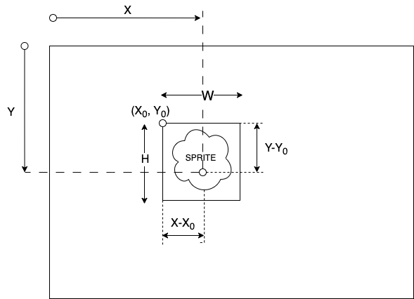
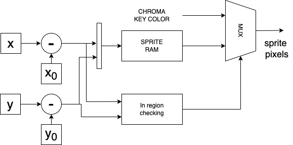
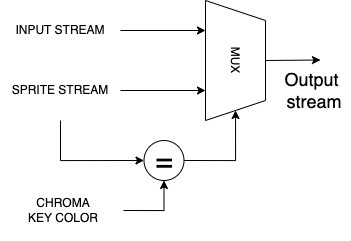

# Fpro video system Sprite core and memories in FPGA 

## Introduction

- Bitmap defines rectangular display area and the color of each pixel in the area.
- Sprite represents a small bitmap whose display area is tiny fraction of the screen.
  - where do we use sprites:
    - small moving graphic objects in larger scene, allowing us for creating animations.
      - e.g. : cursor in GUI, animated characters in games.
    - use them as tiles to create larger images.
- Goal of the project:
  - Implement a sprite core in FPGA.
  - Implement sprite memories in FPGA.
  - Integrate the sprite core in existing FPro video system.

## Designing a sprite core

- Sprite core represents a pixel generation core
  - Generates pixel data for entire screen. Two components of frame: 
    - Sprite pixels: pixel that belongs to sprite. Stored in sprite memory.
    - Chroma-key color pixels: represents transparent pixels. 
    - Why do we use this approach?
      - We can store only the sprite pixels in the sprite memory, without storing the background pixels.
  - Chroma-key blending operation
    - Combines the sprite pixels with the incoming video pixels, that represents the background.
    - when two images are combined, the chroma-key color pixels in the sprite are replaced with the corresponding pixels in the video.  
    - Why we use chroma-key blending?
  
### Generating sprite pixels 

- The sprite has a rectangular display area, even if the sprite is not rectangular. 
  - the pixel in the sprite that does not belong to the sprite have chroma-key color.
    - Example: sprite with a circle shape.


- The sprite is depicted as rectangular area in the sprite memory
  - The (X0,Y0) are the coordinates of the top-left corner of the sprite.
  - Width and height of the sprite are W and H.

- The sprite memory is a 2D array of pixels, where each pixel is represented by a color value.
  - How can we access to the pixels inside the sprite memory?
    - We can access the pixel at (X,Y) by reading the memory at address (X-X0, Y-Y0).
  
- What about the pixels outside the sprite area?
  - The pixels outside the sprite area are chroma-key color pixels.
  - The chroma-key color is a color value that is not used in the sprite.
  - How can we determine whether a pixel is inside or outside the sprite area?
    - We can determine whether a pixel is inside the sprite area by comparing the pixel coordinates with the sprite area coordinates.




- How we can implement this in FPGA?
  - We can implement the sprite memory as a simple dual-port memory.
    - One port is used to read the sprite pixels.
    - The other port is used to write the sprite pixels.
  - To obtain the sprite pixels, we need to read the sprite memory at address (X-X0, Y-Y0).
    - Simple subtractor can be used to calculate the address.
    - Note: X and Y are the coordinates of the pixel in the screen. They are generated by the global frame counter.
  - To determine whether a pixel is inside the sprite area, we need to compare the pixel coordinates with the sprite area coordinates.
    - We can use two comparators to compare the X and Y coordinates with the sprite area coordinates.
    - The output of the comparators is used to choose between the sprite pixel and the chroma-key color pixel.
  - the image with a sprite and chroma-key color pixels is generated by the sprite source module.




### Chroma-key blending operation

- The chroma-key blending operation combines the sprite pixels with the incoming video pixels.
  - The chroma-key color pixels in the sprite are replaced with the corresponding pixels in the video.
  - The chroma-key color is a color value that is not used in the sprite.
  - The chroma-key color represent the transparent pixels in the sprite.

- How we can implement this in FPGA?
  - We can implement the chroma-key blending operation as a simple multiplexer.
    - The multiplexer selects between the sprite pixel and the input (background) pixel based on the chroma-key color.
    - The chroma-key color is a constant value that is stored in a register.
    - The sprite pixel color is compared with the chroma-key color using a comparator.
    - The output of the comparator is used to choose between the sprite pixel and the video pixel.




## Implementing sprite memories

###  Modeling memories with SystemVerilog

#### Random-access memory 

- Key aspects of RAM modules: 
  - Depth: number of memory locations.
  - Width: number of bits in each memory location.
  - Number of ports: number of read and write ports.
  - Direction of ports: read or write.
  - Read and write operations: synchronous or asynchronous.
  - Simultaneous read and write operations 

##### Synchronous dual port RAM
  - two ports for memory access.
  - each condusts read or write operation, independently from each other.
    - has its own address, data input, and data output.
    ```verilog
    module sync_dual_port_RAM #(
    parameter DATA_WIDTH = 8,
    parameter ADDR_WIDTH = 8
    ) (
        input logic clock,
        input logic [ADDR_WIDTH-1:0] addr_a,
        input logic [ADDR_WIDTH-1:0] addr_b,
        input logic [DATA_WIDTH-1:0] datain_a,
        input logic [DATA_WIDTH-1:0] datain_b,
        input logic we_a,
        input logic we_b,
        output logic [DATA_WIDTH-1:0] dataout_a,
        output logic [DATA_WIDTH-1:0] dataout_b
    );
    ```
   - memory array of words is implemented as a 2D array of logical vectors  
      ```verilog
      logic [DATA_WIDTH-1:0] mem [0:2**ADDR_WIDTH-1];
      ```
   - separate process for different ports 
     - check if write enable signal is high, then write the data to the memory array.
     - read the data from the memory array and assign it to the output.
     - Dynamic index is used to access the memory array. 
  
      ```verilog
      always_ff @(posedge clock) begin
      if (we_a) begin
          mem[addr_a] <= datain_a;
      end
        dataout_a <= mem[addr_a];
      end

      always_ff @(posedge clock) begin
          if (we_b) begin
              mem[addr_b] <= datain_b;
          end
          dataout_b <= mem[addr_b];
      end
      ```
  - Initialize the array with the data from the file.
    - $readmemh() function is used to read the data from the file and store it in the memory array.
    - The data is stored in hexadecimal format in the file.
    - The memory array is initialized with the data from the file in the initial block.
    - The memory array is accessed using the address from the input port.
    - The data from the memory array is assigned to the output port.
    ```verilog
      initial begin
          $readmemh("ram_init.txt", mem);
      end
    ```
    
##### Simple dual-port RAM

  - two ports: one for read and one for write.
  - Interface:
    ```verilog
    module sync_simple_dual_port_RAM #(
        parameter DATA_WIDTH = 8,
        parameter ADDR_WIDTH = 8
    )  (
        input logic clock,
        input logic [ADDR_WIDTH-1:0] addr_r,
        input logic [ADDR_WIDTH-1:0] addr_w,
        input logic [DATA_WIDTH-1:0] datain,
        input logic we,
        output logic [DATA_WIDTH-1:0] dataout
    );
    ```
    
  - One process for both ports.
    ```verilog
    always_ff @(posedge clock) begin
        if (we) begin
            mem[addr_w] <= datain;
        end
        dataout <= mem[addr_r];
    end
    ```
        
##### Single-port RAM

  - one port for read and write.
  - Interface:
    ```verilog
    module sync_single_port_RAM #(
        parameter DATA_WIDTH = 8,
        parameter ADDR_WIDTH = 8
    )  (
        input logic clock,
        input logic [ADDR_WIDTH-1:0] addr,
        input logic [DATA_WIDTH-1:0] datain,
        input logic we,
        output logic [DATA_WIDTH-1:0] dataout
    );
    ```
    
  - One process for both read and write operations.
    ```verilog
    always_ff @(posedge clock) begin
        if (we) begin
            mem[addr] <= datain;
        end
        dataout <= mem[addr];
    end
    ```
  

#### Read-only memory

- Read-only memory is a memory that can only be read.
  - pure combinational circuit.
  - emulated with combinational logic.
    - the real ROM is implemented with transistors.
- Two types of ROMs:
  - Lookup table: stores the output values for all possible input values.
  - Example: 7-segment display ROM.
    - The 7-segment display ROM stores the output values for all possible input values.
    - The input values are the 4-bit binary numbers from 0 to 15.
    - The output values are the 7-bit binary numbers that represent the segments of the 7-segment display.
    - The 7-segment display ROM is implemented as a case statement that maps the input values to the output values.
    ```verilog
    module rom_case(
        input logic [3:0] addr,
        output logic [6:0] data
    );
    always_comb begin : 7segDisplay
            case (addr)
                4'h0: data = 7'b1000000; // 0
                4'h1: data = 7'b1111001; // 1
                4'h2: data = 7'b0100100; // 2
                4'h3: data = 7'b0110000; // 3
                4'h4: data = 7'b0011001; // 4
                4'h5: data = 7'b0010010; // 5
                4'h6: data = 7'b0000010; // 6
                4'h7: data = 7'b1111000; // 7
                4'h8: data = 7'b0000000; // 8
                4'h9: data = 7'b0010000; // 9
                4'ha: data = 7'b0001000; // A
                4'hb: data = 7'b0000011; // b
                4'hc: data = 7'b1000110; // C
                4'hd: data = 7'b0100001; // d
                4'he: data = 7'b0000110; // E
                4'hf: data = 7'b0001110; // F
                default: data = 7'b1111111; // off
            endcase
    end
    endmodule
    ```
  - Content-addressable memory: stores the output values for a subset of input values.
    
    ```verilog
        logic [DATA_WIDTH-1:0] hex_rom [0:2**ADDR_WIDTH-1];
        
        // read content from file and store in memoryß
        initial begin
            $readmemh("rom_init.txt", hex_rom);
        end

        assign dataout_a = hex_rom[addr_a];ß
    ```

### Implementing sprite memories

- The sprite memory will be implemented as a simple dual-port RAM.
  - One port is used to read the sprite pixels.
    - the sprite pixels are read by the sprite core and used to generate the sprite.
  - The other port is used to write the sprite pixels.
    - the sprite pixels are written by the CPU and used to update the sprite.

### Implementing the sprite source module

- The sprite source module generates the sprite pixels for the sprite core.
  - The sprite source module reads the sprite pixels from the sprite memory.
  - The sprite source module generates the sprite pixels based on the sprite area coordinates.
  - The sprite source module generates the chroma-key color pixels for the sprite core.

- Four components of the sprite source module:
  - Two subtractors: calculate the address of the sprite pixel in the sprite memory.
  - Sprite memory: reads the sprite pixels from the sprite memory.
  - In region comparator: compares the pixel coordinates with the sprite area coordinates.
  - Chroma-key color generator: generates the chroma-key color pixels.

- Two subtractors are used to calculate the address of the sprite pixel in the sprite memory.
  - We perform the signed subtraction of the pixel coordinates with the sprite area coordinates.
  - the results are used for:
    - accessing the sprite memory. We use only lower 5 bits of the subtraction result.
    - In region comparator. We use to see if the pixel is inside the sprite area or not.
  ```verilog
    // the $signed function is used to convert the unsigned value to signed value
    // the {0,x_pos} is used to create a 11 bit signed value, where the MSB is the sign bit. 
    // therefore, {0,x_pos} is positive number 
    assign x_r = $signed({0,x_pos}) - $signed({0,x_pos_sprite});
    assign y_r = $signed({0,y_pos}) - $signed({0,y_pos_sprite});
  ```
  - The core reads the sprite pixels from the sprite memory.
    - The height and width of the sprite are 32x32.
      - Therefore, the sprite memory is a should contain 32x32 = 1024 pixels.
      - for addreesing the sprite memory we need 10 bits.
    - As the sprite memory is organized as 1D array, we adopt the following formula to calculate the address:
      - `addr = y_r * sprite_width + x_r` (This is valid for row-major order.)
      - considering the sprite width is 32, the address can be obtained as concatenation of lower bits of `y_r` and `x_r`.
   ```verilog
    assign addr = {y_r[4:0], x_r[4:0]};
    logic [PIX_WIDTH-1:0] sprite_rgb_tmp;

    sprite_ram_module #(
        .ADDR_WIDTH(ADDR_WIDTH),
        .PIX_WIDTH(PIX_WIDTH)
    ) uut_sprite_ram (
        .clock(clock),
        .we(wr_en), // part of write interface
        .addr_r(addr_r),
        .addr_w(addr_w), // part of write interface
        .data_in(data_in), // part of write interface
        .data_out(sprite_rgb_tmp)
    );
   ``` 

  - The in region comparator compares the pixel coordinates with the sprite area coordinates.
    - The condition is the following: 
    ```verilog
    // check if the pixel is within the mouse region
    logic in_region;
    assign in_region = (x_r >= 0 && x_r < WIDTH) && (y_r >= 0 && y_r < HEIGHT); 
    ```
  - The chroma-key color generator generates the chroma-key color pixels, based on the `in_region` flag

    ```verilog
    // if the pixel is within the mouse region, then use the sprite_rgb value, else use the CHROMA_KEY value
    assign sprite_rgb = in_region ? sprite_rgb_tmp : CHROMA_KEY;
    ```

  ### Implementing the sprite core  

  - First, we need to implement the chroma-key blending 
  ```verilog
     // chroma blending
    logic [11:0] chroma_blend;
    // sprite_rgb is the pixel value from the sprite memory
    assign chroma_blend = (sprite_rgb == 12'h0) ? si_rgb : sprite_rgb;
  ```

  - Write interface to sprite memory:
    - the CPU can write the sprite pixels to the sprite memory.
    - when the highest bit of address in the write interface is low, the writing in sprite memory is enabled.
    ```verilog
      // write data to the sprite_ram module
      logic wr_en, addr_w;
      assign addr_w = addr[9:0];
      // enable write interface when the highest bit of the address is low
      // the wr_en signal represents the write enable signal for the sprite memory
      assign wr_en = slot_cs & write & (addr[13] == 0);
    ```
  - Write interface to core registers:
    - Three registers are used:
      - bypass register: used to bypass the sprite core - address : 0x2000
      - x_pos register: used to set the x position of the sprite - address : 0x2001
      - y_pos register: used to set the y position of the sprite - address : 0x2002
    ```verilog
    logic bypass_enable; // Bypass register: Function to bypass the rgb2gray module
    logic x_pos_enable, y_pos_enable;

    assign bypass_enable = slot_cs & write & (addr[13] == 1) & (addr[1:0] == 2'b00); // 14'h0000 is the address of the gray register
    assign x_pos_enable = slot_cs & write & (addr[13] == 1) & (addr[1:0] == 2'b01); // 14'h0001 is the address of the x_pos_sprite register
    assign y_pos_enable = slot_cs & write & (addr[13] == 1) & (addr[1:0] == 2'b10); // 14'h0010 is the address of the y_pos_sprite register

        // the information is always contained in the write_data, you just need to know where write_data is going: bypass_reg, x_pos_sprite, y_pos_sprite
    logic bypass_reg; // Bypass register: Function to bypass the rgb2gray module 
    logic [9:0]  x_pos_sprite, y_pos_sprite;

  
    // write data to the gray register
    always_ff @( posedge clock ) begin : writeLogic
        if (reset) begin
            bypass_reg  <= 1'b1;
            x_pos_sprite <= 1'b0;
            y_pos_sprite <= 1'b0;
        end else begin 
            if (bypass_enable) begin 
                bypass_reg <= write_data[0];
            end
            if (x_pos_enable) begin
                x_pos_sprite <= write_data[9:0];
            end
            if (y_pos_enable) begin
                y_pos_sprite <= write_data[9:0];
            end
        end
    end
    ```
  - Add bypass mechanism:
  ```verilog
    assign so_rgb = bypass_reg ? chroma_blend : si_rgb;
  ```
  - Instatiate the sprite source module: 
  ```verilog
    // instantiate the sprite_src module
    logic [11:0] sprite_rgb;
    sprite_src 
    #(
        .ADDR_WIDTH(10),
        .PIX_WIDTH(12),
        .CHROMA_KEY(12'h0)
    ) sprite_src_inst 
    (
        .clock(clock),
        .reset(reset),
        .x_pos(x),
        .y_pos(y),
        .x_pos_sprite(x_pos_sprite),
        .y_pos_sprite(y_pos_sprite),
        .wr_en(wr_en),
        .addr_w(addr_w),
        .data_in(write_data),
        .sprite_rgb(sprite_rgb)
    );
  ```