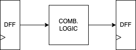
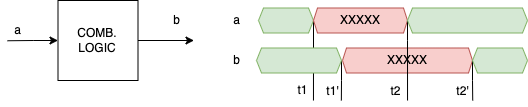
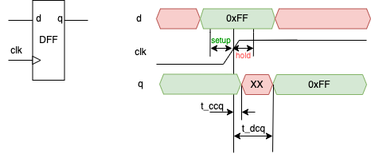
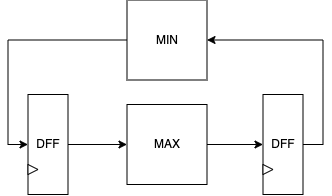

# Timing Considerations 

## Introduction

When considering the timing of a digital system, we need to consider the following:
- The delay of combinational logic
- The delay of flip-flops

### The delay of combinational logic

- We distinguish two delays in combinational logic:
    - The propagation delay
    - The contamination delay

- The contamination delay is the time that it takes for the output value to be contaminated by the input value.
    - How long the output of a gate takes to change after the input changes.

- The propagation delay is the time that it takes for the output value to be stable after the input value has been stable.
    - How long the output of a gate will take to reach its final value after the input has been stable.

- Image of the propagation and contamination delay of a gate
    - `t1` - the input starts to change
    - `t1'` - the output starts to change
    - contamination delay = `t1' - t1`
    - `t2` - the input reaches its final value
    - `t2'` - the output reaches its final value
    - propagation delay = `t2' - t2`

 

### The delay of flip-flops

- D flip-flops sample the input at the active edge of the clock signal
    - Updates the output with the input value at the active edge of the clock signal
    
- For the sampling to be successful: 
    - The data must reach its final value before the clock reaches the 50% point of the clock signal -> setup time
    - The data must remain stable until the clock signal has passed the 50% point -> hold time

- If the input obeys setup and hold time, the following happens:
    - The old value remains stable on input for contamination delay of the flip-flop `t_ccq` (ccq - contamination clock to Q)
    - The output of the flip-flop is updated after the propagation delay of the flip-flop `t_dcq` (dcq - delay clock to Q)

 

## Setup and Hold Time Constraints

- Setup and hold time constraints are used to ensure that the input data is stable when the clock signal arrives.

### Setup time constraint: 

- `t_clk >= t_setup + t_dcq + t_Dmax`
- where `t_setup` is the setup time of the flip-flop, `t_dcq` is the propagation delay of the flip-flop, and `t_Dmax` is the maximum delay of the combinational logic.
- `t_clk` determines the minimal cycle (maximal frequency) of the system.
- If the setup time constraint is not met, the output of the flip-flop will be unpredictable.

### Hold time constraint:

- `t_hold <= t_ccq + t_Dmin`
- where `t_ccq` is the contamination delay of the flip-flop, and `t_Dmin` is the minimum contamination delay of the combinational logic.
- Ensures that no signal is contaminated before the hold time expires. 

### Example: 

- Determine the hold and setup time constraints for the system below:
    - Combinational block MAX has a larger delay than the MIN block.
     
    
- Solution:
    - The setup time constraint is determined by the MAX block:
        - `t_clk >= t_setup + t_dcq + t_Dmax`
     
    - The hold time constraint is determined by the MIN block:
        - `t_hold >= t_ccq + t_Dmin`
     
### Clock skew

- In previous examples, we assumed that the clock signal arrives at the same time at all flip-flops.
- In reality, the clock signal will arrive at different times at different flip-flops.
- The difference in arrival time is called clock skew.
    - Spatial variation in the arrival time of the clock signal
- Effects of clock skew:
    - `t_clk >= t_setup + t_dcq + t_Dmax + t_skew`
    - `t_hold <= t_ccq + t_Dmin - t_skew`
