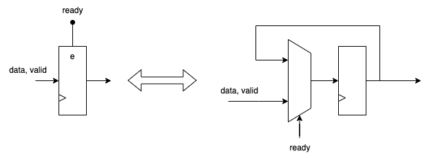

# Pipelining 

Pipelining is a technique used to increase the throughput of a system. It breaks down a complex operation into smaller parts that can be executed in parallel.

## Example of Pipelining: Pizzeria

- 4 stages of making a pizza:
  1. Prepare the dough
  2. Add the toppings
  3. Bake the pizza
  4. Serve the pizza
- **Non-pipelined pizzeria:**
  - One pizza is made at a time
  - The time to make a pizza is the sum of all stage times
  - The time to make 4 pizzas is 4 times the time to make one pizza

- **Pipelined pizzeria:**
  - Each stage is executed in parallel
  - The time to make a pizza is determined by the longest stage
  - The time to make 4 pizzas is determined by the longest stage
  

## Pipelining vs Parallelism

- Two ways to increase throughput:
  - Pipelining - breaking down a complex operation into smaller parts
  - Parallelism - instantiating multiple modules 

- Philosophy behind pipelining:
  - Take overall task and break it down into smaller subtasks
  - Have separate units for each subtask
  - Stages are connected in a linear fashion

- Philosophy behind parallelism:   
  - Take overall task and instantiate multiple modules
  - Modules work in parallel
  - Modules are connected in a parallel fashion

- Throughput vs latency:
  - Throughput: number of tasks completed per unit of time
  - Latency: time to complete a single task from start to finish
  
- Pipeline stages:
  - Registers between stages hold results of the previous stage
  - This frees up the previous stage to start working on the next task

- Advantages of pipelining over parallelism:
  - Increased throughput without the cost of duplicating modules 
  
- Disadvantages of pipelining over parallelism:
  - Increased latency due to pipeline register overhead

- Common practice is to use a combination of pipelining and parallelism

### Pipeline Effect on Design

- Assume we have a module with delay `tM` and area `aM`

- Parallel implementation:
  - N modules with delay `tM` and area `aM`
  - Total delay: `tM + t_reg`
  - Total area: `N * aM`
  - Throughput: `N/(tM + t_reg)`

- Pipelined implementation:
  - N stages with delay `tM` and area `aM`
  - Total delay: `tM + N * t_reg`
  - Total area: `aM + N * a_reg`
  - Throughput: `1/(tM/N + t_reg)`

## Pipelining the Tensor Core

- The tensor core is a complex unit that performs matrix general matrix multiplication (GEMM) operations
  - Introduced in Volta architecture
  - Used in deep learning applications 
- General Matrix Multiplication (GEMM) operation:
  - `D = A x B + C` 
  - `A`,`B` and `C` are input matrices
  - `D` is the result GEMM operation 
- The tensor core operates on 4x4 matrices
  - To calculate one element of the result matrix, the tensor core calculates the scalar product of one row from matrix `A` and one column from matrix `B` and adds the corresponding element from matrix `C`∏

- We compare delay and resource utilization of basic and pipelined implementations:
  - The pipelined implementation has 4 stages:
  - Stage 1: Multiply elements of matrix `A` row with matrix `B` column
  - Stage 2: First reduction of multiplication results
  - Stage 3: Second reduction of results
  - Stage 4: Add results to matrix `C`
  
  - Both implementations synthesized for 100 MHz

- Results:

| Implementation | Delay [ns] | LUTs | FF |
|----------------|------------|------------|--------|
| Basic | 15.01 | 1425 |  179|
| Pipelined | 8.62 | 1264| 404 |

- Pipelined implementation has lower delay
- Pipelined implementation has more flip-flops
  - Note: In combinational implementation, flip-flops are placed before and after the tensor core
- Delay of pipelined implementation corresponds to first stage delay
  - Non-balanced pipeline 

### Pipeline Stalls 

- Cause: Pipeline stage cannot complete operation in allocated time
- Stalled pipeline must notify subsequent stages
- Without stall signals, next stages process invalid data
- In practice, stalling uses ready-valid signals:
  - Data signals transition between stages (dataR1 -> dR2 -> dR3 -> dR4)
  - Ready signals indicate stage can accept new data:
    - Local ready signals from each stage (lR1, lR2, lR3, lR4)
    - Global ready signals propagated through pipeline (gR1, gR2, gR3, gR4)
  - Valid signals indicate data validity:
    - Local valid signals from each stage (lV1, lV2, lV3, lV4)
    - Global valid signals propagated through pipeline (gV1, gV2, gV3, gV4)

- Disadvantage:
  - Ready signal is on critical path

#### Clocking in New Data

- Input MUX selects between current data and previous stage data
 - Selects current data when pipeline is stalled    
 - Selects previous stage data when pipeline runs normally

## Load Balance in Pipeline

- Goal: Equal delay across stages since slowest stage determines throughput
- Solution: Pipeline the slowest stage

### Variable Load 

- Substage timing 
- FIFOs replace pipeline registers between stages
- FIFOs balance load between stages
