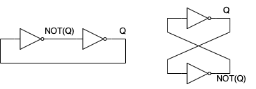

# Metastability and synchronization failure

## Introduction

- serious issue in the design of digital systems
  - it occurs when we violate the setup and hold time constraints of the flip-flop
  - consequence: we put the flip-flop in a state where it is not able to decide whether it should be in the 0 or 1 state
    - this is called the metastable state

## Bistable element 

- a bistable element is a circuit that can be in one of two stable states
  - the two states are called 0 and 1
  - the bistable element is used to store a single bit of information
  - applications: flip-flops, latches, SRAM cells. 

### Static analysis of the bistable element

- let's say the Q = 0, then inverter I1 outputs not(Q) = 1 and after the second inverter I2, we get Q = 0 (and vice versa)
- The circuit reinforces the two states in a loop feedback making them stable, thus name bistable element
  - bistable circuit: the output is stable, before next edge (trigger) occurs
  - other types: astable (oscillator), monostable (one-shot)
  
- To grasp the concept of metastability, we need to understand the inverter and its transfer function:
  - transfer function: how the output voltage changes with respect to the input voltage
  - the transfer function of the inverter: ideal vs real inverter 

- Inverter transfer function:
  - if (Vin < Vth) then Vout = Vdd
  - if (Vin > (Vdd-Vtp)) then Vout = 0
  - if (Vth < Vin < (Vdd-Vtp)) then Vout = -gVin:
    - g - gain of the inverter 
  

- Transfer function of bistable element:
  - the bistable element is a combination of two inverters
  - V_out1 = T(V_in1), where T is the transfer function of the inverter
  - V_out2 = T(V_in2) = T(V_out1) = T(T(V_in1)) 
  - summary: the state amplifies it self -> regenerative feedback

### The metastable state

- What about when V_in1 = Vdd/2, (Vdd is the supply voltage)
  - From the transfer function of the inverter, we know that V_out1 = Vdd/2
  - V_out2 = T(V_out1) = T(Vdd/2) = Vdd/2
  - the output is stuck at Vdd/2

- The Vdd/2 is the metastable state
  - the bistable element is not able to decide whether it should be in the 0 or 1 state
  - the bistable element is in a state of metastability

- The metastable state is a transient state
  - the bistable element will eventually settle in one of the stable states
  - in reality, the Vi = Vdd/2 is not exactly Vdd/2, but a small deviation from it, Vi = Vdd/2 + V_noise
    - V_noise the noise can be thermal noise, process variation, etc.
    - V_out1 = T(V_in1) = T(Vdd/2 + V_noise) = Vdd/2 - gV_noise
    - V_out2 = T(V_out1) = T(Vdd/2 - gV_noise) = Vdd/2 + g^2V_noise
    - V_out1 = T(V_out2) = T(Vdd/2 + g^2V_noise) = Vdd/2 - g^3V_noise
    - V_out2 = T(V_out1) = T(Vdd/2 - g^3V_noise) = Vdd/2 + g^4V_noise
  - Eventually, the V_in1 will be greater than Vdd - Vtp or less than Vtn, and the bistable element will settle in one of the stable states

- "Ball and hill" analogy
  - the metastable state is like a ball on a hill
  - the ball will eventually roll down the hill and settle in the valley
  - the time it takes for the ball to settle in the valley is called the metastable time
  

  
## Metastability in flip-flops

- The metastable state occurs when we violate the setup and hold time constraints of the flip-flop
  - setup time: the time before the clock edge that the data input should be stable
  - hold time: the time after the clock edge that the data input should be stable
  - if we violate the setup and hold time constraints, the flip-flop can go into a metastable state

- Although the metastable state is transient, it can have serious consequences
  - the flip-flop can output an incorrect value
  - the flip-flop can propagate the incorrect value to other parts of the circuit
  - the flip-flop can cause the system to malfunction
  
- In order to understand what this means, we need to understand the design of D flip-flop
  - the D flip-flop is built using two D latches
  - latch: a bistable element that is level-sensitive, i.e., the output changes when the clock signal is high
    - Note: the D flip-flop is edge-triggered, i.e., the output changes when the clock signal transitions from low to high

### D latch design in CMOS 

- The D latch is built using two inverters and two transmission gates
  - when the clock signal is high, the transmission gates are open, and the data flows from the input to the output
  - when the clock signal is low, the transmission gates are closed, and the data is latched
  - one of the inverters has tri-state output, i.e., it can be high, low, or high impedance
    - when the clock signal is low, the output of the inverter is high impedance, thus breaking the feedback loop
    - the feedback loop is broken, which allows the data to be latched on the output

- How does the transmission gate work?
  - when the enable signal is high, the transmission gate is on, and the data flows from the input to the output
  - when the enable signal is low, the transmission gate is off, input and output are disconnected

- How does the tri-state inverter work?
  - when the enable signal is high, the inverter is active, and the output is equal to the inverted input
  - when the enable signal is low, the inverter is in high impedance, and the output is disconnected from the input 

- Setup and hold time constraints of the D flip-flop
  - setup time: the time required for the dat to transition from input to output
    - the setup time: delay of the transmission gate + delay of the inverter
  - hold time: the time after the clock edge that the data input should be stable
    - the hold time: delay of the inverter which controls the transmission gate
      - we need to hold the data stable until the transmission gate is closed
  - if we violate the setup and hold time constraints, the flip-flop can go into a metastable state

### Metastable state in flip-flops

- what happens if we change the input after setup time:
  - previous state: Q = 0, D = 0
  - scenario: D = 1 when violating the setup time
    - when the signal encounters the lower inverter U2, he starts switching transistor 
    - because the clock edge comes too quickly, the signel is not able to propagate through the inverter U2
      - the signal is stuck in the middle of the inverter U2
    - the feedback loop is established and it reinforces the metastable state
  
### Calculating the metastablity MTBF 
  
- Metastability you cannot avoid it but you can reduce the probability of it happening
  - the probability of metastability is inversely proportional to the MTBF (Mean Time Between Failures)
  - MTBF is the average time between two metastable events
  - MTBF is calculated using the following formula:
    - MTBF = (e^(t_MET/C2)) / (C1 * f_clk * f_data)
      - f_clk - clock frequency
      - f_data - data frequency
      - t_MET - slack time
      - C1, C2 - constants that depend on the technology and the flip-flop design
  
- Improving the MTBF:
  - increase the slack time
  - the increase in speed of the flip-flop ussually improves the MTBF
  - supply voltage scaling can affect the MTBF
    - the lower the supply voltage, the higher the probability of metastability
  

