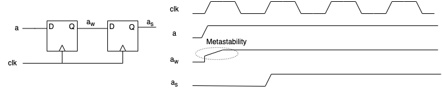
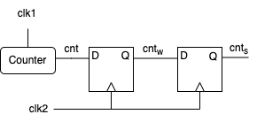
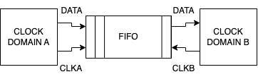
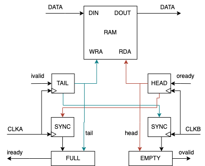

# Synchronizers 

- To avoid metastable state, we need to repsect the setup and hold time of the flip-flop.
- The metastability can occur:
  - sampling asynchronous signals
  - crossing clock domains
    - moving data from one clock domain to another
      - clock domain: a set of signals that are synchronized to a common clock signal

- Two syncronization tasks:
  - sequence synchronizers:
    - sending sequence of data, where each datum needs to be persevered
  - state synchronizers:
    - sending state information, where the current state needs to be preserved
  
## Brute Force Synchronizer

- used to synchronize a single bit of data
- FF1 samples the input signal a, producing a_w
  - a_w is unsafe of high probability of metastability
- FF2 samples a_w, producing a_s
  - a_s is safe
  - the we wait for one clock cycle to ensure that a_s is stable
- when will synchronizer fail?
  - when a_w changes between the time FF1 samples it and the time FF2 samples it
  - the probability of failure is low, but not zero
  - the probability of failure can be reduced by increasing the number of FFs in the synchronizer

### Altera metastability experiment

Read the Altera experiment on metastability on following link: [Altera metastability experiment](https://www.google.com/url?sa=t&source=web&rct=j&opi=89978449&url=https://cdrdv2-public.intel.com/650346/wp-01082-quartus-ii-metastability.pdf&ved=2ahUKEwiVsovdofOKAxX68LsIHbl8FvUQFnoECBwQAQ&usg=AOvVaw07kkdB46gykvwcPqV7Nj4F)

## Multi-bit Synchronizer

- experiment: sampling the output of counter with 4-bit synchronizer
  - the counter is clocked by a f_clk1
  - we want to sample the output of the counter with a f_clk2
  - we employ a 4-bit brute-force synchronizer to sample the output of the counter
  
- on a transition of f_clk1, the counter will increment
  - however, due to metastability we can see some bits of the counter to be unchanged for a few clock cycles
  - case: the counter is at 7 and the counter is about to increment to 8
    - Option 1: the counter transitions to 8 in one clock cycle.
      - everything is fine
    - Option 2: The last three bits of bits change, the first bit remains the same
      - we will sample the 0  
  - when the metastability occurs, the bits act as random bits:
    - they independently transition to 0 or 1
  

## Gray Code

- How to alleviate this:
  - gray code: the counter is encoded in gray code
    - the gray code is a binary encoding where two consecutive values differ in only one bit
    - the gray code is used to avoid the metastability issue
  
  - why gray code?
    - the only 1-bit change in the gray code 

  - Example: let's transition from 4 (0100) to 12 (1100)
    - the last three bits do not change during the transition, therefore the synchronizer will sample the correct value
    - the first bit changes from 0 to 1:
      - Case 1: the first bit transitions to 1 in one clock cycle
        - the synchronizer will sample the correct value
      - Case 2: the first bit remains 0 
        - Incorrect value will be sampled, but it is part of the gray code, so it is not a problem
        - the synchronizer will sample the correct value in the next clock cycle

### Summary

- Two issuses with metastability:
  1. The metastability cause to the output be something between 0 and 1:
    - resolved by using a brute-force synchronizer
  2. The metastability cause to the output be a random value:
    - resolved by using gray code

### FIFO Synchronizer

- FIFO: First-In-First-Out
  - a data structure that allows data to be written and read in the order it was written
  - the data is written to the FIFO at one clock domain and read from the FIFO at another clock domain
  - the FIFO is used to move data from one clock domain to another

- FIFO elements:
  - RAM: stores the data 
  - write pointer: points to the location where the next data will be written
  - read pointer: points to the location where the next data will be read
  - full: indicates that the FIFO is full
  - empty: indicates that the FIFO is empty

- Different clock domains are reading and writing the FIFO
  - what they need to exchange?
    - the write pointer
    - the read pointer
    - as the write and read pointers exist in different clock domains, they need to be synchronized
    - Solution: use a brute-force synchronizer combined with Gray code to synchronize the write and read pointers 

- The full and empty signals are generated are obtained by comparing the write and read pointers
  - the FULL block comparees tail pointer and head pointer, latter residing in the read clock domain (CLKB)
    - we need to synchronize the head pointer t∏o the write clock domain (CLKA) 
  - the EMPTY block compares the head pointer and tail pointer, latter residing in the write clock domain (CLKA)
    - we need to synchronize the tail pointer to the read clock domain (CLKB)

### Summary

- Different clock domains are reading and writing the FIFO
  - the data transfer does not require synchronization 
- The write and read pointers need to be synchronized
  - the brute-force synchronizer is used to synchronize the write and read pointers
  - the Gray code is used to encode the write and read pointers
  - the control logic needs to be synchronized

