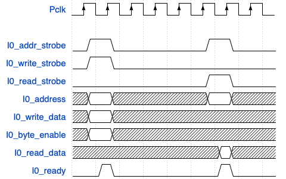
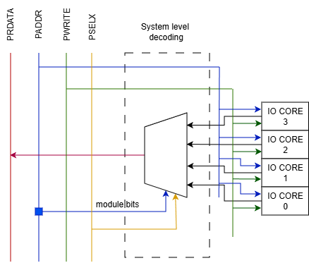
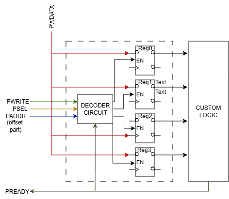
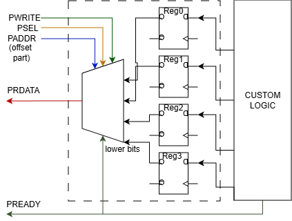

# Developing APB based SoC platform


- In this section, we will develop a simple SoC platform based on the APB protocol 
  - our inspiration lies in the [FPRO platform](https://www.amazon.com/FPGA-Prototyping-SystemVerilog-Examples-MicroBlaze/dp/1119282667)


- Features:
  - simple: easy to use and understand
  - portable: all the IP cores are developed from scratch
  - functional: can be used for real-world applications, but not as powerful as commercial platforms
  - educational: designed for educational purposes
  
- The platform consists of:
  - processor module
  - APB bridge and bus 
  - Interconnect 
  - I/O peripherals (GPIO, UART, etc.)


## Processor module:

- any 32-bit RISC processor can be used
- On the class, we use the [MicroBlaze processor](https://www.amd.com/en/products/software/adaptive-socs-and-fpgas/microblaze.html) and [MicroBlaze MCS](https://www.amd.com/en/products/software/adaptive-socs-and-fpgas/mb-mcs.html)
- Microblaze MCS (Microcontroller system):
  - complete computer system centered around the MicroBlaze processor
  - besides the processor, it includes RAM and IO module with standard set of microcontroller interfaces
  - all the components are constructed from FPGA resources
- Microblaze processor
  - 32-bit processor with RISC architecture
  - "soft" processor, i.e. implemented in the FPGA fabric
  - can be customized to the user requirements
    - e.g. floating-point unit, memory management unit, caches, etc.
    - AXI protocol for communicating with the peripherals
    - Note: the MicroBlaze MCS does not support the AXI protocol


- MMIO scheme: use load and store instructions to access the memory-mapped registers
  - I/O devices and memory are mapped to the same address space
  - each I/O device is assigned a unique address range within the memory map

- I/O register map:
  - I/O device is just a set of registers
    - each register is mapped to a specific address
    - each register depicts a specific function of the device

### I/O address space of the FPRO SoC platform:

- Our system MMIO subsystem specification
  - provides space for 64 I/O devices or slots (0-63)
  - each device has 32 registers (0-31)
  - each register is 32-bit wide
  - the address of the register is 22-bit wide:
    -  ADDRESS[12:6] - address of slot 
    -  ADDRESS[6:0] - address of register

### Interface with the bus

- Main task in SoC is to integrate the custom logic into the system

- To attach the custom logic to the bus and access I/O core, the following steps are required:
  1. Add a wrapper around the custom logic to form a compatible I/O core that can interact with the bus
  2. Update system-level decoding (write operation) and multiplexing (read operation) logic to circuit to indetify and access the I/O core

- Wrapping circuit : 
  - enables core to be addressed by the bus
  - makes the core as a small memory-mapped device
  - contains:
    - decoding circuit for writing into the registers
    - multiplexing circuit for reading from the registers

-  System-level decoding and multiplexing logic:
   - used to identify the I/O core
   - multiplexes the data bus to read the data from the I/O core


## APB bridge 

- The bridge will intercept the MCS I/O bus signals and generate the according request to the APB master 
  - read or write request
- The bridge will also handle the response from the APB master and generate the appropriate signals for the MCS I/O bus 

### MCS I/O bus protocol

- signals involved in the MCS I/O bus protocol:
  - `io_address_strobe`: address strobe signal, used to indicate that the address is valid
  - `io_write_strobe`: write strobe signal to initiate a write operation
  - `io_read_strobe`: read strobe signal to initiate a read operation
  - `io_address`: 32-bit wide address signal used to identify the destination I/O core attached to the MCS I/O bus
  - `io_write_data`: 32-bit wide data signal, used to write the data to the destination I/O core
  - `io_read_data`: 32-bit wide data signal, used to obtain the data from the destination I/O core
  - `io_ready`: indicates whether transaction has been received
  - `io_byte_enable`: which byte of the `io_write_data` data is valid





Write operation:
  1. Master device places the address and data on the bus and asserts the address and write strobe signal
  2. Slave assets the `io_ready` signal, when the transaction is received
  3. Optionally, the master can assert the `io_byte_enable` signal to indicate which byte of the data is valid

Read operation:
  1. Master device places the address on the bus and asserts the address and read strobe signal
  2. Slave gets request and places the data on the `io_read_data` line 
  3. Slave assets the `io_ready` signal, when the read data is available


### APB bridge implementation

1. First, we need to decode the MCS I/O bus signals to determine whether the transaction should be initiated
    - Our whole SoC platform will be act as a single slave on the MCS I/O bus
      - Our APB subsystem starting address is 0xC000_0000, meaning that all addresses from 0xC000_0000 to 0xC0FF_FFFF are mapped to our APB subsystem
      - if the upper 8 bits of the address are equal to 0xC0, then the transaction is intended for our APB subsystem
      - otherwise, the transaction is ignored
  
```verilog
// The APB subsystem acts as slave on I/O bus. It starting address is 0xC000_0000
logic mcs_bridge_enable;
assign mcs_bridge_enable = (io_address[31:24] == BRG_BASE[31:24]);
```

1. Next we concentrate on the command generation
   - Indetify whether the transaction is a read or write operation
   - generate command for the APB master
   - generate the valid signal for the APB master
```verilog
    // Command generation
    // write_req is equal to one when io_write_strobe is asserted and io_read_strobe is not asserted
    logic write_req;
    assign write_req = io_write_strobe & ~io_read_strobe;

    // Command generation
    assign cmd = {write_req, io_write_data, io_address};

    // We will use a address_strobe to generate the valid signal. 
    // regardless of read or write, address_strobe is always asserted when there is a valid address
    assign valid = io_addr_strobe & mcs_bridge_enable; // do not generate any request if we did not select our system
```
1. We handle the response from the APB master and generate the appropriate signals for the MCS I/O bus
   - send read data to the MCS I/O bus if the transaction does not have an error (i_resp[DW] == 0)
   - send ready signal to the MCS I/O bus to indicate that read data are available
```verilog
    // Response handling
    assign io_read_data = i_rdata;
    assign io_ready = i_ready;
        always_comb begin
        io_read_data = resp[DW-1:0];
        if (resp[DW]) begin
            io_read_data = 32'hDEADFA17; 
        end
    end

    // Ready signal
    assign io_ready = i_ready & mcs_bridge_enable;
```

1. Instantiate the APB master module and connect the signals
```verilog
    APB_master #(
        .DW(DW),   // Data width
        .AW(AW)    // Address width
    ) u_apb_master (
        .pCLK    (CLK),
        .pRESETn (RESETn),
        .i_cmd   (cmd),
        .i_valid (valid),
        .o_resp  (resp),
        .o_ready (ready),
        .pADDR   (pADDR),
        .pSELx   (pSELx),
        .pENABLE (pENABLE),
        .pWRITE  (pWRITE),
        .pWDATA  (pWDATA),
        .pRDATA  (pRDATA),
        .pREADY  (pREADY),
        .pSLVERR (pSLVERR)
    );
```

## Interconnect

- Connects the multiple master, memory, and I/O cores (slaves)
- Manages the data flow between the components
- Interconnect will be based on centralized arbitration/decode scheme
  - Arbitration: decides which master can access the bus
  - Decoding: decides which slave is accessed by the master
    - In our case, we have only one master (processor), so we don't need arbitration
  
- For this example, we will use a simple APB interconnect
  - connects the APB master (bridge) to multiple APB slaves (peripherals)
  - handles the address decoding and data multiplexing
  - supports up to 64 APB slaves 
    - each slave is assigned a unique address range

- System level decoding and multiplexing logic:
  - Decoding logic: decodes the address from the master to select the appropriate slave
    - Based on the address, the decoding logic generates the PSEL signal for the selected slave.
    - The rest of the slaves will have their PSEL signal deasserted.
  - Multiplexing logic: multiplexes the data from the selected slave to the master
    - The data from the selected slave is routed to the master based on the PSEL signal.
    - The data from the other slaves is ignored.

- Addressing
  - Each address is 32-bit wide
  - Two parts of the address are used for selecting the slave:
    - module bits - used to select the slave or I/O core
    - register bits - used to select the register within the slave or I/O core

### Write Interface and decoding logic


- Signals involved in the write operation:
  - `PADDR`: 32-bit wide address bus
  - `PWDATA`: 32-bit wide data bus
  - `PWRITE`: write signlal
  - `PENABLE`: enable signal
  - `PSELx`: slave select signal (one-hot encoded for each slave

- First we compare the module address with the address from the master
  - Each slave has a unique base address
  - If the module part of address from the master matches the base module of the slave and PSELx is high, we assert the PSELi signal for that slave 
  - Otherwise, we deassert the PSELi signal
  - All other signals (PADDR, PENABLE, PWRITE, PWDATA) are forwarded to all slaves
  
  Table of address mapping:

| PSELx | ADDRESS (module bits) | PSEL3   |PSEL2   |PSEL1   |PSEL0   |
|-------|-----------------------|---------|--------|--------|--------|
|0|Dont care |0|0|0|0|
|1|Base address of Slave 0|0|0|0|1|
|1|Base address of Slave 1|0|0|1|0|
|1|Base address of Slave 2|0|1|0|0|
|1|Base address of Slave 3|1|0|0|0|
|1|Otherwise|0|0|0|0|




> Note: Due to verboseness, we ommited the pENABLE signal in the diagram, but he is also forwarded to all slaves as well. Also pREADY and pSLVERR are not shown in the diagram, but they are handled in the read interface section in similar way as pRDATA.

### Read Interface and multiplexing logic

- Signals involved in the read operation:
  - `PADDR`: 32-bit wide address bus
  - `PRDATA`: 32-bit wide data bus
  - `PWRITE`: write signlal (0 for read operation)
  - `PENABLE`: enable signal
  - `PSELx`: slave select signal 
  - `PREADY`: ready signal from slave to master

- Multiple slaves can respond to the read request
  - The interconnect needs to multiplex the read data from the selected slave to the master
  - The interconnect also needs to handle the PREADY signal from the selected slave to the master

| PSELx | ADDRESS (module bits) | PRDATA   |
|-------|-----------------------|---------|
|0|Dont care |0|
|1|Base address of Slave 0|From Slave 0|
|1|Base address of Slave 1|From Slave 1|
|1|Base address of Slave 2|From Slave 2|
|1|Base address of Slave 3|From Slave 3|
|1|Otherwise|0|

### Address space of the FPROv2 SoC platform:

| pADDR[31:24] | pADDR[23:13] |pADDR[12:7] | pADDR[6:2] |pADDR[1:0] |
|------|--------------|----------------------|-|-|
| 0xC0 | 0x000 |Slot address | Register address |00|

- Each slot has 32 registers (5 bits for register address)
  - The last 2 bits are not used, because the registers are word-aligned (4 bytes) 
- FProv2 SoC platform supports up to 64 slots (6 bits for slot address)


### Developing the interconnect

- Notation:
  - Mp<SignalName> - signal from/to master
  - Sp<SignalName> - signal from/to slave
    - Each signal is an array of signals, one for each slave
    ```verilog
    // forwarding signals: MpADDR, MpENABLE, MpWRITE, MpWDATA
    genvar i;
    for (i = 0; i < NUM_PERIPHERALS; i++) begin : gen_addr
        assign SpADDR[i] = MpADDR;
        assign SpENABLE[i] = MpENABLE;
        assign SpWRITE[i] = MpWRITE;
        assign SpWDATA[i] = MpWDATA;
    end
    ```

- Parameters:   
    - NUM_REG_PERIPHERAL - number of registers per peripheral
    - NUM_PERIPHERALS - number of peripherals (slaves)
    - DW - data width
    - AW - address width


- First we forward the signals from the master to all slaves
  - PADDR, PENABLE, PWRITE, PWDATA

```verilog
    // forwarding signals: MpADDR, MpENABLE, MpWRITE, MpWDATA
    genvar i;
    for (i = 0; i < NUM_PERIPHERALS; i++) begin : gen_addr
        assign SpADDR[i] = MpADDR;
        assign SpENABLE[i] = MpENABLE;
        assign SpWRITE[i] = MpWRITE;
        assign SpWDATA[i] = MpWDATA;
    end
```

- Here we use a generate block to create the forwarding logic for each slave
  - This block creates NUM_PERIPHERALS instances of the forwarding logic
    - It makes our code more scalable and easier to maintain
    - This is not classical for loop, but a generate loop
      - this mean it will be unrolled during synthesis
  
- Next, we generate the PSEL signal for each slave based on the address from the master
  - We refer to this as system-level decoding logic
  - The PSEL signal is generated based on the address from the master
  - The address bits used for selecting the peripheral are: (log2(NUM_PERIPHERALS) + log2(NUM_REG_PERIPHERAL) + 2 -1): log2(NUM_REG_PERIPHERAL) + 2
    - The +2 is because the registers are word-aligned (4 bytes)

```verilog
    localparam MSB = $clog2(NUM_PERIPHERALS);
    logic [MSB - 1 : 0] baseAddr;
    // Extracting base address from MpADDR
    localparam baseAddr_MSB = ($clog2(NUM_PERIPHERALS) + $clog2(NUM_REG_PERIPHERAL) + 2) - 1;
    localparam baseAddr_LSB = $clog2(NUM_REG_PERIPHERAL) + 2;
    assign baseAddr = MpADDR[baseAddr_MSB : baseAddr_LSB];

    // Decoder: Generate SpSEL signal (one-hot encoding)
    assign SpSEL = (MpSELx) ? (1 << baseAddr) : 0;
```
    - Here we extract the base address from the master address and use it to generate the PSEL signal
    - We use one-hot encoding for the PSEL signal, where only one bit is set to 1, indicating the selected slave

- Finally, we need to handle the read data and ready signals from the slaves to the master
  - We refer to this as system-level multiplexing logic
  - The read data and ready signals from the slaves are multiplexed to the master based on the PSEL signal
  - We use a combinational always block to implement the multiplexing logic

```verilog
    // MUX for the signals: MpRDATA, MpREADY, MpSLVERR
    always_comb begin : readData
        MpREADY = SpREADY[baseAddr];
        MpSLVERR = SpSLVERR[baseAddr];
        // Read data
        MpRDATA = 0;
        if (!MpWRITE) begin
            MpRDATA = SpRDATA[baseAddr];
        end
    end
```


## Developing I/O cores as APB slaves

- Main task in SoC is to integrate the custom logic into the system

- To attach the custom logic to the bus and access I/O core, the following steps are required:
  1. Add a wrapper around the custom logic to form a compatible I/O core that can interact with the bus
  2. Update system-level decoding (write operation) and multiplexing (read operation) logic to circuit to indetify and access the I/O core

- Wrapping circuit : 
  - enables core to be addressed by the bus
  - makes the core as a small memory-mapped device
  - contains:
    - decoding circuit for writing into the registers
    - multiplexing circuit for reading from the registers

-  System-level decoding and multiplexing logic:
   - used to identify the I/O core
   - multiplexes the data bus to read the data from the I/O core

- When developing slave, we need to:
  - Implement custom logic, that represents the functionality of the peripheral
  - define the register map of the peripheral
  - implement the APB slave interface
    - decoding logic for write operations
    - multiplexing logic for read operations
  - write the SW drivers to access the peripheral


 


### Developing APB slave 

- needs to be in compliance with the slot interface

- For this example, we will develop a simple APB slave that represents a memory-mapped 64-bit timer peripheral
  
- The timer has three registers:
    - Configuration register (offset 0x00): used to configure the timer
      - write-only register
      - bit 0: enable/disable the timer
      - bit 1: reset the timer
    - Count low register (offset 0x04): contains the lower 32 bits of the timer count
      - read-only register
    - Count high register (offset 0x08): contains the upper 32 bits of the timer count
      - read-only register

- In this example, we presume that:
  - Writing to the peripheral requires one cycle
  - Reading from the peripheral requires two cycles (one cycle to set up the read and one cycle to read the data)
  
- The design of the APB slave includes:
  - Wrapping logic to interface with the APB bus
    - State machine to manage the read and write operations
    - Decoding logic to select the appropriate register based on the address
  - Logic that implements the timer functionality
  - Logic to generate the APB slave error signal


### Write interface 

- pWRDATA signal is broadcasted to all registers
- In which register the data will be written is determined by decoder circuit
- Write operation occurs when:
  - Write request is asserted to core 
    - pSEL & pWRITE
  - Handshake signals are asserted
    - pENABLE & pREADY
    - Note: pREADY is generated by the slave and is independent of pENABLE
  - Which register is selected
    - determined by pADDR signal




### Read interface

- Read operation occurs when:
  - Read request is asserted to core 
    - pSEL & ~pWRITE
  - Handshake signals are asserted
    - pENABLE & pREADY
    - Note: pREADY is generated by the slave and is independent of pENABLE
  - Which register is forwareded to pRDATA
    - determined by pADDR signal




### Developing the APB slave, timer peripheral example

#### Custom logic

- Timer functionality:
  - 64-bit counter that increments on each clock cycle when enabled
  - Configuration register to enable/disable and reset the timer
  - Count registers to read the current value of the timer

```verilog
    logic [63:0] count_reg;
    logic [31:0] config_reg;

    always_ff @(posedge pCLK) begin
            if (!pRESETn) begin
                count_reg <= 64'b0;
            end else begin
                if(config_reg[0]) begin
                    if(config_reg[1]) begin
                        count_reg <= 0;
                    end else begin
                        count_reg <= count_reg + 1;
                    end
                end
            end
        end
```

#### Register map


| Register | address | Meaning | 
|------|--------------|----------------------|
| Config register | 0x00 | Bit 0 -> enable timer, Bit 1 -> reset timer |
| Count low register | 0x04 | Lower 32 bits of the timer count |
| Count high register | 0x08 | Upper 32 bits of the timer count |

```verilog
    // Register addresses
    `define CONF      7'h00
    `define COUNT_L   7'h04
    `define COUNT_H   7'h08
```

#### APB write interface of the slave

- We will implement the write operation for the configuration register only
  - The count registers are read-only

```verilog
    // define register for config device to enable/clear timer
    logic wr_en;
    // decoding logic 
    assign wr_en = pSEL & pWRITE & pREADY & pENABLE ; 
                               
    // write data into config register when selected 
    always_ff @( posedge pCLK ) begin : write_logic
        if (!pRESETn) begin
            config_reg <= 0;
        end else begin
            if (wr_en) begin
                if(pADDR[6:0] == `CONF) begin
                    config_reg <= pWDATA;
                end
            end
        end
    end
```

#### APB read interface of the slave

- We will implement the read operation for the count registers only
  - The configuration register is write-only
  
```verilog
        // define register
    logic [31:0] read_data;

    assign rd_en = pSEL & !pWRITE & pREADY & pENABLE ; 

    always_ff @(posedge pCLK) begin
        if(!pRESETn) begin
            read_data <= 0;
        end else begin
            if (rd_en) begin
                case (pADDR[6:0])
                    `COUNT_LOW: begin
                        read_data <= count_reg[31:0];
                    end
                    `COUNT_HIGH: begin
                        read_data <= count_reg[63:32];
                    end
                    default: begin
                        read_data <= 32'h00;
                    end
                endcase
            end
        end
    end

    assign pRDATA = read_data;
```

##### Generating APB slave ready signal

- In this example, the I/O core is always ready to accept the request
  - we can generate the pREADY signal as follows:

```verilog
    // Ready state logic
    always_ff @(posedge pCLK) begin
        if (!pRESETn) begin
            pREADY <= 1'b1;
        end else begin
            pREADY <= 1'b1; // always ready
        end
    end```

#### Generating APB slave error signal 

- In this example, we generate the slave error signal if we read from a read only register or write to a write-only register

```verilog
    logic write_fail;
    assign write_fail = (wr_en && pADDR[6:0] != `CONF) ? 1'b1 : 1'b0;

    // read fail, occurs when we read an invalid address
    logic read_fail;
    assign read_fail = (rd_en && pADDR[6:0] != `COUNT_LOW && pADDR[6:0] != `COUNT_HIGH) ? 1'b1 : 1'b0;

    always_ff @(posedge pCLK) begin
        if (!pRESETn) begin
            pSLVERR <= 1'b0;
        end else begin
            pSLVERR <= write_fail | read_fail;
        end
    end
```

#### Registering the core into SoC platform

- After developing the APB slave, we need to register it into the SoC platform
  - Instantiate the APB slave module in the top-level SoC module
  - Connect the APB slave signals to the interconnect signals
  - Write SW drivers to access the peripheral

- In top module of the SoC platform:

```verilog
    APB_timer #(
    .DW(DW),   // Data width
    .AW(AW)    // Address width
    ) u_apb_timer (
    .pCLK    (clock),
    .pRESETn (resetn),
    .pADDR   (SpADDR[1]),
    .pSEL    (SpSEL[1]),
    .pENABLE (SpENABLE[1]),
    .pWRITE  (SpWRITE[1]),
    .pWDATA  (SpWDATA[1]),
    .pRDATA  (SpRDATA[1]),
    .pREADY  (SpREADY[1]),
    .pSLVERR (SpSLVERR[1])
);
```
- Here we instantiate the APB timer peripheral and connect its signals to the interconnect signals
  - We assume that the timer peripheral is connected to slot 1 in the interconnect
  - The interconnect signals are arrays, where each index corresponds to a specific peripheral slot
  - This index determines the base address of the peripheral in the memory map
  - For slot 1, the base address is 0xC000_0080
    -  Base address of the APB subsystem: 0xC000_0000
    -  Offset for slot 1: 0x0000_0080
> How did we get the offset for slot 1?
> - Each slot has 32 registers (5 bits for register address)
> - Each register is 4 bytes (2 bits for byte address)
> - Therefore, each slot occupies 32 * 4 = 128 bytes (0x80 in hex)
> - When we get the address of slot 1, the logic in in the interconnect will: 
>   - generate  PSEL1 signal when the address is in the range of 0xC000_8000 to 0xC000_807F
> Q: What kind of signals will be generated when we have address 0xC001_0004?


- Finally, we need to write SW drivers to access the timer peripheral
  - The drivers will use the MMIO scheme to read and write the registers of the timer peripheral
```c
    #define TIMER_CNTL 0xC0000084
    #define TIMER_CNTH 0xC0000088

    volatile uint32_t * timer_config = (uint32_t *) TIMER ;
    volatile uint32_t * timer_count_low = (uint32_t *)(TIMER + 4); // second mistake: need to put parentheses around the addition
    volatile uint32_t * timer_count_high = (uint32_t *)(TIMER + 8);

    //reset counter
	*timer_config = 0x00000003;
	//start counter
	*timer_config = 0x00000001;

    // measure 1 second delay

    int limit = 100000000; // 100*1e6
 
    counter_new = *timer_count_high;
    counter_new = *timer_count_low + (counter_new << 32);
    counter_old = counter_new;


    while((counter_old + limit) > counter_new) {
        counter_new = *timer_count_high;
        counter_new = *timer_count_low + (counter_new << 32);
    }
```