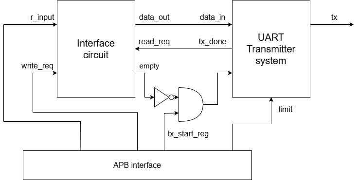

# Developing UART core in FProV2 SoC

In previous cases, we have developed timer and GPIO cores and they were always ready when we were writing or reading data. However, in real-world applications, peripherals like UART operate asynchronously and require proper handling of data transmission and reception.

## Building the custom logic 

The conceptual design of the UART core is shown in the figure below:

  

The UART core consists of interface circuit and UART transmitter. 

### Interface circuit

The interface circuit consists of the buffer and control logic. The buffer stores the received data while the control logic generates the status of buffer (e.g. empty or full). 

```verilog
module interface_circuit #(
    parameter DATA_WIDTH = 8
) (
    input logic clock, 
    input logic reset,
    input logic [DATA_WIDTH-1:0] r_input, 
    input logic write_req, // receiving done  
    input logic read_req, // read uart request 
    output logic rx_empty,
    output logic [DATA_WIDTH-1:0] r_out
);
```

- The `r_input` signal is the data received from the UART receiver.
- The `write_req` signal indicates that the data reception is complete.
- The `read_req` signal is the request from the consumer device to read the data from the buffer.
- The `rx_empty` signal indicates whether the buffer is empty or not.
- The `r_out` signal is the data output from the buffer to the consumer device.

Concerning the buffer, we employ one D flip-flop to store the received data. The buffer is updated at the positive edge of the clock signal and when the `rx_done` signal is equal to 1. 

```verilog
always_ff @(posedge clock) begin : OneWordBuffer
    if (reset) begin
        r_out <= 0;
    end else begin
        if (rx_done) begin
            r_out <= r_input;
        end
    end
end
``` 

The control logic outputs only one signal, `rx_empty`. The signal is equal to 1 when the buffer is empty, i.e. consumer device has read the data. The consumer request the data by setting the `rd_uart` signal to 1. Vice versa, the buffer is full when the `rx_done` signal is equal to 1.

```verilog
assign set_flag = rx_done;
assign clr_flag = rd_uart;

always_ff @( posedge clock ) begin : rx_empty_gen
    if (reset) begin
        flag <= 0; // on reset buffer is empty 
    end else begin
        if (set_flag) begin
            flag <= 1;
        end else begin
            if (clr_flag) begin
                flag <= 0;
            end
        end
    end
end

assign rx_empty = ~set_flag;
```

### UART transmitter

The UART transmitter consists of finite state machine (FSM) and sample tick generator. The FSM has four states: IDLE, START, DATA, and STOP. The transitions between the states are triggered by the `sample_tick` signal generated by the sample tick generator.

The interface of the UART transmitter is shown below:

```verilog
module transmitter_system(
    input logic clock,
    input logic reset,
    input logic [15:0] limit, 
    input logic tx_start,
    input logic [7:0] data_in,
    output logic tx,
    output logic tx_done
);
```
- The `limit` input signal defines the number of clock cycles for the duration of one symbol in UART communication. (e.g., for 19200 baud rate and 100 MHz clock, the limit should be set to 5208).
- The `tx_start` signal initiates the transmission of data stored in the `data_in` signal. 
- The `tx` output signal is the serial data output, while the `tx_done` signal indicates that the transmission is complete.

## Register map

The UART core has the following register map:

| Register | address | Meaning | 
|------|--------------|----------------------|
| Config register | 0x00 | Bit 0 -> enables UART transmitter |
| Speed register | 0x04 | Lower 16 bits denote the value for signal `limit` |
| TX register | 0x08 | Lower 8 bits denote the data to be transmitted |

All registers are write-only. 

## Wrapping the UART core with APB interface

The UART core is wrapped with the APB interface to enable communication with the FProV2 SoC. The APB interface handles read and write requests from the processor and maps them to the appropriate registers in the UART core.

First we generate the enables for writing to the registers:

```verilog
  logic wr_en;
  assign wr_en = pSEL & pWRITE  & pENABLE & pREADY;

  logic [2:0] wr_bus_en;
  assign wr_bus_en[0] = wr_en & (pADDR[6:0] == `UART_CONF_OFF); // write to the first register
  assign wr_bus_en[1] = wr_en & (pADDR[6:0] == `UART_SPEED_OFF); // write to the first register
  assign wr_bus_en[2] = wr_en & (pADDR[6:0] == `UART_TX_OFF); // write to the first register 
```

As in previous core, in order to write to the registers first write request to current core needs to asserted (`pSEL` and `pWRITE`) and handshake signals (`pENABLE` and `pREADY`) need to be high. The individual register write enables are generated based on the address provided in the `pADDR` signal.

The write interface is implemented as follows:

```verilog
  // write interface
// reg data 0x0
    logic tx_start_reg;
    always_ff @(posedge pCLK) begin
        if (!pRESETn) begin
            tx_start_reg <= 0;
        end else begin
            if (wr_bus_en[0]) begin
                tx_start_reg <= pWDATA[0];
            end
        end
    end

    // reg data 0x4
    logic [15:0] limit_reg;
    always_ff @(posedge pCLK) begin
        if (!pRESETn) begin
            limit_reg <= 0;
        end else begin
            if (wr_bus_en[1]) begin
                limit_reg <= pWDATA[15:0];
            end
        end
    end

    // reg data 0x8  
    logic [7:0] data_reg;
    always_ff @(posedge pCLK) begin
        if (!pRESETn) begin
            data_reg <= 0;
        end else begin
            if (wr_bus_en[2]) begin
                data_reg <= pWDATA[7:0];
            end
        end
    end
```

Unlike in previous cores, the `pREADY` signal is generated per registers. We can can always write to the configuration (`UART_CONF_OFF`) and speed register (`UART_SPEED_OFF`). However, the TX register (`UART_TX_OFF`) can be written only when the interface circuit buffer is not full. 

```verilog
  assign pREADY = (pADDR[6:0] == `UART_TX_OFF) ? rx_empty : 1; 
```

## Integrating the UART core into FProV2 SoC

The final step is to integrate the UART core into the FProV2 SoC in the top-level SoC module. This involves instantiating the UART core in the top-level SoC module and connecting it to the APB bus.

```verilog
  // UART core instantiation
  APB_uart #(
    .DW(DW),   // Data width
    .AW(AW)    // Address width
  ) u_apb_uart (
      .pCLK    (clock),
      .pRESETn (resetn),
      .pADDR   (SpADDR[2]),
      .pSEL    (SpSEL[2]),
      .pENABLE (SpENABLE[2]),
      .pWRITE  (SpWRITE[2]),
      .pWDATA  (SpWDATA[2]),
      .pRDATA  (SpRDATA[2]),
      .pREADY  (SpREADY[2]),
      .pSLVERR (SpSLVERR[2]),
      .tx      (tx)
  );

  // the "rest" of peripherals
  genvar i;
  for (i = 3; i < NUM_PERIPHERALS; i++) begin : gen_addr
      assign SpSLVERR[i] = 1; // generate an error signal when addressing unknown peripherals peripheral
      assign SpREADY[i] = 0;
      assign SpRDATA[i] = 32'hFFFFFFFF;
end
```

The base address of the UART core is `0x4000_0100`, and it occupies 3 registers. The UART core is connected to the third slot of the APB bus (`SpADDR[2]`, `SpSEL[2]`, etc.).


## Driver for UART core

We have developed two functions to interact with the UART core: `uart_init` and `uart_print_char`.

```c
#define UART 0xC0000100
#define UART_CONFIG_OFF 0
#define UART_SPEED_OFF 4
#define UART_TX_OFF 8

volatile uint32_t * uart_config = (uint32_t *) (UART+UART_CONFIG_OFF);
volatile uint32_t * uart_speed = (uint32_t *) (UART+UART_SPEED_OFF);
volatile uint32_t * uart_tx = (uint32_t *) (UART+UART_TX_OFF);

void uart_init(uint32_t speed) {
    // configure UART: enable, no parity, 1 stop bit, 8 data bits
    *uart_config = 0x0000000D;
    // set speed
    int limit; 
    limit = 100000000 / speed;
    *uart_speed = speed;
}

void uart_print_char(char c) {
    *uart_tx = (uint32_t) c;
}
```