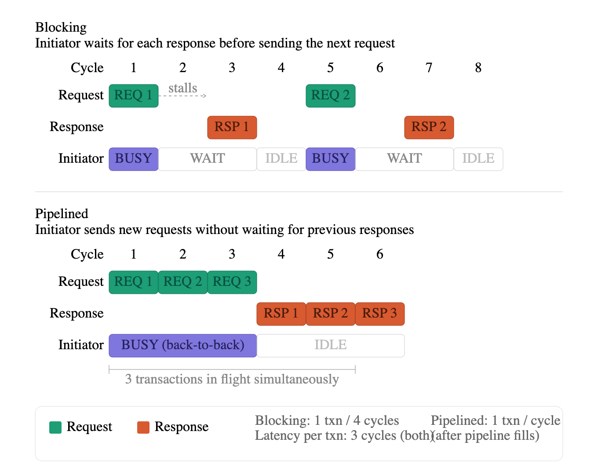
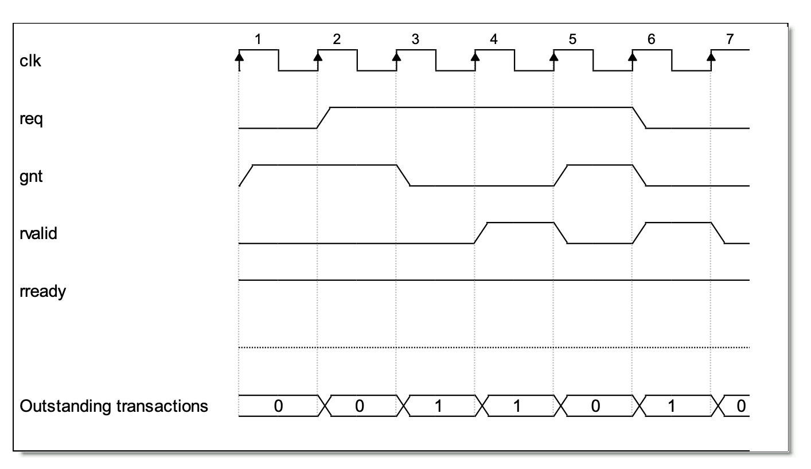
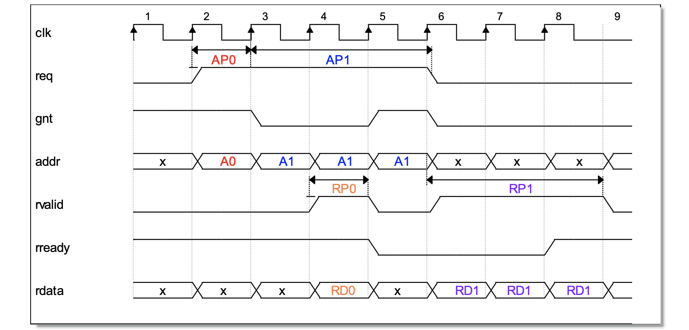

# OBI (Open Bus Interface)

OBI is an open-source specification for on-chip communication, designed as a simpler
alternative to protocols such as AXI and Wishbone. Main properties:

- **Synchronous** — all communication is synchronous with the clock
- **Pipelined** — multiple transactions can be in-flight simultaneously, improving throughput without increasing per-transaction latency

## Transaction types

Every transaction on a SoC consists of two phases: a **request** and a **response**.
Transactions can be classified into two communication models: blocking and pipelined.

### Blocking transactions

In a blocking model, a new transaction can only begin once the previous one has fully completed.
The initiator stalls after issuing a request and cannot proceed until the corresponding response is received.

- Simple to implement — no ordering or tracking logic required
- Low throughput: one transaction every N cycles, where N is the round-trip latency

### Pipelined transactions

In a pipelined model, the initiator can issue multiple requests without waiting for previous responses.
Requests and responses travel on **separate channels**, allowing them to overlap in time.

To support pipelining, two requirements must be met:

1. **Unique transaction ID** — each request carries an identifier so that its response can be matched back to it
2. **Reorder buffer** — responses may return out of order; a buffer re-aligns them to match the original request sequence

- Higher throughput: up to one transaction per cycle once the pipeline is full
- Round-trip latency per transaction remains unchanged — only throughput improves

## Channels

OBI defines two channels: the **Address channel (A)** and the **Response channel (R)**.

### Address channel (A)

The address channel carries all signals that define a request.

#### Address signals

- `addr` — generated by the manager (initiator/master, usually a CPU); denotes the address of the target subordinate device (slave)

#### Write signals

- `we` — write enable; `1` = write request, `0` = read request
- `wdata` — write data; the data to be written into the subordinate device
- `be` — byte enable; indicates which bytes of `wdata` are valid

    | `be` | Byte 3 | Byte 2 | Byte 1 | Byte 0 |
    |------|--------|--------|--------|--------|
    | `0001` | ✗ | ✗ | ✗ | ✓ |
    | `0010` | ✗ | ✗ | ✓ | ✗ |
    | `0100` | ✗ | ✓ | ✗ | ✗ |
    | `1000` | ✓ | ✗ | ✗ | ✗ |
    | `0011` | ✗ | ✗ | ✓ | ✓ |
    | `1111` | ✓ | ✓ | ✓ | ✓ |

#### Handshake signals

- `req` — request valid; asserted by the manager to indicate a valid request on the channel
- `gnt` — grant; asserted by the subordinate to indicate it is ready to accept the request (address and write data)

### Response channel (R)

The response channel carries all signals returned from the subordinate to the manager.

#### Read signals

- `rdata` — read data; returned to the manager on a read transaction

#### Error signals

- `err` — transaction error; asserted by the subordinate to signal a failed transaction

#### Handshake signals

- `rvalid` — asserted by the subordinate to indicate that response data is valid
- `rready` — asserted by the manager to indicate it is ready to accept the response

## Transaction flow

### Write transaction

1. **Address phase** — the manager drives the address and write signals onto the channel and asserts `req` to indicate a valid request
2. **Grant** — the address phase completes when the subordinate asserts `gnt`, signalling that it has accepted the address and write data; the manager may then issue the next request
3. **Response phase** — the manager waits for the subordinate to assert `rvalid`, which indicates the write has completed

> **Note:** it is assumed that `rready` is always asserted. If not, the transaction completes only when both `rready` and `rvalid` are asserted simultaneously.

### Read transaction

The read transaction follows the same flow as a write transaction. The only difference is in the response phase: `rvalid` indicates that the data on the `rdata` line is valid and can be sampled by the manager.

## OBI: a two handshake protocol

OBI uses two handshakes, one per channel.

- **Channel A** — handshake between `req` and `gnt`; once `gnt` is asserted, the manager knows the subordinate has accepted the request and can proceed to the next transaction
- **Channel R** — handshake between `rvalid` and `rready`; the transaction completes when both are asserted simultaneously. For our SoC, `rready` is assumed to be always asserted.

> **Analogy:** Think of a lecture. The professor calls on you and asks a question — that is the `req`. You nod to confirm you understood — that is the `gnt`. When you are ready to answer, you check that the professor is listening — that is `rready`. You then give your answer — that is `rvalid` with data on `rdata`. Once the answer is delivered, the transaction is complete.

 
