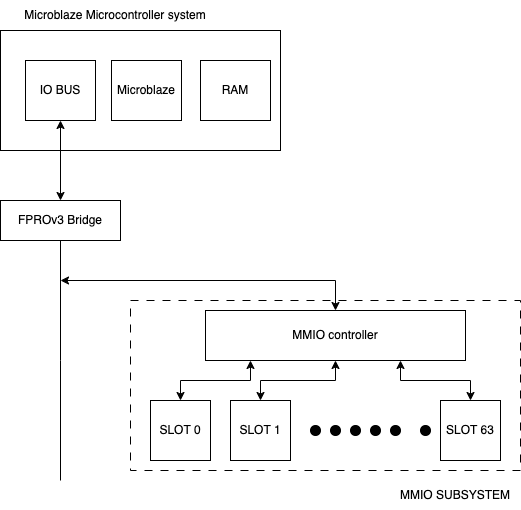
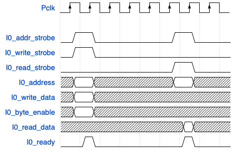
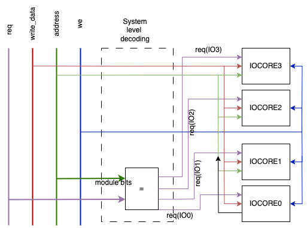
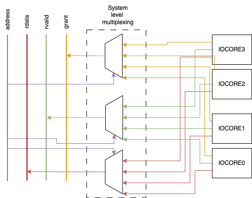

# Developing APB based SoC platform


- In this section, we will develop a simple SoC platform based on the OBI protocol 
  - our inspiration lies in the [FPRO platform](https://www.amazon.com/FPGA-Prototyping-SystemVerilog-Examples-MicroBlaze/dp/1119282667)


- Features:
  - simple: easy to use and understand
  - portable: all the IP cores are developed from scratch
  - functional: can be used for real-world applications, but not as powerful as commercial platforms
  - educational: designed for educational purposes
  
- The platform consists of:
  - processor module
  - OBI bridge and bus 
  - Interconnect 
  - I/O peripherals (GPIO, UART, etc.)


## Processor module:

- any 32-bit RISC processor can be used
- On the class, we use the [MicroBlaze processor](https://www.amd.com/en/products/software/adaptive-socs-and-fpgas/microblaze.html) and [MicroBlaze MCS](https://www.amd.com/en/products/software/adaptive-socs-and-fpgas/mb-mcs.html)
- Microblaze MCS (Microcontroller system):
  - complete computer system centered around the MicroBlaze processor
  - besides the processor, it includes RAM and IO module with standard set of microcontroller interfaces
  - all the components are constructed from FPGA resources
- Microblaze processor
  - 32-bit processor with RISC architecture
  - "soft" processor, i.e. implemented in the FPGA fabric
  - can be customized to the user requirements
    - e.g. floating-point unit, memory management unit, caches, etc.
    - AXI protocol for communicating with the peripherals
    - Note: the MicroBlaze MCS does not support the AXI protocol



- MMIO scheme: use load and store instructions to access the memory-mapped registers
  - I/O devices and memory are mapped to the same address space
  - each I/O device is assigned a unique address range within the memory map

- I/O register map:
  - I/O device is just a set of registers
    - each register is mapped to a specific address
    - each register depicts a specific function of the device

### I/O address space of the FPRO SoC platform:

- Our system MMIO subsystem specification
  - provides space for 64 I/O devices or slots (0-63)
  - each device has 32 registers (0-31)
  - each register is 32-bit wide
  - the address of the register is 22-bit wide:
    -  ADDRESS[12:6] - address of slot 
    -  ADDRESS[6:0] - address of register

### Interface with the bus

- Main task in SoC is to integrate the custom logic into the system

- To attach the custom logic to the bus and access I/O core, the following steps are required:
  1. Add a wrapper around the custom logic to form a compatible I/O core that can interact with the bus
  2. Update system-level decoding (write operation) and multiplexing (read operation) logic to circuit to indetify and access the I/O core

- Wrapping circuit : 
  - enables core to be addressed by the bus
  - makes the core as a small memory-mapped device
  - contains:
    - decoding circuit for writing into the registers
    - multiplexing circuit for reading from the registers

-  System-level decoding and multiplexing logic:
   - used to identify the I/O core
   - multiplexes the data bus to read the data from the I/O core


## FPRO bridge 

- The bridge will intercept the MCS I/O bus signals and generate the according request to the APB master 
  - read or write request
- The bridge will also handle the response from the APB master and generate the appropriate signals for the MCS I/O bus 

### MCS I/O bus protocol

- signals involved in the MCS I/O bus protocol:
  - `io_address_strobe`: address strobe signal, used to indicate that the address is valid
  - `io_write_strobe`: write strobe signal to initiate a write operation
  - `io_read_strobe`: read strobe signal to initiate a read operation
  - `io_address`: 32-bit wide address signal used to identify the destination I/O core attached to the MCS I/O bus
  - `io_write_data`: 32-bit wide data signal, used to write the data to the destination I/O core
  - `io_read_data`: 32-bit wide data signal, used to obtain the data from the destination I/O core
  - `io_ready`: indicates whether transaction has been received
  - `io_byte_enable`: which byte of the `io_write_data` data is valid




> Image adopted from (https://www.amazon.com/FPGA-Prototyping-SystemVerilog-Examples-MicroBlaze/dp/1119282667)

Write operation:
  1. Master device places the address and data on the bus and asserts the address and write strobe signal
  2. Slave assets the `io_ready` signal, when the transaction is received
  3. Optionally, the master can assert the `io_byte_enable` signal to indicate which byte of the data is valid

Read operation:
  1. Master device places the address on the bus and asserts the address and read strobe signal
  2. Slave gets request and places the data on the `io_read_data` line 
  3. Slave assets the `io_ready` signal, when the read data is available


### OBI bridge implementation

1. First, we need to decode the MCS I/O bus signals to determine whether the transaction should be initiated
    - Our whole SoC platform will be act as a single slave on the MCS I/O bus
      - Our OBI subsystem starting address is 0xC000_0000, meaning that all addresses from 0xC000_0000 to 0xC0FF_FFFF are mapped to our OBI subsystem
      - if the upper 8 bits of the address are equal to 0xC0, then the transaction is intended for our OBI subsystem
      - otherwise, the transaction is ignored
  
  ```verilog
    // The OBI subsystem acts as slave on I/O bus. It starting address is 0xC000_0000
    logic mcs_bridge_enable;
    assign mcs_bridge_enable = (io_address[31:24] == BRG_BASE[31:24]);
  ```

2. Next we concentrate on the command generation
   - Indetify whether the transaction is a read or write operation
   - generate the valid signal for the OBI state machine to indicate that there is a valid transaction on the bus

```verilog
    // Command generation
    // write_req is equal to one when io_write_strobe is asserted and io_read_strobe is not asserted
    logic write_req;
    assign write_req = io_write_strobe & ~io_read_strobe;

    // We will use a address_strobe to generate the valid signal. 
    // regardless of read or write, address_strobe is always asserted when there is a valid address
    assign valid = io_addr_strobe & mcs_bridge_enable; // do not generate any request if we did not select our system

    assign write_req = (valid == 1) ? write : delay_write;

```

3. The state machine is employed to manage the transaction and generate the appropriate signals for the OBI protocol
  - The state machine has following signals:
    - IDLE: default state, waiting for a valid transaction
    - ADDRESS: entering the address phase of the transaction 
    - WAIT_RSP: response phase of transaction 
    - DONE: transaction is complete, go back to IDLE or ADDRESS state depending on whether there is a new transaction or not

  ```verilog
    typedef enum logic [1:0] {
          IDLE     = 2'd0,
          ADDR     = 2'd1,
          WAIT_RSP = 2'd2,
          DONE     = 2'd3
    } state_e;
  ```
  - The state register for the state machine is updated on the positive edge of the clock and reset on the negative edge of the reset signal

```verilog
always_ff @(posedge CLK)
        if (!RESETn)
            state_q <= IDLE;
        else         
            state_q <= state_d;
```
   - The next state logic is implemented in following manner
     - In the IDLE state, if there is a valid transaction, we move to the ADDRESS state
     - In the ADDRESS state, we wait for the handshake signals to be asserted on address channel (`obi_gnt_i` and `obi_rvalid_i`) to move to the WAIT_RSP state
     - In the WAIT_RSP state, we wait for the response from the OBI master to be valid (`obi_rvalid_i`), then we move to the DONE state
       - Here we persume that (`obi_rready_i`) is always asserted, meaning that the master is always ready to accept the response
     - In the DONE state, if there is a new valid transaction, we move to the ADDRESS state, otherwise we move back to the IDLE state


3. Generating OBI signals

  - The OBI signals are generated based on the state of the state machine and the transaction type (read or write)
    - `obi_req_o`: asserted when we are in the ADDRESS state, indicating that we are in address phase of the transaction and we want to denote a valid transaction 
    - `obi_addr_o`: the address for the OBI transaction, which equals `io_address` signal
    - `obi_we_o`: write enable signal, which is asserted when we are in the ADDRESS state and the transaction is a write operation
    - `obi_be_o`: byte enable signal, which is equal to `io_byte_enable` signal
    - `obi_wdata_o`: write data signal, which is equal to `io_write_data` signal
    - `obi_rready_o`: read ready signal, which is always asserted in our design, indicating that we are always ready to accept the response from the OBI master

```verilog
    // -----------------------------------------------------------
    // OBI request — hold req and address stable until gnt
    // -----------------------------------------------------------
    assign obi_req_o   = (state_q == ADDR);
    assign obi_addr_o  = io_address;
    assign obi_we_o    = write_req;
    assign obi_be_o    = io_byte_enable;
    assign obi_wdata_o = io_write_data;
    assign obi_rready_o = 1'b1;   // we always accept responses immediately
```
4. Capturing the response:

  - The response from the OBI is captured in a register when the `obi_rvalid_i` signal is asserted, indicating that the read data is valid
  - The read data is stored in a register `rdata_q`, which is then used to drive the `io_read_data` signal back to the master on the MCS I/O bus
  - The `io_ready` signal is generated when the state machine is in the DONE state, indicating that the transaction is complete and the response is ready to be sent back to the master

```verilog    
    logic [31:0] rdata_q;

    always_ff @(posedge CLK) begin
        if (!RESETn)
            rdata_q <= '0;
        else if (obi_rvalid_i)
            rdata_q <= obi_rdata_i;
    end

    // -----------------------------------------------------------
    // IO bus response — IO_Ready pulses one cycle in DONE
    // -----------------------------------------------------------
    assign io_ready     = (state_q == DONE)  & mcs_bridge_enable ;
    assign io_read_data = rdata_q;
```

- Note: the FPROv3 bridge implementation forces to wait for the response from the OBI master before accepting a new transaction on the MCS I/O bus, meaning that we cannot pipeline the transactions on the MCS I/O bus. This is a design choice to simplify the implementation of the bridge and the state machine, but it can be modified to allow pipelining if needed.


## Interconnect

- Connects the multiple master, memory, and I/O cores (slaves)
- Manages the data flow between the components
- Interconnect will be based on centralized arbitration/decode scheme
  - Arbitration: decides which master can access the bus
  - Decoding: decides which slave is accessed by the master
    - In our case, we have only one master (processor), so we don't need arbitration
  
- For this example, we will use a simple OBI interconnect
  - connects the OBI master (bridge) to multiple OBI slaves (peripherals)
  - handles the address decoding and data multiplexing
  - supports up to 64 OBI slaves 
    - each slave is assigned a unique address range

- System level decoding and multiplexing logic:
  - Decoding logic: decodes the address from the master to select the appropriate slave
    - Based on the address, the decoding logic generates the `obi_req_o` signal for the selected slave.
    - The rest of the slaves will have their `obi_req_o` signal deasserted.
  - Multiplexing logic: multiplexes the data from the selected slave to the master
    - The data from the selected slave is routed to the master based on the `obi_req_o` signal.
    - The data from the other slaves is ignored.

- Addressing
  - Each address is 32-bit wide
  - Two parts of the address are used for selecting the slave:
    - module bits - used to select the slave or I/O core
    - register bits - used to select the register within the slave or I/O core

### Write Interface and decoding logic


- Signals involved in the write operation:
  - `obi_addr_o`: 32-bit wide address bus
  - `obi_wdata_o`: 32-bit wide data bus
  - `obi_we_o`: write request signal
  - `obi_be_o`: byte enable signal
  - `obi_req_o`: slave select signal (one-hot encoded for each slave)

- First we compare the module address with the address from the master
  - Each slave has a unique base address
  - If the module part of address from the master matches the base module of the slave and `obi_req_o` is high, we assert the `obi_req_o` signal for that slave 
  - Otherwise, we deassert the `obi_req_o` signal
  - All other signals (`obi_addr_o`, `obi_enable_o`, `obi_we_o`, `obi_be_o`, `obi_wdata_o`) are forwarded to all slaves
  
  Table of address mapping:

| obi_req_o (Master) | ADDRESS (module bits) | obi_req_o (IO Core 3)   | obi_req_o (IO Core 2)   |obi_req_o (IO Core 1)   |obi_req_o (IO Core 0)   |
|-------|-----------------------|---------|--------|--------|--------|
|0|Dont care |0|0|0|0|
|1|Base address of Slave 0|0|0|0|1|
|1|Base address of Slave 1|0|0|1|0|
|1|Base address of Slave 2|0|1|0|0|
|1|Base address of Slave 3|1|0|0|0|
|1|Otherwise|0|0|0|0|




> Note: Due to verboseness, we ommited the `obi_be_o` and `obi_rready_o` signals. They are also forwarded to all slaves.

### Read Interface and multiplexing logic

- Signals involved in the read operation:
  - `obi_addr_o`: 32-bit wide address bus
  - `obi_rdata_i`: 32-bit wide data bus
  - `obi_gnt_i`: grant signal from slave to master, indicating that the slave has accepted the request
  - `obi_rvalid_i`: read valid signal from slave to master, indicating that the read data is valid or that write operation is complete


- Multiple slaves can respond to the read request
  - The interconnect needs to multiplex the read data from the selected slave to the master
  - The interconnect also needs to handle the PREADY signal from the selected slave to the master

| we_o | ADDRESS (module bits) | rddata   |
|-------|-----------------------|---------|
|1|Dont care |0|
|0|Base address of IO core  0|From IO core  0|
|0|Base address of IO core  1|From IO core  1|
|0|Base address of IO core  2|From IO core  2|
|0|Base address of IO core  3|From IO core  3|
|0|Otherwise|0|




### Address space of the FPROv2 SoC platform:

| obi_ADDR[31:24] | obi_ADDR[23:13] |obi_ADDR[12:7] | obi_ADDR[6:2] |obi_ADDR[1:0] |
|------|--------------|----------------------|-|-|
| 0xC0 | 0x000 |Slot address | Register address |00|

- Each slot has 32 registers (5 bits for register address)
  - The last 2 bits are not used, because the registers are word-aligned (4 bytes) 
- FProv2 SoC platform supports up to 64 slots (6 bits for slot address)


### Developing the interconnect

- Notation:
  - master_<Signal_Name>_<i/o> - signal from/to master
  - slave_<Signal_Name>_<i/o> - signal from/to slave

1. Extract the module and register address from the master address bus

```verilog    
  // Write interface 
  // 1. Calculate the base address bits and offset bits based on the number of peripherals and number of registers per peripheral
  localparam baseAddr_MSB = ($clog2(NUM_PERIPHERALS) + $clog2(NUM_REG_PERIPHERAL) + 2) - 1; // evalutesto 6+5+2-1=12 for 64 peripherals with 32 registers each
  localparam baseAddr_LSB = $clog2(NUM_REG_PERIPHERAL) + 2; // evaluates to 5+2=7 for 32 registers per peripheral
```    

2. Write interface 
  - Generate the slave select signal for each slave based on the one-hot encoded base address and the write enable signal from the master

```verilog    

  localparam MSB = $clog2(NUM_PERIPHERALS);
  logic [MSB - 1 : 0] baseAddr;
  logic [NUM_PERIPHERALS-1:0] onehot_sel;

  assign baseAddr = master_obi_addr_o[baseAddr_MSB : baseAddr_LSB];
  assign onehot_sel = ({ {(NUM_PERIPHERALS-1){1'b0}}, 1'b1 } << baseAddr);
  
  // Decoder: one-hot request routing to the selected peripheral.
  assign slave_obi_req_i =  master_obi_req_o ? (1 << baseAddr) : 0;
```
  - Forward the address, write data, byte enable, and write enable signals from the master to all slaves

```verilog  
  // Forward shared OBI address channel signals to all peripherals.
  genvar i;
  for (i = 0; i < NUM_PERIPHERALS; i++) begin : gen_addr
      assign slave_obi_addr_i[i] = master_obi_addr_o;
      assign slave_obi_we_i[i] = master_obi_we_o;
      assign slave_obi_wdata_i[i] = master_obi_wdata_o;
      assign slave_obi_be_i[i] = master_obi_be_o;
      assign slave_obi_rready_i[i] = 1; 
  end
``` 


3. Read interface - Generate the read data bus for the master by multiplexing the read data from the slaves based on the one-hot encoded base address and the read valid signal from the slaves

```verilog  
  // Read data muxing: route the read data from the selected peripheral to the master, and route the gnt, rvalid and err signals from the selected peripheral to the master as well
    always_comb begin : default_assign
        // Default assignments to avoid latches
        master_obi_rdata_i = slave_obi_rdata_o[baseAddr];
    end
    
    // Muxing grant, rvalid and err signals from the selected peripheral to the master
    always_comb begin : readData
        master_obi_gnt_i = slave_obi_gnt_o[baseAddr]; // Dynamic address when multiplexing grant signals from the selected peripheral to the master 
        master_obi_rvalid_i = slave_obi_rvalid_o[baseAddr];
        master_obi_err_i = slave_obi_err_o[baseAddr];
    end
```  

## Developing I/O cores as OBI slaves

- Main task in SoC is to integrate the custom logic into the system

- To attach the custom logic to the bus and access I/O core, the following steps are required:
  1. Add a wrapper around the custom logic to form a compatible I/O core that can interact with the bus
  2. Update system-level decoding (write operation) and multiplexing (read operation) logic to circuit to indetify and access the I/O core

- Wrapping circuit : 
  - enables core to be addressed by the bus
  - makes the core as a small memory-mapped device
  - contains:
    - decoding circuit for writing into the registers
    - multiplexing circuit for reading from the registers

-  System-level decoding and multiplexing logic:
   - used to identify the I/O core
   - multiplexes the data bus to read the data from the I/O core

- When developing slave, we need to:
  - Implement custom logic, that represents the functionality of the peripheral
  - define the register map of the peripheral
  - implement the APB slave interface
    - decoding logic for write operations
    - multiplexing logic for read operations
  - write the SW drivers to access the peripheral


 


### Developing OBI slave 

- needs to be in compliance with the slot interface

- For this example, we will develop a simple OBI slave that represents a memory-mapped 64-bit timer peripheral
  
- The timer has three registers:
    - Configuration register (offset 0x00): used to configure the timer
      - write-only register
      - bit 0: enable/disable the timer
      - bit 1: reset the timer
    - Count low register (offset 0x04): contains the lower 32 bits of the timer count
      - read-only register
    - Count high register (offset 0x08): contains the upper 32 bits of the timer count
      - read-only register


  
- The design of the OBI slave includes:
  - Wrapping logic to interface with the OBI bus
    - State machine to manage the read and write operations
    - Decoding logic to select the appropriate register based on the address
  - Logic that implements the timer functionality
  - Logic to generate the OBI slave error signal


- TBD 